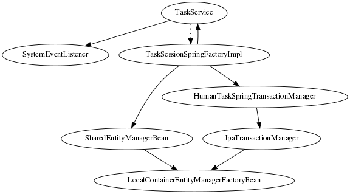

== 集成Spring

=== Drools 6.0重要变更

Drools Spring集成经历了与Drools 6.0的变化完全一致的改造。 以下是一些主要的变化：

*   推荐的Drools Spring的前缀已经从“drools：”改为“kie：”
*   6.0中的新顶级标签
    **   kie:kmodule
    **   kie:import (from version 6.2)
    **   kie:releaseId (from version 6.2)
*   以下标签不再作为顶级标签有效。
    **   kie:kbase - A child of the __kie:kmodule__ tag.
    **   kie:ksession - A child of the __kie:kbase__ tag.
*   从以前的版本中删除标签Drools 5.x
    **   drools:resources
    **   drools:resource
    **   drools:grid
    **   drools:grid-node

=== 与Drools Expert整合

在本节中，我们将解释__kie__命名空间。

==== KieModule

__ <kie：kmodule> __定义了KieBase和相关的KieSession的集合。 __kmodule__标签有一个MANDATORY参数“id”。

.样品
|====
| 属性 | 说明 | 需要
| id | Bean的__id__是从其他bean引用的名称。标准的Spring ID语义适用。 | Yes
|====

__kmodule__标签只能包含以下标签作为子标签。

*   kie:kbase
请参阅Drools Expert文档中的kmodule.xml文档，以获取有关kmodule需求的详细说明。

==== KieBase

===== <kie：kbase>的参数作为属性：

.Sample
|====
| Attribute | Description | Required
| name | KieBase的名字 | Yes
| packages | 以逗号分隔的资源包列表将包含在此kbase | No
| includes | 包含kbase名称。来自相应kbase的所有资源都包含在这个kbase中。 | No
| default | 布尔（TRUE / FALSE）。默认kbase，如果没有提供，则假定为FALSE | No
| scope | prototype \| singleton。如果没有提供假设为singleton（默认） | No
| eventProcessingMode | 事件处理模式。有效的选项是STREAM，CLOUD | No
| equalsBehavior | 有效的选项是IDENTITY，EQUALITY | No
| declarativeAgenda | 有效选项是启用，禁用，true，false | No
|====

===== __kbase__标签只能包含以下标签作为子标签

*   kie:ksession

===== <kie：kbase>的定义示例

kmodule可以包含多个（1..n）kbase元素。

.kbase定义的例子
[source,java]
----
<kie:kmodule id="sample_module">
   <kie:kbase name="kbase1" packages="org.drools.spring.sample">
     ...
   </kie:kbase>
</kie:kmodule>

<bean id="kiePostProcessor"
          class="org.kie.spring.KModuleBeanFactoryPostProcessor"/>
----

===== Spring Bean范围（用于KieBase和KieSession）

当定义一个KieBase或一个KieSession时，你可以选择为该bean声明一个范围。例如，为了强制Spring在每次需要时产生一个新的bean实例，你应该声明bean的scope属性是“prototype”。类似的方法，如果你希望Spring在每次需要的时候返回相同的bean实例，你应该声明bean的scope属性是'singleton'。

==== 重要的提示

对于KMODULE对象的正确初始化（kbase / ksession），它是强制性的类型``org.kie.spring.KModuleBeanFactoryPostProcessor``或``的一个bean`org.kie.spring.annotations.KModuleAnnotationPostProcessor``来限定。

.定期的kie-spring post处理器bean定义
[source,java]
----
<bean id="kiePostProcessor"
          class="org.kie.spring.KModuleBeanFactoryPostProcessor"/>
----

.使用注释时kie-spring后处理器的bean定义
[source,java]
----
<bean id="kiePostProcessor"
          class="org.kie.spring.annotations.KModuleAnnotationPostProcessor"/>
----

[NOTE]
没有org.kie.spring.KModuleBeanFactoryPostProcessor或org.kie.spring.annotations.KModuleAnnotationPostProcessor bean定义，kie-spring集成将无法工作。

==== KieSessions

<kie：ksession>元素定义了KieSessions。相同的标记用于定义有状态（__org.kie.api.runtime.KieSession__）和无状态（__org.kie.api.runtime.StatelessKieSession__）会话。

=====  <kie：ksession>的参数作为属性：

.Sample
|====
| Attribute | Description | Required
| name | ksession的名字。 | Yes
| type | 是会话__stateful__还是__stateless？__。如果此属性为空或缺少，则会话将被视为Stateful类型。 | No
| default | 这是默认会话吗？ | no
| scope | prototype \| singleton. 如果没有提供假设为单例（默认） | no
| clockType | REALTIME或PSEUDO | no
| listeners-ref | 指定对事件侦听器组的引用（请参阅https://docs.jboss.org/drools/release/7.4.1.Final/drools-docs/html_single/index.html#_kie_grouping_listeners ['定义侦听器组'）]以下部分）。 | no
|====

.ksession定义的例子
[source,java]
----
<kie:kmodule id="sample-kmodule">
  <kie:kbase name="drl_kiesample3" packages="drl_kiesample3">
    <kie:ksession name="ksession1" type="stateless"/>
    <kie:ksession name="ksession2"/>
  </kie:kbase>
</kie:kmodule>

<bean id="kiePostProcessor"
          class="org.kie.spring.KModuleBeanFactoryPostProcessor"/>
----

===== Spring Bean范围（用于KieBase和KieSession）

当定义一个KieBase或一个KieSession时，你可以选择为该bean声明一个范围。例如，为了强制Spring在每次需要时产生一个新的bean实例，你应该声明bean的scope属性是“prototype”。类似的方法，如果你希望Spring在每次需要的时候返回相同的bean实例，你应该声明bean的scope属性是'singleton'。

==== https://docs.jboss.org/drools/release/7.4.1.Final/drools-docs/html_single/index.html#_kie_releaseid[]https://docs.jboss.org/drools/release/7.4.1.Final/drools-docs/html_single/index.html#_kie_releaseid[14.2.5. Kie:ReleaseId]

===== <kie:releaseId>的属性参数:

.Sample
|====
| Attribute | Description | Required
| id | Bean的__id__是从其他bean引用的名称。标准的Spring ID语义适用。 | Yes
| groupId | ggroupId来自Maven GAV  | Yes
| artifactId | 来自Maven GAV的artifactId | Yes
| version | Maven GAV | Yes
|====

.releaseId定义的例子
[source,java]
----
<kie:releaseId id="beanId" groupId="org.kie.spring"
            artifactId="named-artifactId" version="1.0.0-SNAPSHOT"/>
----

==== Kie:Import

从版本6.2开始，kie-spring允许从classpath中的kjar中导入kie对象。目前支持导入kie对象的两种模式。

|====
| Attribute | Description | Required
| releaseId | 引用一个Bean ID。标准的Spring ID语义适用。 | No
| enableScanner | 启用扫描仪。该属性仅在指定了“releaseId”的情况下使用。 | No
| scannerInterval | 扫描间隔以毫秒为单位。该属性仅在指定了“releaseId”的情况下使用。 | No
|====

===== Global Import

__import__标签将强制自动扫描类路径上的所有jar，初始化Kie对象（Kbase / KSessions）并将这些对象导入到spring上下文中。

Global Import
----
<kie:import />
----

===== Specific Import - ReleaseId

在导入标签上使用__releaseId-ref__属性将初始化特定的Kie对象（Kbase / KSessions）并将这些对象导入到spring上下文中。

.使用releaseId导入Kie对象
[source,java]
----
<kie:import releaseId-ref="namedKieSession"/>
<kie:releaseId id="namedKieSession" groupId="org.drools"
            artifactId="named-kiesession" version="7.4.1.Final"/>
----

Kie扫描功能可以启用KieBase的导入与一个特定的releaseId。此功能目前不适用于全球导入。

.使用releaseId导入Kie对象 - 启用扫描器
[source,java]
----
<kie:import releaseId-ref="namedKieSession"
            enableScanner="true" scannerInterval="1000"/>

<kie:releaseId id="namedKieSession" groupId="org.drools"
            artifactId="named-kiesession" version="7.4.1.Final"/>
----

如果扫描器已定义并启用，则会创建一个隐式__KieScanner__对象并将其插入到弹簧上下文中。它可以从春天的背景来回顾。

.从Spring上下文恢复KieScanner
[source,java]
----
// the implicit name would be releaseId#scanner
KieScanner releaseIdScanner = context.getBean("namedKieSession#scanner", KieScanner.class);
releaseIdScanner.scanNow();
----

[NOTE]
kie-ci必须在类路径上可用，才能使releaseId导入功能正常工作。

==== Annotations

@KContainer，@KBase和@KSession都支持可选的“name”属性。 Spring通常在注入时会“获取”，所有注入都会为同一组注释接收相同的实例。 “名称”注释强制每个名称的唯一实例，尽管该名称的所有实例都将是identity equals。

===== @KReleaseId

用于将实例绑定到KieModule的特定版本。如果kie-ci位于类路径上，则会自动解析依赖关系，从远程存储库下载。

===== @KContainer

.注入Classpath KieContainer
[source,java]
----
@KContainer
private KieContainer kContainer;
----

.注入动态KieModule的KieContainer
[source,java]
----
@KContainer
@KReleaseId(groupId = "jar1", artifactId = "art1", version = "1.1")
private KieContainer kContainer;
----

.Injects named KieContainer for Dynamic KieModule
[source,java]
----
@KContainer(name = "kc1")
@KReleaseId(groupId = "jar1", artifactId = "art1", version = "1.1")
private KieContainer kContainer;
----

===== @KBase

默认的参数，如果给定的，映射到值属性，并指定春季xml文件中的KieBase的名称。

.从Classpath KieContainer注入默认的KieBase
[source,java]
----
@KBase
private KieBase kbase;
----

.从动态KieModule注入默认KieBase
[source,java]
----
@KBase
@KReleaseId( groupId = "jar1", artifactId = "art1", version = "1.0")
private KieBase kbase;
----

.并行版本加载“jar1.KBase1”KieBase
[source,java]
----
@KBase("kbase1")
@KReleaseId( groupId = "jar1", artifactId = "art1", version = "1.0")
private KieBase kbase1v10;

@KBase("kbase1")
@KReleaseId( groupId = "jar1", artifactId = "art1", version = "1.1")
private KieBase kbase1v11;
----

.并行版本加载“jar1.ksession1”KieSession
[source,java]
----
@KSession("ksession1")
@KReleaseId( groupId = "jar1", artifactId = "art1", version = "1.0")
private KieSession ksession11kb2;

@KSession("ksession1")
@KReleaseId( groupId = "jar1", artifactId = "art1", version = "1.1")
private KieSession ksession11kb2;
----

===== @KSession for KieSession

默认参数（如果给出）映射到value属性，并从kmodule.xml或spring xml文件指定KieSession的名称

.从Classpath KieContainer注入默认的KieSession
[source,java]
----
@KSession
private KieSession ksession;
----

.从动态KieModule注入默认KieSession
[source,java]
----
@KSession
@KReleaseId( groupId = "jar1", artifactId = "art1", version = "1.0")
private KieSession ksession;
----

.并行版本加载“jar1.KBase1”KieBase
[source,java]
----
@KSession("ksession1")
@KReleaseId( groupId = "jar1", artifactId = "art1", version = "1.0")
private KieSession ksessionv10;

@KSession("ksession1")
@KReleaseId( groupId = "jar1", artifactId = "art1", version = "1.1")
private KieSession ksessionv11;
----

.使用'name'属性为'jar1.KBase1'KieSession强制新的实例
[source,java]
----
@KSession("ksession1")
@KReleaseId( groupId = "jar1", artifactId = "art1", version = "1.0")
private KieSession ksession1ks1

@KSession("ksession1")
@KReleaseId( groupId = "jar1", artifactId = "art1", version = "1.0")
private KieSession ksession1ks2
----

===== @KSession for StatelessKieSession

默认参数（如果给出）映射到value属性，并从kmodule.xml或spring xml文件指定KieSession的名称。

.从Classpath KieContainer注入默认的StatelessKieSession
[source,java]
----
@KSession
private StatelessKieSession ksession;
----

.从动态KieModule注入默认的StatelessKieSession
[source,java]
----
@KSession
@KReleaseId( groupId = "jar1", artifactId = "art1", version = "1.0")
private StatelessKieSession ksession;
----

.并行版本加载“jar1.KBase1”KieBase
[source,java]
----
@KSession("ksession1")
@KReleaseId( groupId = "jar1", rtifactId = "art1", version = "1.0")
private StatelessKieSession ksessionv10;

@KSession("ksession1")
@KReleaseId( groupId = "jar1", rtifactId = "art1", version = "1.1")
private StatelessKieSession ksessionv11;
----

[source,java]
----
@KSession(value="ksession1", name="ks1")
@KReleaseId( groupId = "jar1", artifactId = "art1", version = "1.0")
private StatelessKieSession ksession1ks1

@KSession(value="ksession1", name="ks2")
@KReleaseId( groupId = "jar1", artifactId = "art1", version = "1.0")
private StatelessKieSession ksession1ks2
----

===== 重要的提示

当使用注释时，为了正确初始化kmodule对象（kbase / ksession），必须定义org.kie.spring.annotations.KModuleAnnotationPostProcessor类型的Bean

.kie-spring注释处理器bean的定义
[source,java]
----
<bean id="kiePostProcessor"
            class="org.kie.spring.annotations.KModuleAnnotationPostProcessor"/>
----

.kie-spring注解 - 组件扫描
----
<context:component-scan base-package="org.kie.spring.annotations"/>
----

[NOTE]
使用注释时后处理器是不同的。

==== 事件监听器

Drools支持添加三种类型的监听器到KieSessions - __AgendaListener__，__WorkingMemoryListener__，__ProcessEventListener__

kie-spring模块允许您使用XML标签将这些侦听器配置为KieSessions。这些标记与实际的监听器接口名称相同，即<kie：agendaEventListener ...>，<kie：ruleRuntimeEventListener ...>和<kie：processEventListener ...>。

kie-spring提供了将侦听器定义为独立（个人）侦听器的功能，并将它们定义为一个组。

===== 定义独立的监听器

===== 属性

.Sample
|====
| Attribute | Required | Description
| ref | No | 对另一个声明的bean的引用。
|====

.监听器配置示例 - 使用bean：ref。
[source,java]
----
<bean id="mock-agenda-listener" class="mocks.MockAgendaEventListener"/>
<bean id="mock-rr-listener" class="mocks.MockRuleRuntimeEventListener"/>
<bean id="mock-process-listener" class="mocks.MockProcessEventListener"/>

<kie:kmodule id="listeners_kmodule">
  <kie:kbase name="drl_kiesample" packages="drl_kiesample">
    <kie:ksession name="ksession2">
      <kie:agendaEventListener ref="mock-agenda-listener"/>
      <kie:processEventListener ref="mock-process-listener"/>
      <kie:ruleRuntimeEventListener ref="mock-rr-listener"/>
    </kie:ksession>
  </kie:kbase>
</kie:kmodule>

<bean id="kiePostProcessor"
          class="org.kie.spring.KModuleBeanFactoryPostProcessor"/>
----

===== 嵌套元素

*   bean
    **   class = String
    **   name = String （可选）示例199.侦听器配置示例 - 使用嵌套的Bean。
[source,java]
----
<kie:kmodule id="listeners_module">
  <kie:kbase name="drl_kiesample" packages="drl_kiesample">
   <kie:ksession name="ksession1">
	  <kie:agendaEventListener>
      <bean class="mocks.MockAgendaEventListener"/>
      </kie:agendaEventListener>
    </kie:ksession>
  </kie:kbase>
</kie:kmodule>

<bean id="kiePostProcessor"
          class="org.kie.spring.KModuleBeanFactoryPostProcessor"/>
----

===== 空标签：没有'ref'且没有nestedbean的声明

当定义侦听器时没有引用实现bean而不包含嵌套bean时，__ <drools：ruleRuntimeEventListener /> __底层实现添加了在API中定义的侦听器的Debug版本。

调试侦听器将相应的Event toString消息打印到_System.err。 _

.侦听器配置示例 - 默认为由知识API提供的调试版本。
[source,java]
----
<bean id="mock-agenda-listener" class="mocks.MockAgendaEventListener"/>
<bean id="mock-rr-listener" class="mocks.MockRuleRuntimeEventListener"/>
<bean id="mock-process-listener" class="mocks.MockProcessEventListener"/>

<kie:kmodule id="listeners_module">
 <kie:kbase name="drl_kiesample" packages="drl_kiesample">
    <kie:ksession name="ksession2">
      <kie:agendaEventListener />
      <kie:processEventListener />
      <kie:ruleRuntimeEventListener />
    </kie:ksession>
 </kie:kbase>
</kie:kmodule>

<bean id="kiePostProcessor"
          class="org.kie.spring.KModuleBeanFactoryPostProcessor"/>
----

===== 不同声明样式的混合搭配

drools-spring模块允许您在相同的KieSession中混合和匹配不同的声明式样式。下面的例子提供了更多的清晰。

.监听器配置示例 - “ref”/ nested-bean / empty样式的混合和匹配。
[source,java]
----
<bean id="mock-agenda-listener" class="mocks.MockAgendaEventListener"/>
<bean id="mock-rr-listener" class="mocks.MockRuleRuntimeEventListener"/>
<bean id="mock-process-listener" class="mocks.MockProcessEventListener"/>

<kie:kmodule id="listeners_module">
  <kie:kbase name="drl_kiesample" packages="drl_kiesample">
    <kie:ksession name="ksession1">
      <kie:agendaEventListener>
          <bean class="org.kie.spring.mocks.MockAgendaEventListener"/>
      </kie:agendaEventListener>
    </kie:ksession>
    <kie:ksession name="ksession2">
      <kie:agendaEventListener ref="mock-agenda-listener"/>
      <kie:processEventListener ref="mock-process-listener"/>
      <kie:ruleRuntimeEventListener ref="mock-rr-listener"/>
    </kie:ksession>
  </kie:kbase>
</kie:kmodule>

<bean id="kiePostProcessor"
          class="org.kie.spring.KModuleBeanFactoryPostProcessor"/>
----

===== 定义相同类型的多个侦听器

为KieSession定义多个相同事件监听器类型的bean也是有效的。

.侦听器配置示例 - 同一类型的多个侦听器。
[source,java]
----
<bean id="mock-agenda-listener" class="mocks.MockAgendaEventListener"/>

<kie:kmodule id="listeners_module">
  <kie:kbase name="drl_kiesample" packages="drl_kiesample">
    <kie:ksession name="ksession1">
      <kie:agendaEventListener ref="mock-agenda-listener"/>
      <kie:agendaEventListener>
          <bean class="org.kie.spring.mocks.MockAgendaEventListener"/>
      </kie:agendaEventListener>
    </kie:ksession>
  </kie:kbase>
</kie:kmodule>

<bean id="kiePostProcessor"
          class="org.kie.spring.KModuleBeanFactoryPostProcessor"/>
----

===== 定义一组监听器

drools-spring允许分组的监听器。当您定义一组侦听器并希望将它们附加到多个会话时，这是特别有用的。分组功能也非常有用，当我们为“测试”定义一组监听器，然后将其切换为“生产”使用时。

===== 属性

.Sample
|====
| Attribute | Required | Description
| ID | yes | 唯一标识符
|====

===== 嵌套元素

*   kie:agendaEventListener…
*   kie:ruleRuntimeEventListener…
*   kie:processEventListener…

[NOTE]
上述子元素可以以任何顺序声明。一个组中只允许一个类型的声明。

===== 示例

.Group of listeners - example
[source,java]
----
<bean id="mock-agenda-listener" class="mocks.MockAgendaEventListener"/>
<bean id="mock-rr-listener" class="mocks.MockRuleRuntimeEventListener"/>
<bean id="mock-process-listener" class="mocks.MockProcessEventListener"/>

<kie:kmodule id="listeners_module">
  <kie:kbase name="drl_kiesample" packages="drl_kiesample">
    <kie:ksession name="statelessWithGroupedListeners" type="stateless"
             listeners-ref="debugListeners"/>
  </kie:kbase>
</kie:kmodule>

  <kie:eventListeners id="debugListeners">
  <kie:agendaEventListener ref="mock-agenda-listener"/>
  <kie:processEventListener ref="mock-process-listener"/>
  <kie:ruleRuntimeEventListener ref="mock-rr-listener"/>
</kie:eventListeners>

<bean id="kiePostProcessor"
          class="org.kie.spring.KModuleBeanFactoryPostProcessor"/>
----

==== Loggers

Drools支持将两种类型的日志添加到KieSessions - __ConsoleLogger__，__FileLogger .__

kie-spring模块允许您使用XML标签将这些记录器配置为KieSessions。 这些标签与实际的记录器接口名称相同，即<kie：consoleLogger ...>和<kie：fileLogger ...>。

===== 定义一个控制台logger:

控制台日志可以通过使用__ <kie：consoleLogger /> __标签附加到KieSession。这个标签没有属性，必须直接出现在<kie：ksession ...>元素下。

.定义一个控制台记录器 - 例子
[source,java]
----
<kie:kmodule id="loggers_module">
  <kie:kbase name="drl_kiesample" packages="drl_kiesample">
    <kie:ksession name="ConsoleLogger-statefulSession" type="stateful">
      <kie:consoleLogger/>
    </kie:ksession>
  </kie:kbase>
</kie:kmodule>

<bean id="kiePostProcessor"
          class="org.kie.spring.KModuleBeanFactoryPostProcessor"/>
----

===== 定义文件logger:

文件记录器可以通过使用__ <kie：fileLogger /> __标签附加到KieSession。该标签具有以下属性，并且必须直接存在于<kie：ksession ...>元素下。

.Sample
|====
| Attribute | Required | Description
| ID | yes | 唯一标识符
| file | yes | 磁盘上实际文件的路径
| threaded | no | 默认为false。有效值为“true”或“false”
| interval | no | 整数。指定从内存刷新到磁盘的时间间隔。
|====

.定义一个文件记录器 - 例子
[source,java]
----
<kie:kmodule id="loggers_module">
  <kie:kbase name="drl_kiesample" packages="drl_kiesample">
    <kie:ksession name="ConsoleLogger-statefulSession" type="stateful">
      <kie:fileLogger id="fl_logger" file="#{ systemProperties['java.io.tmpdir'] }/log1"/>
      <kie:fileLogger id="tfl_logger" file="#{ systemProperties['java.io.tmpdir'] }/log2"
                          threaded="true" interval="5"/>
    </kie:ksession>
  </kie:kbase>
</kie:kmodule>

<bean id="kiePostProcessor"
          class="org.kie.spring.KModuleBeanFactoryPostProcessor"/>
----

===== 关闭FileLogger

为防止泄漏，建议以编程方式关闭_ <kie：fileLogger ...> _。

[source,java]
----
LoggerAdaptor adaptor = (LoggerAdaptor) context.getBean("fl_logger");
adaptor.close();
----

==== 定义批处理命令

可以使用__ <kie：batch> __元素为给定的ksession定义一组批处理命令。该标记没有属性，并且必须直接存在于<kie：ksession ...>元素下。支持的命令是
初始化批处理命令

*   insert-object
    **   ref = String (optional)
    **   Anonymous bean
*   set-global
    **   identifier = String (required)
    **   reg = String (optional)
    **   Anonymous bean
*   fire-all-rules
    **   max : n
*   fire-until-halt
*   start-process
    **   parameter
        ***   identifier = String (required)
        ***   ref = String (optional)
        ***   Anonymous bean
*   signal-event
    **   ref = String (optional)
    **   event-type = String (required)
    **   process-instance-id =n (optional)Example 206. Batch commands - example
[source,java]
----
<kie:kmodule id="batch_commands_module">
  <kie:kbase name="drl_kiesample" packages="drl_kiesample">
    <kie:ksession name="ksessionForCommands" type="stateful">
      <kie:batch>
        <kie:insert-object ref="person2"/>
        <kie:set-global identifier="persons" ref="personsList"/>
        <kie:fire-all-rules max="10"/>
      </kie:batch>
    </kie:ksession>
  </kie:kbase>
</kie:kmodule>

<bean id="kiePostProcessor"
          class="org.kie.spring.KModuleBeanFactoryPostProcessor"/>
----

==== 持久化

持久化配置选项

*   jpa-persistence
    **   transaction-manager
        **   ref = String
    **   entity-manager-factory
        **   ref = StringExample 207. ksession JPA configuration example
[source,java]
----
<kie:kstore id="kstore" /> <!-- provides KnowledgeStoreService implementation -->

<bean id="myEmf"
       class="org.springframework.orm.jpa.LocalContainerEntityManagerFactoryBean">
   <property name="dataSource" ref="ds" />
   <property name="persistenceUnitName"
       value="org.drools.persistence.jpa.local" />
</bean>

<bean id="txManager" class="org.springframework.orm.jpa.JpaTransactionManager">
   <property name="entityManagerFactory" ref="myEmf" />
</bean>

<kie:kmodule id="persistence_module">
  <kie:kbase name="drl_kiesample" packages="drl_kiesample">
    <kie:ksession name="jpaSingleSessionCommandService">
      <kie:configuration>
         <kie:jpa-persistence>
           <kie:transaction-manager ref="txManager"/>
           <kie:entity-manager-factory ref="myEmf"/>
         </kie:jpa-persistence>
      </kie:configuration>
    </kie:ksession>
  </kie:kbase>
</kie:kmodule>

<bean id="kiePostProcessor"
          class="org.kie.spring.KModuleBeanFactoryPostProcessor"/>
----

==== 利用其他Spring功能

本节提供了与Drools Expert集成时利用其他标准弹簧功能的详细信息。

===== 使用Spring表达式（Spel）

[source,java]
----
<kie:kmodule id="batch_commands_module">
  <kie:kbase name="drl_kiesample" packages="#{packageRepository.packages}">
    <kie:ksession name="ksessionForCommands" type="stateful"/>
  </kie:kbase>
</kie:kmodule>

<bean id="kiePostProcessor"
      class="org.kie.spring.KModuleBeanFactoryPostProcessor"/>

<bean id="packageRepository" class="sample.package.class.PackageRepo">
  <property name="packages" value="drl_kiesample3">
</bean>
----

[source,java]
----
<kie:kmodule id="loggers_module">
  <kie:kbase name="drl_kiesample" packages="drl_kiesample">
    <kie:ksession name="ConsoleLogger-statefulSession" type="stateful">
      <kie:fileLogger id="fl" file="#{ systemProperties['java.io.tmpdir'] }/log1"/>
      <kie:fileLogger id="tfl" file="#{ systemProperties['java.io.tmpdir'] }/log2"
            threaded="true" interval="5"/>
    </kie:ksession>
  </kie:kbase>
</kie:kmodule>

<bean id="kiePostProcessor"
            class="org.kie.spring.KModuleBeanFactoryPostProcessor"/>
----

===== 使用Spring配置文件

Spring 3.1为spring-beans模式的beans元素引入了新的profile属性。在不同环境中启用和禁用配置文件时，此属性充当开关。这个属性的一个潜在的用途可以是在“开发”环境中使用调试记录器定义相同的kbase，并且在“产品”环境中没有记录器。

下面的代码片段说明了“配置文件”的概念。

[source,java]
----
<beans xmlns="http://www.springframework.org/schema/beans"
xmlns:xsi="http://www.w3.org/2001/XMLSchema-instance"
xmlns:kie="http://drools.org/schema/kie-spring"
xsi:schemaLocation="http://www.springframework.org/schema/beans
http://www.springframework.org/schema/beans/spring-beans-4.0.xsd
http://drools.org/schema/kie-spring http://drools.org/schema/kie-spring.xsd">
  <beans profile="development">
    <kie:kmodule id="test-kmodule">
      <kie:kbase name="drl_kiesample" packages="drl_kiesample">
        <kie:ksession name="ksession1" type="stateless">
            <kie:consoleLogger />
        </kie:ksession>
      </kie:kbase>
    </kie:kmodule>
    ...
  </beans>

  <beans profile="production">
    <kie:kmodule id="test-kmodule">
      <kie:kbase name="drl_kiesample" packages="drl_kiesample">
        <kie:ksession name="ksession1" type="stateless"/>
      </kie:kbase>
    </kie:kmodule>
    ...
  </beans>
</beans>
----

如上所示，Spring XML包含配置文件的定义。在加载__ApplicationContext__时，你必须告诉Spring你正在加载哪个配置文件。

有几种选择你的配置文件的方法，最有用的是使用“spring.profiles.active”系统属性。

[source,java]
----
System.setProperty("spring.profiles.active", "development");
ApplicationContext ctx = new ClassPathXmlApplicationContext("beans.xml");
----

显然，如上所示对事物进行硬编码并不是一个好习惯，推荐的做法是保持系统属性定义独立于应用程序。

----
-Dspring.profiles.active="development"
----

配置文件也可以通过编程方式加载和启用

[source,java]
----
...
GenericXmlApplicationContext ctx = new GenericXmlApplicationContext("beans.xml");
ConfigurableEnvironment env = ctx.getEnvironment();
env.setActiveProfiles("development");
ctx.refresh();
...
----

=== 与jBPM Human Task集成

本章描述了在使用Spring配置人工任务服务器时所使用的基础架构，以及一些关于在执行此操作时使用的基础架构的信息。

==== 如何用jBPM人工任务配置Spring

TjBPM人工任务服务器可以配置为使用Spring持久性。 https://docs.jboss.org/drools/release/7.4.1.Final/drools-docs/html_single/index.html#_kie_spring_human_task_example[[_kie_spring_human_task_example]]是一个使用本地事务和Spring的线程安全的例子EntityManager代理。

下图显示了https://docs.jboss.org/drools/release/7.4.1.Final/drools-docs/html_single/index.html#_kie_spring_human_task_example [[kie_spring_human_task_example]]中使用的依赖关系图。

.Spring Human Task整合注入依赖

一个“TaskService”实例依赖于另外两种类型的bean：一个drools“SystemEventListener”bean以及一个“TaskSessionSpringFactoryImpl”bean。 TaskSessionSpringFactoryImpl bean被注入到TaskService bean中，因为这会导致循环依赖。为了解决这个问题，当``TaskService`` bean被注入到``TaskSessionSpringFactoryImpl`` bean中时，所使用的setter方法秘密地将TaskSessionSpringFactoryImpl实例重新注入到``TaskService``中，并初始化``TaskService`` bean也是。

“TaskSessionSpringFactoryImpl”bean负责在人工任务中创建所有处理事务和持久性上下文管理的内部实例。除了一个“TaskService”实例外，这个bean还需要注入一个事务管理器和一个持久化上下文。具体来说，它需要一个“HumanTaskSpringTransactionManager”bean（作为事务管理器）的实例和一个“SharedEntityManagerBean”bean（作为持久化上下文实例）的实例。

我们还使用了一些标准的Spring bean来配置持久性：有一个bean用来存放EntityManagerFactory实例和SharedEntityManagerBean实例。 SharedEntityManagerBean为实际的EntityManager提供了一个共享的，线程安全的代理。

“HumanTaskSpringTransactionManager”bean作为Spring事务管理器的包装器，在这里是JpaTransactionManager。由于这个，“JpaTransactionManager”bean的一个实例也被实例化了。

.用Spring配置人工任务
[source,java]
----
<?xml version="1.0" encoding="UTF-8"?>
<beans xmlns="http://www.springframework.org/schema/beans"
       xmlns:xsi="http://www.w3.org/2001/XMLSchema-instance"
       xmlns:jbpm="http://drools.org/schema/drools-spring"
       xsi:schemaLocation="http://www.springframework.org/schema/beans http://www.springframework.org/schema/beans/spring-beans-3.0.xsd
       http://drools.org/schema/drools-spring org/drools/container/spring/drools-spring-1.2.0.xsd">

  <!-- persistence & transactions-->
  <bean id="htEmf" class="org.springframework.orm.jpa.LocalContainerEntityManagerFactoryBean">
    <property name="persistenceUnitName" value="org.jbpm.task" />
  </bean>

  <bean id="htEm" class="org.springframework.orm.jpa.support.SharedEntityManagerBean">
    <property name="entityManagerFactory" ref="htEmf"/>
  </bean>

  <bean id="jpaTxMgr" class="org.springframework.orm.jpa.JpaTransactionManager">
    <property name="entityManagerFactory" ref="htEmf" />
    <!-- this must be true if using the SharedEntityManagerBean, and false otherwise -->
    <property name="nestedTransactionAllowed" value="true"/>
  </bean>

  <bean id="htTxMgr" class="org.drools.container.spring.beans.persistence.HumanTaskSpringTransactionManager">
    <constructor-arg ref="jpaTxMgr" />
  </bean>

  <!-- human-task beans -->

  <bean id="systemEventListener" class="org.drools.SystemEventListenerFactory" factory-method="getSystemEventListener" />

  <bean id="taskService" class="org.jbpm.task.service.TaskService" >
    <property name="systemEventListener" ref="systemEventListener" />
  </bean>

  <bean id="springTaskSessionFactory" class="org.jbpm.task.service.persistence.TaskSessionSpringFactoryImpl"
        init-method="initialize" depends-on="taskService" >
    <!-- if using the SharedEntityManagerBean, make sure to enable nested transactions -->
    <property name="entityManager" ref="htEm" />
    <property name="transactionManager" ref="htTxMgr" />
    <property name="useJTA" value="false" />
    <property name="taskService" ref="taskService" />
  </bean>

</beans>
----

当使用“SharedEntityManagerBean”实例时，配置Spring事务管理器使用嵌套事务很重要。 这是因为``SharedEntityManagerBean``是一个__transactional__持久化上下文，每次操作后都会关闭持久化上下文。 但是，人工任务服务器需要能够在操作之后访问（保持）实体。 嵌套事务允许我们仍然可以访问实体，否则这些实体将被分离并且不再可访问，特别是在使用使用实体的延迟初始化的ORM框架时。

另外，虽然TaskSessionSpringFactoryImpl bean接受了一个“useJTA”参数，但是目前与Spring的JTA事务还没有经过充分的测试。