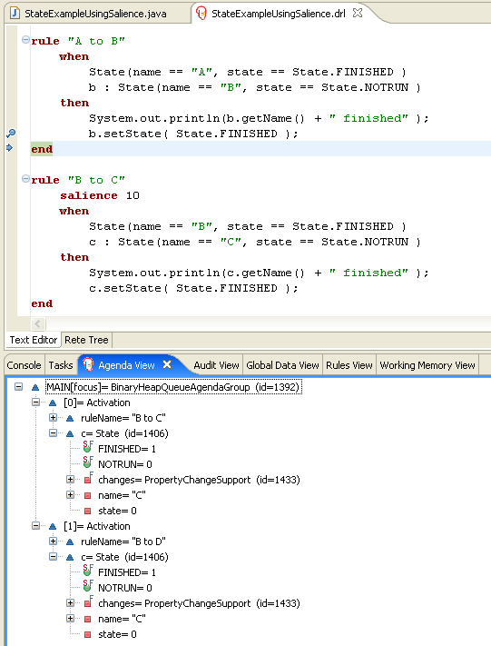
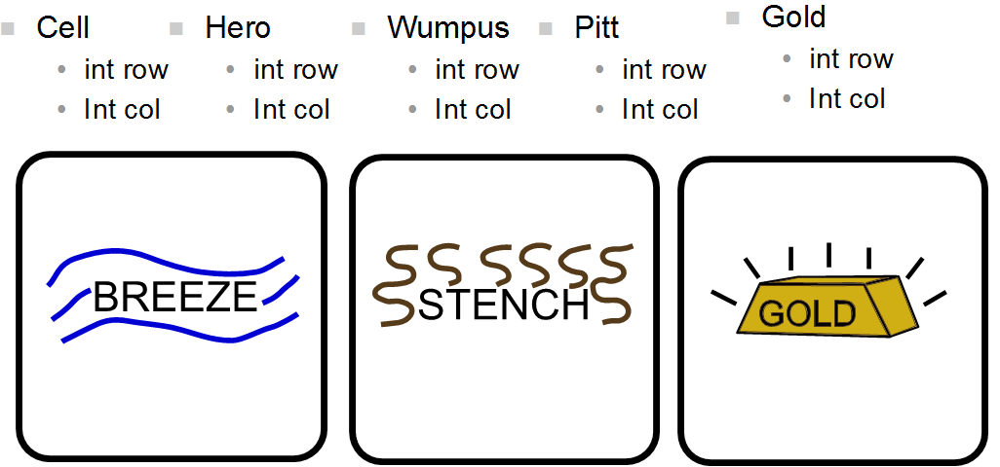
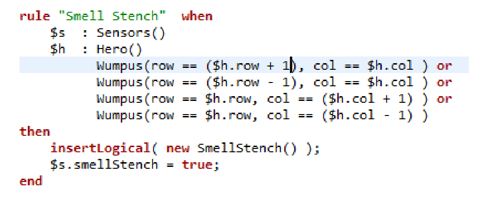

== 例子

=== 获取例子

确保安装了Drools Eclipse插件，该插件需要先安装图形编辑框架（GEF）依赖项。然后下载并提取drools-examples zip文件，其中包含一个已经创建的Eclipse项目。将该项目导入新的Eclipse工作区。规则都有执行规则的示例类。如果您想在另一个项目（或另一个IDE）中尝试这些示例，那么您当然需要手动设置依赖关系。很多，但不是所有的例子都记录在下面，享受！

一些示例需要运行Java 1.6。

===  Hello World

[source,java]
----
Name: Hello World
Main class: org.drools.examples.helloworld.HelloWorldExample
Module: drools-examples
Type: Java application
Rules file: HelloWorld.drl
Objective: demonstrate basic rules in use
----

“Hello World”示例显示了一个使用规则的简单应用程序，使用MVEL和Java方言编写。

这个例子演示了如何创建和使用“KieSession”。此外，显示审计日志记录和调试输出，这是从其他示例中省略，因为它们都非常相似。

以下代码片段显示了如何使用三行代码创建会话。

.例256. HelloWorld：创建KieSession
====
[source,java]
----
    KieServices ks = KieServices.Factory.get();   <1>
    KieContainer kc = ks.getKieClasspathContainer();   <2>
    KieSession ksession = kc.newKieSession("HelloWorldKS");  <3>
----

<1>获得KieServices工厂。 这是应用程序用来与引擎交互的主要界面。

<2>从项目类路径创建一个KieContainer。 这将查找一个 **/META-INF/kmodule.xml** 文件来配置和实例化KieModule到KieContainer中。

<3>根据指定的“HelloWorldKS”会话配置创建一个会话。

====

Drools有一个事件模型，揭示了很多内部发生的事情。 提供了两个默认的调试侦听器：“DebugAgendaEventListener”和“DebugWorkingMemoryEventListener”，它们将调试事件信息输出到控制台窗口中显示的“System.err”流中。 将侦听器添加到Session很简单，如下面的代码片段所示。 “KieRuntimeLogger”提供了执行审计，其结果可以在图形浏览器中查看。 记录器实际上是构建在“Agenda”和“RuleRuntime”监听器上的专用实现。 当引擎完成执行时，必须调用``logger.close（）``。

大多数示例都使用Drools的“审计日志记录”功能记录执行流程以供日后检查。

.HelloWorld：事件记录和审计
[source,java]
----
    // The application can also setup listeners
    ksession.addEventListener( new DebugAgendaEventListener() );
    ksession.addEventListener( new DebugRuleRuntimeEventListener() );

    // To setup a file based audit logger, uncomment the next line
    // KieRuntimeLogger logger = ks.getLoggers().newFileLogger( ksession, "./helloworld" );

    // To setup a ThreadedFileLogger, so that the audit view reflects events whilst debugging,
    // uncomment the next line
    // KieRuntimeLogger logger = ks.getLoggers().newThreadedFileLogger( ksession, "./helloworld", 1000 );
----

这个例子中使用的单个类非常简单。 

它有两个字段：消息，一个“String”和状态，可以是两个整数“HELLO”或“GOODBYE”中的一个。

.HelloWorld例子：Message Class
[source,java]
----
public static class Message {
    public static final int HELLO   = 0;
    public static final int GOODBYE = 1;

    private String          message;
    private int             status;
    ...
}
----

用消息文本“Hello World”和状态“HELLO”创建一个“Message”对象，然后将其插入到引擎中，此时执行fireAllRules（）。

.HelloWorld：执行
[source,java]
----
    // The application can insert facts into the session
    final Message message = new Message();
    message.setMessage( "Hello World" );
    message.setStatus( Message.HELLO );
    ksession.insert( message );

    // and fire the rules
    ksession.fireAllRules();
----

以Java应用程序的形式执行示例：

1. 在Eclipse IDE中打开“org.drools.examples.helloworld.HelloWorldExample”类

2. 右键单击该类，然后选择“run as...”，然后选择“Java应用程序”
如果我们在fireAllRules（）方法中放置一个断点并选择了ksession变量，我们可以看到议程中的“Hello World”规则已经被激活。

.Hello World：fireAllRules日程视图


应用程序打印输出到“System.out”，而调试监听器打印输出到“System.err”。

.控制台窗口中的HelloWorld：System.out
[source,java]
----
Hello World
Goodbye cruel world
----

.HelloWorld: 控制台窗口中的System.err
[source,java]
----
==>[ActivationCreated(0): rule=Hello World;
                   tuple=[fid:1:1:org.drools.examples.helloworld.HelloWorldExample$Message@17cec96]]
[ObjectInserted: handle=[fid:1:1:org.drools.examples.helloworld.HelloWorldExample$Message@17cec96];
                 object=org.drools.examples.helloworld.HelloWorldExample$Message@17cec96]
[BeforeActivationFired: rule=Hello World;
                   tuple=[fid:1:1:org.drools.examples.helloworld.HelloWorldExample$Message@17cec96]]
==>[ActivationCreated(4): rule=Good Bye;
                   tuple=[fid:1:2:org.drools.examples.helloworld.HelloWorldExample$Message@17cec96]]
[ObjectUpdated: handle=[fid:1:2:org.drools.examples.helloworld.HelloWorldExample$Message@17cec96];
                old_object=org.drools.examples.helloworld.HelloWorldExample$Message@17cec96;
                new_object=org.drools.examples.helloworld.HelloWorldExample$Message@17cec96]
[AfterActivationFired(0): rule=Hello World]
[BeforeActivationFired: rule=Good Bye;
                   tuple=[fid:1:2:org.drools.examples.helloworld.HelloWorldExample$Message@17cec96]]
[AfterActivationFired(4): rule=Good Bye]
----

实际的规则在文件__src / main / resources / org / drools / examples / helloworld / HelloWorld.drl__中：

.HelloWorld：规则“Hello World”
[source,java]
----
rule "Hello World"
      dialect "mvel"
  when
      m : Message( status == Message.HELLO, message : message )
  then
      System.out.println( message );
      modify ( m ) { message = "Goodbye cruel world",
                     status = Message.GOODBYE };
end
----

该规则的LHS（在``when``）部分规定，对于插入到状态为“Message.HELLO”的Rule Runtime的每个“Message”对象，它将被激活。除此之外，还创建了两个变量绑定：变量“message”绑定到“message”属性，变量“m”绑定到匹配的“Message”对象本身。

该规则的RHS（在“then”后面）或规则的结果部分是用规则属性“dialect”声明的MVEL表达式语言编写的。在将绑定变量“message”的内容打印到“System.out”后，该规则改变了“Message”对象边界的“message”和“status”属性的值到``m``。这是通过使用MVEL的``modify``语句来完成的，它允许您在一个语句中应用一个赋值块，引擎会在块尾部自动通知变化。

在“修改”调用中，可以在DRL中设置一个断点，并在执行规则结果期间再次检查“日程”视图。这次我们通过“Debug As”和“Drools application”开始执行，而不是运行“Java应用程序”：

1.在Eclipse IDE中打开“org.drools.examples.HelloWorld”类。

2.右键单击该类，然后选择“调试为...”，然后选择“Drools应用程序”。
现在我们可以看到使用Java方言的另一个规则“Good Bye”被激活并放置在议程中。

图379. Hello World：规则“Hello World”议程视图该规则的LHS（在``when``）部分规定，对于插入到状态为“Message.HELLO”的Rule Runtime的每个“Message”对象，它将被激活。除此之外，还创建了两个变量绑定：变量“message”绑定到“message”属性，变量“m”绑定到匹配的“Message”对象本身。

该规则的RHS（在“then”后面）或规则的结果部分是用规则属性“dialect”声明的MVEL表达式语言编写的。在将绑定变量“message”的内容打印到“System.out”后，该规则改变了“Message”对象边界的“message”和“status”属性的值到``m``。这是通过使用MVEL的``modify``语句来完成的，它允许您在一个语句中应用一个赋值块，引擎会在块尾部自动通知变化。

在“修改”调用中，可以在DRL中设置一个断点，并在执行规则结果期间再次检查“日程”视图。这次我们通过“Debug As”和“Drools application”开始执行，而不是运行“Java应用程序”：

1.在Eclipse IDE中打开“org.drools.examples.HelloWorld”类。

2.右键单击该类，然后选择“调试为...”，然后选择“Drools应用程序”。
现在我们可以看到使用Java方言的另一个规则“Good Bye”被激活并放置在议程中。

.Hello World：规则“Hello World”议程视图


指定“java”方言的“Good Bye”规则与“Hello World”规则相似，只是它与状态为“Message.GOODBYE”的“Message”对象相匹配。
例263. HelloWorld：规则“Good Bye”
[source,java]
----
rule "Good Bye"
      dialect "java"
  when
      Message( status == Message.GOODBYE, message : message )
  then
      System.out.println( message );
end
----

实例化KieRuntimeLogger的Java代码创建了一个审计日志文件，可以将其加载到审计视图中。 Audit视图在许多示例中用于演示示例执行流程。 在下面的视图屏幕截图中，我们可以看到该对象被插入，这将创建“Hello World”规则的激活; 然后执行激活，其更新引起“再见”规则激活的“消息”对象; 最后还会执行“再见”规则。 在“审计”视图中选择事件以绿色突出显示原始事件; 因此“激活已创建”事件以绿色突出显示为“激活已执行”事件的来源。

.Hello World：审核视图


=== 状态示例

这个例子实现了两个不同的版本来演示实现相同基本行为的不同方式：前向链接，即引擎根据工作内存中事实的变化，评估，激活和激发规则的能力。

==== Understanding the State Example

[source,java]
----
Name: State Example
Main class: org.drools.examples.state.StateExampleUsingSalience
Module: drools-examples
Type: Java application
Rules file: StateExampleUsingSalience.drl
Objective: Demonstrates basic rule use and Conflict Resolution for rule firing priority.
----

每个“State”类都有其名称和当前状态的字段（参见org.drools.examples.state.State类）。 每个对象的两种可能的状态是：

*“NOTRUN”

*“FINISHED”

.State Class
[source,java]
----
public class State {
    public static final int NOTRUN   = 0;
    public static final int FINISHED = 1;

    private final PropertyChangeSupport changes =
        new PropertyChangeSupport( this );

    private String name;
    private int    state;

    ... setters and getters go here...
}
----

忽略后面将解释的“PropertyChangeSupport”，我们看到创建了四个名为A，B，C和D的“State”对象。最初它们的状态被设置为“NOTRUN”，这是默认的 为使用的构造函数。 每个实例依次被断言为Session，然后调用“fireAllRules（）”。

.显着性状态：执行
[source,java]
----
        final State a = new State( "A" );
        final State b = new State( "B" );
        final State c = new State( "C" );
        final State d = new State( "D" );

        ksession.insert( a );
        ksession.insert( b );
        ksession.insert( c );
        ksession.insert( d );

        ksession.fireAllRules();

        ksession.dispose(); // Stateful rule session must always be disposed when finished
----

要执行该应用程序：

1.在Eclipse IDE中打开“org.drools.examples.state.StateExampleUsingSalience”类。

2.右键单击该类，然后选择“作为...运行”，然后选择“Java应用程序”
您将在Eclipse控制台窗口中看到以下输出：

.突出状态：控制台输出
[source,java]
----
A finished
B finished
C finished
D finished
----

共有四条规则。 首先，“Bootstrap”规则触发，设置A为“FINISHED”状态，然后B使状态改变为“FINISHED”。 C和D都依赖于B，引起一个冲突，这个冲突由显着性值来解决。 让我们看看这个被执行的方式。

了解发生的事情的最好方法是使用审计日志功能以图形方式查看每个操作的结果。 要查看由此示例运行生成的审计日志，请执行以下操作：

1. 如果审核视图不可见，点击“窗口”，然后选择“显示视图”，然后选择“其他...”和“流水”，最后选择“审核视图”。

2. 在“审计视图”中单击“打开日志”按钮并选择文件“<drools-examples-dir>/log/state.log”之后，“审计视图”将如下图所示：

.突出状态示例审计视图


从上到下阅读“审计视图”中的日志，我们看到工作内存中的每个操作和相应的更改。 通过这种方式，我们观察到状态对象A在“NOTRUN”状态中的声明激活了“Bootstrap”规则，而其他“状态”对象的声明没有立即生效。

.突出状态：规则“引导”
[source,java]
----
rule Bootstrap
    when
        a : State(name == "A", state == State.NOTRUN )
    then
        System.out.println(a.getName() + " finished" );
        a.setState( State.FINISHED );
end
----

规则Bootstrap的执行将A的状态改变为“FINISHED”，然后激活规则“A到B”。

.突出状态：规则“A到B”
[source,java]
----
rule "A to B"
    when
        State(name == "A", state == State.FINISHED )
        b : State(name == "B", state == State.NOTRUN )
    then
        System.out.println(b.getName() + " finished" );
        b.setState( State.FINISHED );
end
----

规则“A到B”的执行将B的状态改变为“完成”，这激活了规则“B到C”和“B到D”，将他们的激活放到议程上。 从现在开始，这两条规则可能会触发，因此，它们被认为是“冲突的”。 冲突解决策略允许引擎的议程来决定要触发哪个规则。 由于规则“B到C”具有**更高显着性值**（10对比默认显着值0），所以它首先触发，修改对象C以表示“完成”。 上面显示的审计视图反映了规则“A到B”中“状态”对象的修改，导致两个激活冲突。 议程的观点也可以用来调查议程的状态，调试点放在规则本身，议程观点打开。 下面的屏幕截图显示了规则“A到B”中的断点和具有两个冲突规则的议程的状态。

.状态示例日程视图


.突出状态：规则“B到C”
[source,java]
----
rule "B to C"
        salience 10
    when
        State(name == "B", state == State.FINISHED )
        c : State(name == "C", state == State.NOTRUN )
    then
        System.out.println(c.getName() + " finished" );
        c.setState( State.FINISHED );
end
----

规则“B到D”最后触发，修改对象D到状态“完成”。

.显着性状态：规则“B到D”
[source,java]
----
rule "B to D"
    when
        State(name == "B", state == State.FINISHED )
        d : State(name == "D", state == State.NOTRUN )
    then
        System.out.println(d.getName() + " finished" );
        d.setState( State.FINISHED );
end
----

没有更多的规则可以执行，所以引擎停止。

在这个例子中另一个值得注意的概念是使用基于PropertyChangeListener对象的__dynamic facts__。 如文档中所述，为了让引擎看到事实属性的变化并作出反应，应用程序必须告诉引擎发生了变化。 这可以通过使用“modify”语句在规则中显式地完成，或者通过让引擎知道事实实现由__JavaBeans规范定义的“PropertyChangeSupport”来隐式完成。 这个例子演示了如何使用“PropertyChangeSupport”来避免在规则中需要显式的“修改”语句。 为了使用这个特性，确保你的事实实现了``PropertyChangeSupport``，就像类org.drools.example.State`一样，并且在规则文件中使用下面的代码来配置引擎 听取这些事实的财产变化：

.声明一个动态事实
[source,java]
----
declare type State
    @propertyChangeSupport
end
----

当使用“PropertyChangeListener”对象时，每个设置者必须为通知实现一些额外的代码。 这里是org.drools.examples类中``state`的setter：

.使用PropertyChangeSupport的Setter示例
[source,java]
----
public void setState(final int newState) {
    int oldState = this.state;
    this.state = newState;
    this.changes.firePropertyChange( "state",
                                     oldState,
                                     newState );
}
----

在这个例子中还有另一个类：``StateExampleUsingAgendaGroup``。 它从A到B执行到C到D，如上所述，但是“StateExampleUsingAgendaGroup”使用议程组来控制规则冲突，并且首先触发哪个规则冲突。

议程小组是将议程分成小组和控制哪些小组可以执行的一种方式。 默认情况下，所有规则都在议程组“MAIN”中。 “议程组”属性可让您为规则指定不同的议程组。 最初，工作记忆的重点是议程组“主要”。 小组的规则只有在小组获得焦点时才会触发。 这可以通过``setFocus（）``或规则属性``auto-focus``实现。 “自动对焦”是指规则匹配并激活时，规则自动将焦点设置到其议程组。 这是“自动对焦”，使“B到C”规则在“B到D”之前开始。

.议程组状态例子：规则“B到C”
[source,java]
----
rule "B to C"
      agenda-group "B to C"
      auto-focus true
  when
      State(name == "B", state == State.FINISHED )
      c : State(name == "C", state == State.NOTRUN )
  then
      System.out.println(c.getName() + " finished" );
      c.setState( State.FINISHED );
      kcontext.getKnowledgeRuntime().getAgenda().getAgendaGroup( "B to D" ).setFocus();
end
----

规则“B到C”在议程组“B到D”上调用“setFocus（）”，允许激活规则，允许规则“B到D”触发。

.议程组状态例子：规则“B到D”
[source,java]
----
rule "B to D"
      agenda-group "B to D"
  when
      State(name == "B", state == State.FINISHED )
      d : State(name == "D", state == State.NOTRUN )
  then
      System.out.println(d.getName() + " finished" );
      d.setState( State.FINISHED );
end
----

=== 斐波那契的例子

[source,java]
----
Name: Fibonacci
Main class: org.drools.examples.fibonacci.FibonacciExample
Module: drools-examples
Type: Java application
Rules file: Fibonacci.drl
Objective: Demonstrates Recursion,
  the CE not and cross product matching
----

由比萨的莱昂纳多发现的斐波纳契数（参见http://en.wikipedia.org/wiki/Fibonacci_number[html：en.wikipedia.org/wiki/Fibonacci_number]）（参见http://en.wikipedia.org /wiki/Fibonacci[http://en.wikipedia.org/wiki/Fibonacci]）是一个以0和1开始的序列。下一个斐波那契数是通过加上两个前面的斐波那契数得到的。 斐波纳契数列以0,1,1,2,3,5,8,13,21,34,55,89,144,233,377,610,987,1597,2584,4181,6765,10946 ... 斐波那契示例演示递归和冲突解决与显着性值。

在这个例子中使用了单一事实类“斐波那契”。 它有两个字段，顺序和值。 序列字段用于指示斐波纳契数列中对象的位置。 值字段显示该序列位置的斐波那契对象的值，使用-1表示仍需要计算的值。

.斐波那契类
[source,java]
----
public static class Fibonacci {
    private int  sequence;
    private long value;

    public Fibonacci( final int sequence ) {
        this.sequence = sequence;
        this.value = -1;
    }

    ... setters and getters go here...
}
----

执行示例：

1. 在Eclipse IDE中打开“org.drools.examples.fibonacci.FibonacciExample”类。

2. 右键单击该类，然后选择“作为...运行”，然后选择“Java应用程序”
Eclipse在其控制台窗口中显示以下输出（“... snip ...”表示为了节省空间而删除的行）：

.Fibonacci例子：控制台输出
[source,java]
----
recurse for 50
recurse for 49
recurse for 48
recurse for 47
...snip...
recurse for 5
recurse for 4
recurse for 3
recurse for 2
1 == 1
2 == 1
3 == 2
4 == 3
5 == 5
6 == 8
...snip...
47 == 2971215073
48 == 4807526976
49 == 7778742049
50 == 12586269025
----

为了从Java中解决这个问题，我们只插入一个Fibonacci对象，序列字段为50，然后使用递归规则插入其他49个“斐波那契”对象。 这个例子不使用“PropertyChangeSupport”。 它使用MVEL方言，这意味着我们可以使用“修改”关键字，它允许一个块设置器动作，它也通知引擎的变化。

.Fibonacci例子：执行
[source,java]
----
ksession.insert( new Fibonacci( 50 ) );
ksession.fireAllRules();
----

规则递归非常简单。 它将每个断言的“斐波那契”对象与值-1相匹配，创建并断言一个新的“斐波那契”对象，其序列小于当前匹配的对象。 每次添加Fibonacci对象，而序列字段等于1的对象不存在时，规则将重新匹配并再次触发。 一旦我们在内存中有50个Fibonacci对象，就使用``not``条件元素来停止规则的匹配。 该规则也有一个显着的价值，因为我们需要在执行Bootstrap规则之前拥有所有50个“Fibonacci”对象。

.Fibonacci例子：Rule“Recurse”
[source,java]
----
rule Recurse
    salience 10
    when
        f : Fibonacci ( value == -1 )
        not ( Fibonacci ( sequence == 1 ) )
    then
        insert( new Fibonacci( f.sequence - 1 ) );
        System.out.println( "recurse for " + f.sequence );
end
----

审计视图显示了由Java代码完成的序列字段为50的“斐波那契”对象的原始断言。 审计视图显示规则的连续递归，每个断言的“Fibonacci”对象导致Recurse规则被激活并再次触发。

.Fibonacci示例：“递归”审计视图1


当一个序列字段为2的“Fibonacci”对象被声明时，“Bootstrap”规则会与“Recurse”规则一起被匹配和激活。 请注意字段“sequence”上的多重限制，测试是否与1或2相等。

.Fibonacci例子：规则“Bootstrap”
[source,java]
----
rule Bootstrap
    when
        f : Fibonacci( sequence == 1 || == 2, value == -1 ) // multi-restriction
    then
        modify ( f ){ value = 1 };
        System.out.println( f.sequence + " == " + f.value );
end
----

在这一点上，议程看起来如下所示。 然而，“Bootstrap”规则不会触发，因为“Recurse”规则具有更高的显着性。

.Fibonacci示例：“递归”议程视图1


当一个序列为1的Fibonacci对象被声明时，Bootstrap规则再次匹配，导致两条规则的激活。 请注意，“Recurse”规则不匹配和激活，因为只要存在序列为1的“Fibonacci”对象，“not”条件元素就会停止规则的匹配。

.斐波纳契示例：“递归”议程视图2


一旦我们有两个“斐波那契”对象的值不等于-1，“计算”规则就可以匹配。这是“Bootstrap”规则，将序列1和2的对象设置为值1.此时在工作存储器中有50个斐波那契对象。现在我们需要选择一个合适的三元组来依次计算它们的每个值。在没有场限制的情况下使用三个斐波纳契模式限制可能的交叉产品将导致50x49x48的可能组合，导致约125,000个可能的规则发射，其中大部分是不正确的。 “计算”规则使用字段约束以正确的顺序正确约束斐波纳契模式;这种技术被称为__cross产品匹配___。第一个模式找到任意一个值为！= -1的斐波那契，并绑定模式和字段。第二个斐波那契也是这样做的，但是它增加了一个额外的字段约束，以确保它的序列大于绑定到“f1”的斐波那契数。当这个规则第一次触发时，我们知道只有序列1和序列2的值为1，这两个约束确保了序列1和序列2的引用序列2引用序列2。斐波纳契的值等于-1，序列大于“f2”。在这一点上，我们有三个从可用交叉积中正确选择的“斐波那契”对象，我们可以计算出绑定到“f3”的第三个“斐波那契”对象的值。

.斐波纳契例子：规则“计算”
[source,java]
----
rule Calculate
    when
        // Bind f1 and s1
        f1 : Fibonacci( s1 : sequence, value != -1 )
        // Bind f2 and v2; refer to bound variable s1
        f2 : Fibonacci( sequence == (s1 + 1), v2 : value != -1 )
        // Bind f3 and s3; alternative reference of f2.sequence
        f3 : Fibonacci( s3 : sequence == (f2.sequence + 1 ), value == -1 )
    then
        // Note the various referencing techniques.
        modify ( f3 ) { value = f1.value + v2 };
        System.out.println( s3 + " == " + f3.value );
end
----

``modify``语句更新了绑定到``f3``的``Fibonacci``对象的值。 这意味着我们现在有另一个新的斐波纳契对象，其值不等于-1，这允许“计算”规则重新匹配并计算下一个斐波纳契数。 下面的Audit视图显示了如何触发最后一个“Bootstrap”修改“Fibonacci”对象，使“计算”规则匹配，然后修改另一个允许“计算”规则再次匹配的斐波纳契对象。 这个过程一直持续到所有Fibonacci对象的值被设置为止。

.斐波那契示例：“Bootstrap”审计视图


=== 银行教程

[source,java]
----
Name: BankingTutorial
Main class: org.drools.examples.banking.BankingExamplesApp.java
Module: drools-examples
Type: Java application
Rules file: org.drools.examples.banking.*.drl
Objective: Demonstrate pattern matching, basic sorting and calculation rules.
----

本教程演示了开发完整的个人银行应用程序以处理多个账户中的贷方和借记的过程。 它使用一组为设计过程创建的设计模式。

RuleRunner类是一个简单的工具，用来对一组数据执行一个或多个DRL文件。 它编译软件包并为每个执行创建知识库，使我们能够轻松执行每个场景并检查输出。 事实上，对于一个只需构建一次知识库并进行缓存的生产系统来说，这并不是一个好的解决方案，但对于本教程来说，这应该就足够了。

.银行教程：RuleRunner
[source,java]
----
public class RuleRunner {

    public RuleRunner() {
    }

    public void runRules(String[] rules,
                         Object[] facts) throws Exception {

        KnowledgeBase kbase = KnowledgeBaseFactory.newKnowledgeBase();
        KnowledgeBuilder kbuilder = KnowledgeBuilderFactory.newKnowledgeBuilder();

        for ( int i = 0; i < rules.length; i++ ) {
            String ruleFile = rules[i];
            System.out.println( "Loading file: " + ruleFile );
            kbuilder.add( ResourceFactory.newClassPathResource( ruleFile,
                                                                RuleRunner.class ),
                          ResourceType.DRL );
        }

        Collection<KnowledgePackage> pkgs = kbuilder.getKnowledgePackages();
        kbase.addKnowledgePackages( pkgs );
        StatefulKnowledgeSession ksession = kbase.newStatefulKnowledgeSession();

        for ( int i = 0; i < facts.length; i++ ) {
            Object fact = facts[i];
            System.out.println( "Inserting fact: " + fact );
            ksession.insert( fact );
        }

        ksession.fireAllRules();
    }
}
----

我们的第一个示例Java类加载并执行单个DRL文件__Example.drl__，但不插入任何数据。

.银行教程：Java例子1
[source,java]
----
public class Example1 {
    public static void main(String[] args) throws Exception {
        new RuleRunner().runRules( new String[] { "Example1.drl" },
                                   new Object[0] );
    }
}
----

执行的第一个简单规则有一个总是为真的单个“eval”条件，所以这个规则将在启动之后匹配并触发一次。

.Banking教程：Example1.drl中的规则
[source,java]
----
rule "Rule 01"
    when
        eval( 1==1 )
    then
        System.out.println( "Rule 01 Works" );
end
----

规则的输出如下，显示规则匹配并执行单个打印语句。

.银行教程：Example1.java的输出
[source,java]
----
Loading file: Example1.drl
Rule 01 Works
----

下一步是提出一些简单的事实并将其打印出来。

.银行教程：Java Example2
[source,java]
----
public class Example2 {
    public static void main(String[] args) throws Exception {
        Number[] numbers = new Number[] {wrap(3), wrap(1), wrap(4), wrap(1), wrap(5)};
        new RuleRunner().runRules( new String[] { "Example2.drl" },
                                   numbers );
    }

    private static Integer wrap( int i ) {
        return new Integer(i);
    }
}
----

这不使用任何特定的事实，而是声明一组java.lang.Integer对象。 这不被认为是“最佳实践”，因为一个数字不是一个有用的事实，但我们在这里使用它来演示添加更多复杂性之前的基本技术。

现在我们将创建一个简单的规则来打印出这些数字。

.银行教程：Example2.drl中的规则
[source,java]
----
rule "Rule 02"
    when
        Number( $intValue : intValue )
    then
        System.out.println( "Number found with value: " + $intValue );
end
----

这个规则再一次没有什么特别之处。 它识别任何“Number”对象的事实并打印出这些值。 注意抽象类“Number”的使用：我们插入了“Integer”对象，但是我们现在寻找任何类型的数字。 模式匹配引擎能够匹配声明对象的接口和超类。

输出显示正在加载DRL，事实插入，然后匹配和解雇规则。 我们可以看到每个插入的数字都是匹配的，并被打印出来。

.银行教程：Example2.java的输出
[source,java]
----
Loading file: Example2.drl
Inserting fact: 3
Inserting fact: 1
Inserting fact: 4
Inserting fact: 1
Inserting fact: 5
Number found with value: 5
Number found with value: 1
Number found with value: 4
Number found with value: 1
Number found with value: 3
----

当然，有许多更好的方式来对数字进行排序，而不是使用规则，但是因为当我们开始查看银行业务规则时，我们将需要按日期顺序应用一些现金流，我们将开发简单的基于规则的排序技术。

.银行教程：Example3.java
[source,java]
----
public class Example3 {
    public static void main(String[] args) throws Exception {
        Number[] numbers = new Number[] {wrap(3), wrap(1), wrap(4), wrap(1), wrap(5)};
        new RuleRunner().runRules( new String[] { "Example3.drl" },
                                   numbers );
    }

    private static Integer wrap(int i) {
        return new Integer(i);
    }
}
----

我们再一次插入我们的Integer对象，但这次规则稍有不同：

.银行教程：Example3.drl中的规则
[source,java]
----
rule "Rule 03"
    when
        $number : Number( )
        not Number( intValue < $number.intValue )
    then
        System.out.println("Number found with value: " + $number.intValue() );
        retract( $number );
end
----

规则的第一行标识一个“Number”，并提取该值。 第二行确保不存在比第一个模式找到的更小的数字。 我们可能期望只匹配一个数字 - 在集合中最小的一个。 但是，打印后的数字缩回意味着最小的数字已被删除，显示次数最少的数字，依此类推。

结果输出显示数字现在按数字排序。

.Banking教程：Example3.java的输出
[source,java]
----
Loading file: Example3.drl
Inserting fact: 3
Inserting fact: 1
Inserting fact: 4
Inserting fact: 1
Inserting fact: 5
Number found with value: 1
Number found with value: 1
Number found with value: 3
Number found with value: 4
Number found with value: 5
----

我们准备开始走向个人会计规则。 第一步是创建一个“Cashflow”对象。

.银行教程：类现金流
[source,java]
----
public class Cashflow {
    private Date   date;
    private double amount;

    public Cashflow() {
    }

    public Cashflow(Date date, double amount) {
        this.date = date;
        this.amount = amount;
    }

    public Date getDate() {
        return date;
    }

    public void setDate(Date date) {
        this.date = date;
    }

    public double getAmount() {
        return amount;
    }

    public void setAmount(double amount) {
        this.amount = amount;
    }

    public String toString() {
        return "Cashflow[date=" + date + ",amount=" + amount + "]";
    }
}
----

“Cashflow”类有两个简单的属性，一个日期和一个金额。 （请注意，对货币单位使用``double``通常是__not__是一个好主意，因为浮点数不能准确表示大多数数字。）还有一个重载的构造函数来设置值，还有一个方法``toString`` 打印现金流。 __Example4.java__的Java代码插入五个现金流对象，具有不同的日期和金额。

.银行教程：Example4.java
[source,java]
----
public class Example4 {
    public static void main(String[] args) throws Exception {
        Object[] cashflows = {
            new Cashflow(new SimpleDate("01/01/2007"), 300.00),
            new Cashflow(new SimpleDate("05/01/2007"), 100.00),
            new Cashflow(new SimpleDate("11/01/2007"), 500.00),
            new Cashflow(new SimpleDate("07/01/2007"), 800.00),
            new Cashflow(new SimpleDate("02/01/2007"), 400.00),
        };

        new RuleRunner().runRules( new String[] { "Example4.drl" },
                                   cashflows );
    }
}
----

The convenience class ``SimpleDate`` extends ``java.util.Date``, providing a constructor taking a String as input and defining a date format. The code is listed below
Example 293. Banking Tutorial: Class SimpleDate
[source,java]
----
public class SimpleDate extends Date {
    private static final SimpleDateFormat format = new SimpleDateFormat("dd/MM/yyyy");

    public SimpleDate(String datestr) throws Exception {
        setTime(format.parse(datestr).getTime());
    }
}
----

现在，我们来看看__Example4.drl__，看看我们如何打印排序的“Cashflow”对象：

.银行教程：Example4.drl中的规则
[source,java]
----
rule "Rule 04"
    when
        $cashflow : Cashflow( $date : date, $amount : amount )
        not Cashflow( date < $date)
    then
        System.out.println("Cashflow: "+$date+" :: "+$amount);
        retract($cashflow);
end
----

在这里，我们确定一个“现金流量”并提取日期和金额。 在该规则的第二行中，我们确保没有比发现的现金流更早的日期。 结果，我们打印满足规则的“现金流量”，然后收回，为下一个最早的“现金流量”做准备。 所以，我们产生的输出是：

.银行教程：Example4.java的输出
[source,java]
----
Loading file: Example4.drl
Inserting fact: Cashflow[date=Mon Jan 01 00:00:00 GMT 2007,amount=300.0]
Inserting fact: Cashflow[date=Fri Jan 05 00:00:00 GMT 2007,amount=100.0]
Inserting fact: Cashflow[date=Thu Jan 11 00:00:00 GMT 2007,amount=500.0]
Inserting fact: Cashflow[date=Sun Jan 07 00:00:00 GMT 2007,amount=800.0]
Inserting fact: Cashflow[date=Tue Jan 02 00:00:00 GMT 2007,amount=400.0]
Cashflow: Mon Jan 01 00:00:00 GMT 2007 :: 300.0
Cashflow: Tue Jan 02 00:00:00 GMT 2007 :: 400.0
Cashflow: Fri Jan 05 00:00:00 GMT 2007 :: 100.0
Cashflow: Sun Jan 07 00:00:00 GMT 2007 :: 800.0
Cashflow: Thu Jan 11 00:00:00 GMT 2007 :: 500.0
----

接下来，我们扩展我们的“现金流量”，产生一个可以是信用或借方操作的“TypedCashflow”。 （通常情况下，我们只是将这个添加到“Cashflow”类型中，但是我们使用扩展来保持类的前一个版本不变）。

.Banking教程：Class TypedCashflow
[source,java]
----
public class TypedCashflow extends Cashflow {
    public static final int CREDIT = 0;
    public static final int DEBIT  = 1;

    private int             type;

    public TypedCashflow() {
    }

    public TypedCashflow(Date date, int type, double amount) {
        super( date, amount );
        this.type = type;
    }

    public int getType() {
        return type;
    }

    public void setType(int type) {
        this.type = type;
    }

    public String toString() {
        return "TypedCashflow[date=" + getDate() +
               ",type=" + (type == CREDIT ? "Credit" : "Debit") +
               ",amount=" + getAmount() + "]";
    }
}
----

有很多方法可以改善这个代码，但是为了这个例子，这个可以。

现在我们来创建Example5，这是一个运行我们的代码的类。

.银行教程：Example5.java
[source,java]
----
public class Example5 {
    public static void main(String[] args) throws Exception {
        Object[] cashflows = {
            new TypedCashflow(new SimpleDate("01/01/2007"),
                              TypedCashflow.CREDIT, 300.00),
            new TypedCashflow(new SimpleDate("05/01/2007"),
                              TypedCashflow.CREDIT, 100.00),
            new TypedCashflow(new SimpleDate("11/01/2007"),
                              TypedCashflow.CREDIT, 500.00),
            new TypedCashflow(new SimpleDate("07/01/2007"),
                              TypedCashflow.DEBIT, 800.00),
            new TypedCashflow(new SimpleDate("02/01/2007"),
                              TypedCashflow.DEBIT, 400.00),
        };

        new RuleRunner().runRules( new String[] { "Example5.drl" },
                                   cashflows );
    }
}
----

在这里，我们简单地创建一组“Cashflow”对象，它们是信用卡或借记卡业务。 我们将它们和__Example5.drl__提供给RuleEngine。

现在，我们来看一个打印排序的“Cashflow”对象的规则。

.银行教程：Example5.drl中的规则
[source,java]
----
rule "Rule 05"
    when
        $cashflow : TypedCashflow( $date : date,
                                   $amount : amount,
                                   type == TypedCashflow.CREDIT )
        not TypedCashflow( date < $date,
                           type == TypedCashflow.CREDIT )
    then
        System.out.println("Credit: "+$date+" :: "+$amount);
        retract($cashflow);
end
----

在这里，我们用“CREDIT”类型标识一个“Cashflow”事实并提取日期和金额。 在该规则的第二行中，我们确保不存在相同类型的“现金流量”，并且具有比找到的更早的日期。 结果是，我们打印满足模式的现金流，然后将其收回，为下一个最早的“CREDIT”类型的现金流提供路径。

所以，我们产生的输出是

.银行教程：Example5.java的输出
[source,java]
----
Loading file: Example5.drl
Inserting fact: TypedCashflow[date=Mon Jan 01 00:00:00 GMT 2007,type=Credit,amount=300.0]
Inserting fact: TypedCashflow[date=Fri Jan 05 00:00:00 GMT 2007,type=Credit,amount=100.0]
Inserting fact: TypedCashflow[date=Thu Jan 11 00:00:00 GMT 2007,type=Credit,amount=500.0]
Inserting fact: TypedCashflow[date=Sun Jan 07 00:00:00 GMT 2007,type=Debit,amount=800.0]
Inserting fact: TypedCashflow[date=Tue Jan 02 00:00:00 GMT 2007,type=Debit,amount=400.0]
Credit: Mon Jan 01 00:00:00 GMT 2007 :: 300.0
Credit: Fri Jan 05 00:00:00 GMT 2007 :: 100.0
Credit: Thu Jan 11 00:00:00 GMT 2007 :: 500.0
----

继续我们的银行业务，我们现在要在两个银行账户上处理贷方和借方，计算账户余额。 为了做到这一点，我们创建了两个独立的``Account``对象，并在将它们传递给Rule Engine之前将它们注入到``Cashflows``对象中。 这样做的原因是提供方便的访问正确的帐户，而不必诉诸辅助类。 先来看看“Account”类。 这是一个带有帐号和余额的简单Java对象：

.银行教程：账户class
[source,java]
----
public class Account {
    private long   accountNo;
    private double balance = 0;

    public Account() {
    }

    public Account(long accountNo) {
        this.accountNo = accountNo;
    }

    public long getAccountNo() {
        return accountNo;
    }

    public void setAccountNo(long accountNo) {
        this.accountNo = accountNo;
    }

    public double getBalance() {
        return balance;
    }

    public void setBalance(double balance) {
        this.balance = balance;
    }

    public String toString() {
        return "Account[" + "accountNo=" + accountNo + ",balance=" + balance + "]";
    }
}
----

现在让我们来扩展我们的TypedCashflow，得到AllocatedCashflow来包含一个Account参考。

.Banking教程：Class AllocatedCashflow
[source,java]
----
public class AllocatedCashflow extends TypedCashflow {
    private Account account;

    public AllocatedCashflow() {
    }

    public AllocatedCashflow(Account account, Date date, int type, double amount) {
        super( date, type, amount );
        this.account = account;
    }

    public Account getAccount() {
        return account;
    }

    public void setAccount(Account account) {
        this.account = account;
    }

    public String toString() {
        return "AllocatedCashflow[" +
               "account=" + account +
               ",date=" + getDate() +
               ",type=" + (getType() == CREDIT ? "Credit" : "Debit") +
               ",amount=" + getAmount() + "]";
    }
}
----

__Example5.java__的Java代码创建了两个“Account”对象，并在构造函数调用中将其中的一个传递给每个现金流。

.银行教程：Example5.java
[source,java]
----
public class Example6 {
    public static void main(String[] args) throws Exception {
        Account acc1 = new Account(1);
        Account acc2 = new Account(2);

        Object[] cashflows = {
            new AllocatedCashflow(acc1,new SimpleDate("01/01/2007"),
                                  TypedCashflow.CREDIT, 300.00),
            new AllocatedCashflow(acc1,new SimpleDate("05/02/2007"),
                                  TypedCashflow.CREDIT, 100.00),
            new AllocatedCashflow(acc2,new SimpleDate("11/03/2007"),
                                  TypedCashflow.CREDIT, 500.00),
            new AllocatedCashflow(acc1,new SimpleDate("07/02/2007"),
                                  TypedCashflow.DEBIT,  800.00),
            new AllocatedCashflow(acc2,new SimpleDate("02/03/2007"),
                                  TypedCashflow.DEBIT,  400.00),
            new AllocatedCashflow(acc1,new SimpleDate("01/04/2007"),
                                  TypedCashflow.CREDIT, 200.00),
            new AllocatedCashflow(acc1,new SimpleDate("05/04/2007"),
                                  TypedCashflow.CREDIT, 300.00),
            new AllocatedCashflow(acc2,new SimpleDate("11/05/2007"),
                                  TypedCashflow.CREDIT, 700.00),
            new AllocatedCashflow(acc1,new SimpleDate("07/05/2007"),
                                  TypedCashflow.DEBIT,  900.00),
            new AllocatedCashflow(acc2,new SimpleDate("02/05/2007"),
                                  TypedCashflow.DEBIT,  100.00)
        };

        new RuleRunner().runRules( new String[] { "Example6.drl" },
                                   cashflows );
    }
}
----

现在，我们来看看__Example6.drl__中的规则，以了解我们如何按日期顺序应用每个现金流并计算和打印余额。

.Banking教程：Example6.drl中的规则
[source,java]
----
rule "Rule 06 - Credit"
    when
        $cashflow : AllocatedCashflow( $account : account,
                                       $date : date,
                                       $amount : amount,
                                       type == TypedCashflow.CREDIT )
        not AllocatedCashflow( account == $account, date < $date)
    then
        System.out.println("Credit: " + $date + " :: " + $amount);
        $account.setBalance($account.getBalance()+$amount);
        System.out.println("Account: " + $account.getAccountNo() +
                           " - new balance: " + $account.getBalance());
        retract($cashflow);
end

rule "Rule 06 - Debit"
    when
        $cashflow : AllocatedCashflow( $account : account,
                            $date : date,
                            $amount : amount,
                            type == TypedCashflow.DEBIT )
        not AllocatedCashflow( account == $account, date < $date)
    then
        System.out.println("Debit: " + $date + " :: " + $amount);
        $account.setBalance($account.getBalance() - $amount);
        System.out.println("Account: " + $account.getAccountNo() +
                           " - new balance: " + $account.getBalance());
        retract($cashflow);
end
----

虽然我们有单独的信贷和借记规则，但是我们在检查早期现金流量时没有指定类型。 这是为了使所有现金流量按日期顺序应用，而不管现金流类型。 在这种情况下，我们确定要使用的账户，并在后果中用现金流量进行更新。

.Banking教程：Example6.java的输出
[source,java]
----
Loading file: Example6.drl
Inserting fact: AllocatedCashflow[account=Account[accountNo=1,balance=0.0],date=Mon Jan 01 00:00:00 GMT 2007,type=Credit,amount=300.0]
Inserting fact: AllocatedCashflow[account=Account[accountNo=1,balance=0.0],date=Mon Feb 05 00:00:00 GMT 2007,type=Credit,amount=100.0]
Inserting fact: AllocatedCashflow[account=Account[accountNo=2,balance=0.0],date=Sun Mar 11 00:00:00 GMT 2007,type=Credit,amount=500.0]
Inserting fact: AllocatedCashflow[account=Account[accountNo=1,balance=0.0],date=Wed Feb 07 00:00:00 GMT 2007,type=Debit,amount=800.0]
Inserting fact: AllocatedCashflow[account=Account[accountNo=2,balance=0.0],date=Fri Mar 02 00:00:00 GMT 2007,type=Debit,amount=400.0]
Inserting fact: AllocatedCashflow[account=Account[accountNo=1,balance=0.0],date=Sun Apr 01 00:00:00 BST 2007,type=Credit,amount=200.0]
Inserting fact: AllocatedCashflow[account=Account[accountNo=1,balance=0.0],date=Thu Apr 05 00:00:00 BST 2007,type=Credit,amount=300.0]
Inserting fact: AllocatedCashflow[account=Account[accountNo=2,balance=0.0],date=Fri May 11 00:00:00 BST 2007,type=Credit,amount=700.0]
Inserting fact: AllocatedCashflow[account=Account[accountNo=1,balance=0.0],date=Mon May 07 00:00:00 BST 2007,type=Debit,amount=900.0]
Inserting fact: AllocatedCashflow[account=Account[accountNo=2,balance=0.0],date=Wed May 02 00:00:00 BST 2007,type=Debit,amount=100.0]
Debit: Fri Mar 02 00:00:00 GMT 2007 :: 400.0
Account: 2 - new balance: -400.0
Credit: Sun Mar 11 00:00:00 GMT 2007 :: 500.0
Account: 2 - new balance: 100.0
Debit: Wed May 02 00:00:00 BST 2007 :: 100.0
Account: 2 - new balance: 0.0
Credit: Fri May 11 00:00:00 BST 2007 :: 700.0
Account: 2 - new balance: 700.0
Credit: Mon Jan 01 00:00:00 GMT 2007 :: 300.0
Account: 1 - new balance: 300.0
Credit: Mon Feb 05 00:00:00 GMT 2007 :: 100.0
Account: 1 - new balance: 400.0
Debit: Wed Feb 07 00:00:00 GMT 2007 :: 800.0
Account: 1 - new balance: -400.0
Credit: Sun Apr 01 00:00:00 BST 2007 :: 200.0
Account: 1 - new balance: -200.0
Credit: Thu Apr 05 00:00:00 BST 2007 :: 300.0
Account: 1 - new balance: 100.0
Debit: Mon May 07 00:00:00 BST 2007 :: 900.0
Account: 1 - new balance: -800.0
----

=== 定价规则决策表示例

定价规则决策表演示了在电子表格中使用Excel的XLS格式的决策表来计算保险单的零售成本。 提供规则集的目的是计算申请特定政策的汽车司机的基本价格和折扣。 司机的年龄，历史和政策类型都对基本保费有所贡献，而另外一些规则则以折扣百分比来处理。

[source,java]
----
Name: Example Policy Pricing
Main class: org.drools.examples.decisiontable.PricingRuleDTExample
Module: drools-examples
Type: Java application
Rules file: ExamplePolicyPricing.xls
Objective: demonstrate spreadsheet-based decision tables.
----

==== Executing the example

打开文件__PricingRuleDTExample.java__并将其作为Java应用程序执行。 它应该在控制台窗口中产生以下输出：

[source,java]
----
Cheapest possible
BASE PRICE IS: 120
DISCOUNT IS: 20
----

执行示例的代码遵循通常的模式。 加载规则，插入事实并创建无状态会话。 有什么不同是如何添加规则。

[source,java]
----
DecisionTableConfiguration dtableconfiguration =
    KnowledgeBuilderFactory.newDecisionTableConfiguration();
        dtableconfiguration.setInputType( DecisionTableInputType.XLS );

        KnowledgeBuilder kbuilder = KnowledgeBuilderFactory.newKnowledgeBuilder();

        Resource xlsRes = ResourceFactory.newClassPathResource( "ExamplePolicyPricing.xls",
                                                                getClass() );
        kbuilder.add( xlsRes,
                      ResourceType.DTABLE,
                      dtableconfiguration );
----

请注意使用“DecisionTableConfiguration”对象。 其输入类型设置为“DecisionTableInputType.XLS”。 如果你使用BRMS，这一切当然是照顾你的。

在这个例子中有两个事实类型，``Driver``和``Policy``。 两者都使用它们的默认值。 “驾驶员”已有30年的历史，没有事先声明，目前的风险状况为“低”。 申请的“政策”是“COMPREHENSIVE”，尚未获得批准。

==== The decision table

在这个决策表中，每一行都是一个规则，每一列都是一个条件或一个动作。

.决策表配置


参照上面的电子表格显示，我们有`RuleSet`声明，它提供了包名。在这里还有其他可选的项目，比如用于全局变量的“Variables”，用于导入类的“Imports”。在这种情况下，规则的命名空间与我们使用的事实类相同，所以我们可以忽略它。

再往下看，我们可以看到“RuleTable”声明。此后的名称（定价范围）用作所有生成的规则的前缀。在此之下，我们有“条件或行动”，表明这一栏的目的，即它是否构成条件的一部分或者是否会产生规则的结果。

你可以看到有一个驱动程序，他的数据跨越三个单元格，这意味着它下面的模板表达式适用于这个事实。我们观察驾驶员的年龄范围（使用“$ 1”和“$ 2”，逗号分隔值），“locationRiskProfile”和“PriorClaims”。在行动栏中，我们设定政策底价并记录消息。

.基础价格计算


在前面的电子表格部分中，有宽广的类别括号，由最左列中的注释表示。因为我们知道司机的细节和他们的政策，所以我们可以说（有点想法），他们应该匹配第18行，因为他们没有事故发生，而且是30岁。这给了我们120的底价。

.折扣计算


以上部分包含我们可能授予我们的驱动程序的折扣条件。 “年龄”方括号中的折扣结果，之前索赔的数量和政策类型。 在我们的案例中，司机是30，没有任何先前的要求，并正在申请一个“综合”的政策，这意味着我们可以给20％的折扣。 请注意，这实际上是一个单独的表，但在同一个工作表中，以便应用不同的模板。

决策表生成规则很重要。 这意味着他们不是简单的自上而下的逻辑，而是更多的一种手段来捕捉数据导致的规则。 这是一个细微的差别，迷惑了一些人。 规则的评估不一定按给定的顺序，因为规则引擎的所有正常机制仍然适用。

=== 宠物店例子

[source,java]
----
Name: Pet Store
Main class: org.drools.examples.petstore.PetStoreExample
Module: drools-examples
Type: Java application
Rules file: PetStore.drl
Objective: Demonstrate use of Agenda Groups, Global Variables and integration with a GUI,
including callbacks from within the rules
----

Pet Store示例显示了如何将规则与GUI集成在一起，在这种情况下是基于Swing的桌面应用程序。在规则文件中，它演示了如何使用议程组和自动对焦来控制允许在任何给定时间触发一组规则中的哪一个。它还说明了规则中Java和MVEL方言的混合，累积函数的使用以及从规则集中调用Java函数的方式。

所有的Java代码都包含在一个文件__PetStore.java__中，定义了以下主要类（除了几个类来处理Swing事件）：

* ·`Petstore``包含我们很快会看到的``main（）``方法。

* “PetStoreUI”负责创建和显示基于Swing的GUI。它包含几个较小的类，主要用于响应各种GUI事件，例如鼠标按钮点击。

* TableModel保存表数据。把它看作是扩展了Swing类``AbstractTableModel``的JavaBean。

* CheckoutCallback允许GUI与规则交互。

* Ordershow可以保留我们想要购买的物品。

* ``采购`存储订单和我们正在购买的产品的细节。

* ``Product``是一个JavaBean，它提供了可供购买的产品的细节和价格。
大部分Java代码是纯JavaBeans或基于Swing的。本节仅讨论Swing相关的几个要点，但是有关Swing组件的很好的教程可以在Sun的Swing网站http://java.sun.com/docs/books/tutorial/uiswing/[http ：//java.sun.com/docs/books/tutorial/uiswing/]。

下面显示了与规则和事实相关的__Petstore.java__中的Java代码段。

.在PetStore.main中创建PetStore KieContainer
[source,java]
----
// KieServices is the factory for all KIE services
KieServices ks = KieServices.Factory.get();

// From the kie services, a container is created from the classpath
KieContainer kc = ks.getKieClasspathContainer();

// Create the stock.
Vector<Product> stock = new Vector<Product>();
stock.add( new Product( "Gold Fish", 5 ) );
stock.add( new Product( "Fish Tank", 25 ) );
stock.add( new Product( "Fish Food", 2 ) );

// A callback is responsible for populating the
// Working Memory and for firing all rules.
PetStoreUI ui = new PetStoreUI( stock,
                                new CheckoutCallback( kc ) );
ui.createAndShowGUI();
----

上面显示的代码根据类路径创建一个“KieContainer”，并基于__kmodule.xml__文件中的定义。 不同于事实被断言并立即开除的其他例子，这个例子将这个步骤推迟到稍后。 这样做的方式是通过最后一行来创建一个``PetStoreUI``对象，这个``PetStoreUI``对象是通过一个接受Vector对象``stock``的构造函数来收集我们的产品，一个``CheckoutCallback``的实例 包含我们刚刚加载的规则库的类。

触发规则的Java代码在“CheckoutCallBack.checkout（）”方法中。 当用户按下结账按钮时，这被触发（最终）。

.触发规则 - 从CheckoutCallBack.checkout（）中提取
[source,java]
----
public String checkout(JFrame frame, List<Product> items) {
    Order order = new Order();

    // Iterate through list and add to cart
    for ( Product p: items ) {
        order.addItem( new Purchase( order, p ) );
    }

    // Add the JFrame to the ApplicationData to allow for user interaction

    // From the container, a session is created based on
    // its definition and configuration in the META-INF/kmodule.xml file
    KieSession ksession = kcontainer.newKieSession("PetStoreKS");

    ksession.setGlobal( "frame", frame );
    ksession.setGlobal( "textArea", this.output );

    ksession.insert( new Product( "Gold Fish", 5 ) );
    ksession.insert( new Product( "Fish Tank", 25 ) );
    ksession.insert( new Product( "Fish Food", 2 ) );

    ksession.insert( new Product( "Fish Food Sample", 0 ) );

    ksession.insert( order );
    ksession.fireAllRules();

    // Return the state of the cart
    return order.toString();
}
----

两个项目被传入这个方法。一个是在GUI底部的输出文本框架周围的“JFrame”Swing组件的句柄。第二个是订单项目清单;这来自“TableModel”，它存储了GUI右上部分“表”区域的信息。

for循环将来自GUI的订单项目列表转换成也包含在文件__PetStore.java__中的“Order”JavaBean。请注意，可以直接在规则中引用Swing数据集，但使用简单的Java对象这样做是更好的编码实践。这意味着，如果我们想要将示例转换为Web应用程序，我们不会与Swing绑定。

需要注意的是，这个例子中的__all状态存储在Swing组件中，并且规则实际上是无状态的.__每次按下“Checkout”按钮时，该代码复制Swing“TableModel”的内容进入会话的工作记忆。

在这个代码中，有九个对KieSession的调用。第一个从“KieContainer”创建一个新的“KieSession”。请记住，当我们在main（）方法中创建了CheckoutCallBack类时，我们传入了这个``KieContainer``。接下来的两个调用传入两个对象，我们将把这两个对象作为全局变量保存在规则中：Swing文本区域和用于写入消息的Swing框架。

更多的插入将产品信息放入到“KieSession”中，以及订单列表中。最后的调用是标准的``fireAllRules（）``。接下来，我们看看这个方法在rules文件中发生了什么。

.Package，Imports，Globals和Dialect：从PetStore.drl中提取
[source,java]
----
package org.drools.examples

import org.kie.api.runtime.KieRuntime
import org.drools.examples.petstore.PetStoreExample.Order
import org.drools.examples.petstore.PetStoreExample.Purchase
import org.drools.examples.petstore.PetStoreExample.Product
import java.util.ArrayList
import javax.swing.JOptionPane;

import javax.swing.JFrame

global JFrame frame
global javax.swing.JTextArea textArea
----

文件__PetStore.drl__的第一部分包含标准包和导入语句，以使各种Java类可用于规则。 我们新来的是两个全局的``frame``和``textArea``。 它们持有对调用“setGlobal（）”方法的Java代码先前传递的Swing组件“JFrame”和“JTextArea”组件的引用。 与规则中的变量不同，只要规则被触发，全局变量在会话的整个生命周期中都保留其值。

文件__PetStore.drl__中的下一个提取包含两个函数，这些函数是我们将很快看到的规则引用的。

.规则中的Java函数：从PetStore.drl中提取
[source,java]
----
function void doCheckout(JFrame frame, KieRuntime krt) {
        Object[] options = {"Yes",
                            "No"};

        int n = JOptionPane.showOptionDialog(frame,
                                             "Would you like to checkout?",
                                             "",
                                             JOptionPane.YES_NO_OPTION,
                                             JOptionPane.QUESTION_MESSAGE,
                                             null,
                                             options,
                                             options[0]);

       if (n == 0) {
            krt.getAgenda().getAgendaGroup( "checkout" ).setFocus();
       }
}

function boolean requireTank(JFrame frame, KieRuntime krt, Order order, Product fishTank, int total) {
        Object[] options = {"Yes",
                            "No"};

        int n = JOptionPane.showOptionDialog(frame,
                                             "Would you like to buy a tank for your " + total + " fish?",
                                             "Purchase Suggestion",
                                             JOptionPane.YES_NO_OPTION,
                                             JOptionPane.QUESTION_MESSAGE,
                                             null,
                                             options,
                                             options[0]);

       System.out.print( "SUGGESTION: Would you like to buy a tank for your "
                           + total + " fish? - " );

       if (n == 0) {
             Purchase purchase = new Purchase( order, fishTank );
             krt.insert( purchase );
             order.addItem( purchase );
             System.out.println( "Yes" );
       } else {
            System.out.println( "No" );
       }
       return true;
}
----

在规则文件中使用这些函数只是使Pet Store示例更加紧凑。在现实生活中，你可能在自己的文件中，在相同的规则包中，或者在标准的Java类上作为一个静态方法，并使用``import function my.package.Foo.hello``来导入它们。

这两个功能的目的是：

* doCheckout（）会显示一个对话框询问用户是否希望结账。如果他们这样做，焦点被设置为“checkout”议程组，允许该组中的规则（可能）触发。

* requireTank（）会显示一个对话框询问用户是否想购买坦克。如果是这样，一个新的鱼缸“产品”被添加到工作内存中的订单列表中。
我们将看到稍后调用这些函数的规则。下一组示例来自宠物商店规则本身。第一个提取是发生的第一个提取，部分原因是它的auto-focus属性设置为true。

.将项目放入工作内存：从PetStore.drl中提取
[source,java]
----
// Insert each item in the shopping cart into the Working Memory
// Insert each item in the shopping cart into the Working Memory
rule "Explode Cart"
    agenda-group "init"
    auto-focus true
    salience 10
    dialect "java"
when
    $order : Order( grossTotal == -1 )
    $item : Purchase() from $order.items
then
    insert( $item );
    kcontext.getKnowledgeRuntime().getAgenda().getAgendaGroup( "show items" ).setFocus();
    kcontext.getKnowledgeRuntime().getAgenda().getAgendaGroup( "evaluate" ).setFocus();
end
----

这个规则匹配所有尚未计算“grossTotal”的订单。它按顺序为每个购买项目循环。 “爆炸购物车”规则的一些部分应该是熟悉的：规则名称，显着性（建议规则的顺序被触发）和方言设置为“java”“``。有三个新功能：

* ``agenda-group`` “init” 定义议程组的名称。在这种情况下，组中只有一个规则。但是，Java代码和规则结果都不会将焦点集中到这个组，因此它依靠下一个属性来触发它。

* ``auto-focus`` 确保确保此规则作为议程组中唯一的规则，当从Java代码调用fireAllRules（）时，有机会触发。

* ``kcontext.setFocus（）`` 把焦点设置到 ``show items和 ``评估``议程组，从而允许他们的规则触发。在实践中，我们遍历订单上的所有项目，将它们插入到内存中，然后在每次插入之后触发其他规则。
接下来的两个列表显示了``show items``和``evaluate``议程组内的规则。我们按照它们被调用的顺序来看待它们。

.在GUI中显示项目 - 从PetStore.drl中提取
[source,java]
----
rule "Show Items"
    agenda-group "show items"
    dialect "mvel"
when
    $order : Order( )
    $p : Purchase( order == $order )
then
   textArea.append( $p.product + "\n");
end
----

显示项目``议程组``只有一个规则，称为“显示项目”（注意大小写的区别）。 对于工作内存（或会话）中当前订单上的每笔购买，它将详细信息记录到GUI底部的文本区域。 用来做这个的``textArea``变量是我们前面看到的全局变量之一。

“评估”议程小组也获得了前面列出的“爆炸小车”规则的重点。 这个议程小组有两个规则，```免费鱼食品样品```和``建议坦克``，如下所示。

.评估议程组：从PetStore.drl中提取
[source,java]
----
// Free Fish Food sample when we buy a Gold Fish if we haven't already bought
// Fish Food and don't already have a Fish Food Sample
rule "Free Fish Food Sample"
    agenda-group "evaluate"
    dialect "mvel"
when
    $order : Order()
    not ( $p : Product( name == "Fish Food") && Purchase( product == $p ) )
    not ( $p : Product( name == "Fish Food Sample") && Purchase( product == $p ) )
    exists ( $p : Product( name == "Gold Fish") && Purchase( product == $p ) )
    $fishFoodSample : Product( name == "Fish Food Sample" );
then
    System.out.println( "Adding free Fish Food Sample to cart" );
    purchase = new Purchase($order, $fishFoodSample);
    insert( purchase );
    $order.addItem( purchase );
end

// Suggest a tank if we have bought more than 5 gold fish and don't already have one
rule "Suggest Tank"
    agenda-group "evaluate"
    dialect "java"
when
    $order : Order()
    not ( $p : Product( name == "Fish Tank") && Purchase( product == $p ) )
    ArrayList( $total : size > 5 ) from collect( Purchase( product.name == "Gold Fish" ) )
    $fishTank : Product( name == "Fish Tank" )
then
    requireTank(frame, kcontext.getKieRuntime(), $order, $fishTank, $total);
end
----

规则```免费鱼食品样品```只会在下列情况下才会开火

* 我们已经__没有__任何鱼食了，__和__

* 我们__不会__有一个免费的鱼类食品样本，__和__

* 我们在我们的订单里有一条金鱼。

如果规则确实触发了，它会创建一个新的产品（鱼食品样本），并将其添加到工作记忆中的顺序中。

规则“建议坦克”只会触发如果

* 我们__已经__在我们的订单中有一个鱼缸，__和__

* 我们在我们的订单中有5种以上的黄金鱼产品。

如果规则确实触发了，它会调用我们前面看到的函数“requireTank（）”（向用户显示一个对话框，并且如果确认，在订单/工作内存中添加一个Tank）。 当调用__requireTank__（）函数时，规则将传递全局__frame__变量，以便函数具有Swing GUI的句柄。

我们看的下一个规则是``checkout``。

.执行签出 - 从PetStore.drl中提取
[source,java]
----
rule "do checkout"
    dialect "java"
    when
    then
        doCheckout(frame, kcontext.getKieRuntime());
end
----

规则``做结帐``有**没有议程组设置，没有自动对焦属性**。 因此，被视为默认（MAIN）议程组的一部分。 这个小组默认情况下，当明确的焦点设置给他们的议程小组的所有规则已经运行的过程中，默认为焦点。

这个规则没有LHS，所以RHS将总是调用doCheckout（）函数。 当调用“doCheckout（）”函数时，规则传递全局的“frame”变量给函数一个Swing GUI的句柄。 正如我们前面看到的，doCheckout（）函数向用户显示一个确认对话框。 如果确认，该函数将焦点设置为__checkout__议程组，允许触发下一批规则。

.结帐规则：从PetStore.drl中提取
[source,java]
----
rule "Gross Total"
    agenda-group "checkout"
    dialect "mvel"
when
   $order : Order( grossTotal == -1)
   Number( total : doubleValue )
       from accumulate( Purchase( $price : product.price ), sum( $price ) )
then
    modify( $order ) { grossTotal = total };
    textArea.append( "\ngross total=" + total + "\n" );
end

rule "Apply 5% Discount"
    agenda-group "checkout"
dialect "mvel"
when
   $order : Order( grossTotal >= 10 && < 20 )
then
   $order.discountedTotal = $order.grossTotal * 0.95;
   textArea.append( "discountedTotal total=" + $order.discountedTotal + "\n" );
end

rule "Apply 10% Discount"
    agenda-group "checkout"
    dialect "mvel"
when
   $order : Order( grossTotal >= 20 )
then
   $order.discountedTotal = $order.grossTotal * 0.90;
   textArea.append( "discountedTotal total=" + $order.discountedTotal + "\n" );
end
----

__checkout__议程组有三条规则：

* 如果我们还没有计算总毛额，“毛总值”将产品价格累加到一个总和中，将这个总值存入会话中，并通过Swing的`JTextArea`显示出来，使用``textArea``又是一个全局变量。

* 如果我们的总额在10到20之间，```应用5％折扣```计算折扣总额并将其添加到会话并显示在文本区域中。

* 如果我们的总额不低于20，``“申请10％折扣”``计算折扣总额并将其添加到会议并显示在文本区域。
现在我们已经完成了代码中发生的事情，让我们来看看实际运行代码时会发生什么。文件__PetStore.java__包含一个“main（）”方法，所以它可以作为一个标准的Java应用程序运行，无论是从命令行还是通过IDE。这假定你有你的类路径设置正确。 （有关更多信息，请参阅示例部分的开头部分。）

我们看到的第一个屏幕是宠物商店演示。它有一个可用产品列表（左上），一个空白的选定产品列表（右上），结帐和重置按钮（中）和一个空的系统消息区（底部）。

.启动后的PetStore Demo


为了达到这一点，发生了以下事情：

1. “main（）”方法已经运行并加载了规则库__但还没有启动rules__。 到目前为止，这是与已经运行的规则相关的唯一代码。

2. 一个新的``PetStoreUI``对象已经被创建，并被赋予一个规则库的句柄，以备后用。

3. 各种Swing组件做他们的东西，并显示上面的屏幕和__等待用户输入___。

点击列表中的各种产品可能会给您一个类似于下面的屏幕。

.选择产品的PetStore演示


请注意__no__规则代码已经在这里被解雇了。这只是Swing代码，监听鼠标点击事件，并将一些选定的产品添加到“TableModel”对象中，以显示在右上角的部分。 （另外，请注意，这是模型视图控制器设计模式的经典用法）。

只有当我们按下“Checkout”按钮时，我们才会按照与先前代码相同的顺序执行业务规则。

1.方法``CheckOutCallBack.checkout（）``被Swing类调用（最终），等待点击“Checkout”按钮。这将从“TableModel”对象（GUI的右上角）插入数据，并将其插入会话的工作存储器中。然后它触发规则。

2.“爆炸车”的规则是第一个触发，因为它的自动对焦设置为真。它循环通过购物车中的所有产品，确保产品在工作记忆中，然后给“显示项目”和“评估”议程组一个机会。这些小组的规则将购物车的内容添加到文本区域（在窗口的底部），决定是否给我们免费的鱼食，并询问我们是否要购买一个鱼缸。如下图所示。

.我们想买一个鱼缸吗？


1. __Do Checkout__规则是下一个被触发的，因为它（a）没有其他议程组目前有焦点和（b）它是默认（MAIN）议程组的一部分。 它总是调用_ doCheckout（）函数__，显示“您想要签出吗？ 对话框。

2. doCheckout（）函数将焦点设置为“checkout”议程组，让该组中的规则可以选择触发。

3.“结帐”议程组中的规则显示购物车的内容并应用适当的折扣。

4. __Swing然后等待用户输入___检出更多产品（并导致规则再次触发），或关闭GUI - 请参见下图。

.所有规则开启后的Petstore Demo。


我们可以添加更多的System.out调用来演示这个事件的流程。 正如它目前出现在控制台窗口中的输出在下面的列表中给出。

.运行PetStore GUI的Console（System.out）
[source,java]
----
Adding free Fish Food Sample to cart
SUGGESTION: Would you like to buy a tank for your 6 fish? - Yes
----

=== 诚实的政治家的例子

[source,java]
----
Name: Honest Politician
Main class: org.drools.examples.honestpolitician.HonestPoliticianExample
Module: drools-examples
Type: Java application
Rules file: HonestPoliticianExample.drl
Objective: Illustrate the concept of "truth maintenance" based on the logical insertion of facts
----

诚实的政治家的例子用逻辑断言来展示真理维护。 基本前提是一个对象只能在一个语句为真时才存在。 规则的结果可以在逻辑上用“insertLogical（）”方法插入一个对象。 这意味着只要逻辑上插入的规则保持为真，对象将只保留在工作存储器中。 当规则不再为真时，对象会自动缩回。

在这个例子中有一个“Politician”类，名字和布尔值是诚实的。 插入四个诚实国家的政治家设置为真。

.班级政治家
[source,java]
----
public class Politician {
    private String name;
    private boolean honest;
    ...
}
----

.诚实的政治家：执行
[source,java]
----
Politician blair = new Politician("blair", true);
Politician bush = new Politician("bush", true);
Politician chirac = new Politician("chirac", true);
Politician schroder = new Politician("schroder", true);

ksession.insert( blair );
ksession.insert( bush );
ksession.insert( chirac );
ksession.insert( schroder );

ksession.fireAllRules();
----

控制台窗口输出显示，虽然至少有一个诚实的政治家，民主生活。 然而，每个政治家又被一个邪恶的公司腐化，使所有的政客变得不诚实，民主就死了。

.诚实的政治家：控制台输出
[source,java]
----
Hurrah!!! Democracy Lives
I'm an evil corporation and I have corrupted schroder
I'm an evil corporation and I have corrupted chirac
I'm an evil corporation and I have corrupted bush
I'm an evil corporation and I have corrupted blair
We are all Doomed!!! Democracy is Dead
----

只要在工作记忆中至少有一个诚实的政客，一个新的“希望”对象就会被逻辑断言。这个对象只存在于至少有一个诚实的政治家。只要所有的政治家都不诚实，“希望”的对象就会自动撤回。为了确保它在任何其他规则之前被触发，这个规则被赋予了一个显着性，因为在这个阶段，“希望是死的”规则实际上是真实的。

.诚实的政治家：规则“我们有一个诚实的政治家”
[source,java]
----
rule "We have an honest Politician"
    salience 10
    when
        exists( Politician( honest == true ) )
    then
        insertLogical( new Hope() );
end
----

只要“Hope”对象存在，“Hope Lives”规则就会匹配并触发。它突出了10个，所以它优先于“腐败诚实”。

.诚实的政治家：统治“希望生活”
[source,java]
----
rule "Hope Lives"
    salience 10
        when
            exists( Hope() )
        then
            System.out.println("Hurrah!!! Democracy Lives");
end
----

既然有希望，一开始我们有四位诚实的政治家，我们就有四个激发这个统治的冲动。 他们会依次开火，腐蚀每个政客，使他们不再诚实。 当所有四位政治家都被腐化了，我们就没有一个政治家拥有“诚实”的真实性。 因此，“我们有一个诚实的政治家”的规则不再是真实的，逻辑插入的对象（由于最后一次执行“新希望”）会被自动撤回。

.诚实的政治家：统治“腐化诚实”
[source,java]
----
rule "Corrupt the Honest"
    when
        politician : Politician( honest == true )
        exists( Hope() )
    then
        System.out.println( "I'm an evil corporation and I have corrupted " + politician.getName() );
        modify ( politician ) { honest = false };
end
----

“希望”对象被自动收回，通过事实维护系统，“希望”不应用的条件元素不再是真实的，以便下面的规则匹配并激发。

.诚实的政治家：“希望已死”
[source,java]
----
rule "Hope is Dead"
    when
        not( Hope() )
    then
        System.out.println( "We are all Doomed!!! Democracy is Dead" );
end
----

让我们来看看这个应用程序的审计跟踪：

.诚实的政治家示例审计视图


我们插入第一个政治家的那一刻，我们有两个激活。规则“我们有一个诚实的政治家”对于第一个插入的政治家只激活一次，因为它使用一个存在的条件元素，这个元素匹配任何数字一次。在这个阶段，“Hope is Dead”规则也被激活，因为我们还没有插入“Hope”对象。规则“我们有一个诚实的政治家”首先发射，因为它比“希望已死”插入了“希望”对象有更高的显着性。 （这个动作被突出显示为绿色）。“希望”对象的插入激活“希望生活”并取消激活“希望是死的”。它也激活了每个插入的诚实的政治家“腐败的诚实”。规则“希望生活”执行，印制“万岁!!!民主生活”。那么，对于每一个政治家来说，统治“腐败诚实”就会发生，印刷“我是一个邪恶的公司，我已经腐化了X”，其中X是政治家的名字，并且把政治家的诚实价值修改为虚假。当最后一位诚实的政客被破坏时，“希望”会被真实维护系统自动收回，如蓝色高亮显示的区域所示。绿色突出显示区域显示当前所选蓝色突出显示区域的原点。一旦“希望”事实被收回，“希望已死”激活并引发印刷“我们都注定了!!!民主已经死了”。

=== 数独例子

[source,java]
----
Name: Sudoku
Main class: org.drools.examples.sudoku.SudokuExample
Type: Java application
Rules file: sudoku.drl, validate.drl
Objective: Demonstrates the solving of logic problems, and complex pattern matching.
----

这个例子演示了如何使用Drools在一个大的潜在解决方案空间中找到一个解决方案，这个解决方案是基于一些约束条件。我们使用数独的热门难题。这个例子还显示了如何将Drools集成到图形界面中，以及如何使用回调函数与正在运行的Drools规则引擎进行交互，以根据运行时工作内存的变化更新图形界面。

==== 数独概述

数独是一个基于逻辑的数字拼图游戏。其目标是填充9x9网格，以便每个列，每一行，以及九个3x3区域中的每一个都包含从1到9的数字，一次且只有一次。

谜题制定者提供了一个部分完成的网格，谜题求解器的任务是完成这些约束的网格。

解决这个问题的一般策略是确保当你插入一个新号码时，它应该在其特定的3x3区域，行和列中是唯一的。

有关更详细的描述，请参阅http://en.wikipedia.org/wiki/Sudoku [维基百科]。

==== 运行示例

如上所述下载并安装drools-examples，然后执行__java org.drools.examples.DroolsExamplesApp__并点击“SudokuExample”。

该窗口包含一个空的网格，但程序带有一些内部存储的网格，可以加载和解决。点击“文件”，然后“样本”，选择“简单”加载其中一个例子。请注意，在加载网格之前，所有按钮都是禁用的。

.初始屏幕


加载“简单”示例根据拼图的初始状态填充网格。

.加载“简单”


点击“解决”按钮，基于Drools的引擎将填写剩余的值，并且这些按钮再次处于非活动状态。

.“简单”解决


或者，您可以点击“步骤”按钮查看规则集的下一个数字。控制台窗口将显示正在执行的规则的详细信息，以便以可读的形式解决步骤。下面介绍这些消息的一些示例。

[source,java]
----
single 8 at [0,1]
column elimination due to [1,2]: remove 9 from [4,2]
hidden single 9 at [1,2]
row elimination due to [2,8]: remove 7 from [2,4]
remove 6 from [3,8] due to naked pair at [3,2] and [3,7]
hidden pair in row at [4,6] and [4,4]
----

点击“转储”按钮查看网格状态，单元格显示既定值或剩余可能性候选值。

[source,java]
----
       Col: 0     Col: 1     Col: 2     Col: 3     Col: 4     Col: 5     Col: 6     Col: 7     Col: 8
Row 0:   2 4  7 9   2 456        4567 9   23 56  9  --- 5 ---  --- 1 ---    3  67 9  --- 8 ---     4 67
Row 1:  12    7 9  --- 8 ---  1    67 9   23  6  9  --- 4 ---   23  67    1 3  67 9    3  67 9  --- 5 ---
Row 2:  1  4  7 9  1  456     --- 3 ---      56 89      5 78       5678   --- 2 ---     4 67 9  1  4 67
Row 3:  1234       12345      1  45      12  5  8   --- 6 ---   2  5 78       5 78      45 7    --- 9 ---
Row 4:  --- 6 ---  --- 7 ---      5      --- 4 ---   2  5  8   --- 9 ---      5  8   --- 1 ---  --- 3 ---
Row 5:  --- 8 ---  12 45      1  45   9  12  5      --- 3 ---   2  5 7        567       4567     2 4 67
Row 6:  1 3   7    1 3  6     --- 2 ---    3 56 8       5  8     3 56 8   --- 4 ---    3 567 9  1    678
Row 7:  --- 5 ---  1 34 6     1  4 678     3  6 8   --- 9 ---    34 6 8   1 3  678   --- 2 ---  1    678
Row 8:    34       --- 9 ---     4 6 8   --- 7 ---  --- 1 ---   23456 8     3 56 8     3 56          6 8
----

现在，让我们加载一个故意无效的数独网格。 点击“File”，“Samples”和“！DELIBERATELY BROKEN！”。 请注意，此网格以某些问题开始，例如，值5在第一行中出现两次。

.破碎的初始状态


加载一个网格后，几条简单的规则会执行一次完整性检查。 在这种情况下，以下消息打印在标准输出上：

[source,java]
----
cell [0,8]: 5 has a duplicate in row 0
cell [0,0]: 5 has a duplicate in row 0
cell [6,0]: 8 has a duplicate in col 0
cell [4,0]: 8 has a duplicate in col 0
Validation complete.
----

不过，点击“解决”按钮，将解决规则应用到这个无效网格。 这不会完成; 一些细胞保持空白。

图399.断开“已解决”状态


解决功能已经通过使用实施标准解决技术的规则来实现。 它们基于仍然是候选小区的值集合。 例如，如果这样的集合包含单个值，那么这是单元格的值。 稍微不太明显的是在九个单元组中的一个组中出现一个值。 检测这些情况的规则插入一个Setting类型的事实与某个特定单元格的解决方案值。 这个事实导致从该单元所属的任何组中的所有其他单元中消除该值。 最后，它被收回。

其他规则只是减少了某些单元的允许值。 裸体对“，”行中隐藏的对“，”隐藏的对“，”隐藏的对“等规则仅仅消除了可能性，而没有建立解决方案。 “X翼成排”，“X翼成列”，“路口拆除排”，“路口拆除柱”等技术更加完善。

==== Java源代码和规则概述

Java源代码可以在/ src / main / java / org / drools / examples / sudoku目录中找到，两个DRL文件定义了位于/ src / main / rules / org / drools / examples / sudoku目录。

包org.drools.examples.sudoku.swing包含一组实现Sudoku拼图框架的类。请注意，这个软件包对Drools库没有任何依赖关系。 “SudokuGridModel”定义了一个接口，可以将Sudoku拼图存储为一个9x9的“Cell”对象网格。 SudokuGridView是一个Swing组件，可以直观地显示SudokuGridModel的任何实现。 “SudokuGridEvent”和“SudokuGridListener”用于在模型和视图之间传递状态变化：当单元格的值被解析或更改时触发事件。如果您熟悉其他Swing组件（如JTable）中的模型视图控制器模式，那么这种模式应该很熟悉。 SudokuGridSamples提供了一些部分填充的数独谜题用于演示目的。

包``org.drools.examples.sudoku.ru``包含一个工具类和一个编译DRL文件的方法。

包org.drools.examples.sudoku包含一组实现基本Cell对象及其各种聚合的CellFile子类型CellRow和CellCol以及“CellSqr”，所有这些都是“CellGroup”的子类型。有趣的是，“Cell”和“CellGroup”是“SetOfNine”的子类，它提供了“free”类型的“Set”属性。对于“单元格”来说，它代表了单个候选集合;对于一个“CellGroup”来说，这个集合是它所有单元格的候选集合的联合，或者简单地说就是仍然需要分配的一组数字。

使用81个“Cell”和27个“CellGroup”对象以及由“Cell”属性“cellRow”，“cellCol”和“cellSqr”以及“CellGroup”属性“单元”是“单元”对象的列表，可以编写规则来检测允许向单元分配值的特定情况或从某个候选集中消除值。

类“Setting”的一个对象用于触发伴随分配值的操作：从同级单元和相关单元组的候选集合中删除。 此外，在所有应该检测新情况的规则中使用“设置”事实的存在; 这是为了避免对不一致的中间状态的反应。

一个“Stepping”类的对象被用在一个低优先级规则中，当一个“Step”没有定期终止时执行一个紧急停止。 这表明这个难题不能被程序解决。

类“org.drools.examples.sudoku.SudokuExample”实现了一个Java应用程序，将所描述的组件组合在一起。

==== 数独验证器规则（validate.drl）

验证规则检测单元组中的重复号码。 他们被合并成一个议程组，使我们能够在加载一个谜题后明确地激活它们。

这三条规则“在单元格中重复”非常相似。 第一个模式定位一个具有分配值的单元格。 第二种模式是拉入小区所属的三个小区组中的任何一个。 最终模式将找到一个单元格（不是第一个单元格），其值与第一个单元格的值相同，并分别位于同一行，列或方块中。

规则“终止小组”最后发射。 它打印一条消息并呼叫停止。

==== 数独解决规则（sudoku.drl）

在这个文件中有三种规则：一个组处理一个数字分配给一个单元，另一个组检测可行的分配，第三个组从候选集合中删除值。

规则“设置值”，“消除单元格中的值”和“缩回设置”取决于“设置”对象的存在。第一条规则处理对单元格的赋值以及从单元格的三个组的“空闲”集合中删除值的操作。另外，它递减一个计数器，当它为零时，将控制权返回给调用fireUntilHalt（）的Java应用程序。规则“消除单元格中的值”的目的是减少与新分配的单元格有关的所有单元格的候选列表。最后，当全部消除时，规则“收回设置”撤销触发的“设置”事实。

只有两个规则可以检测到一个单元号码分配的情况。规则“单”触发一个候选集包含单个数字的“单元格”。当没有单个候选者的细胞时，但是当存在包含候选者的细胞，但是该细胞所属的三个组中的一个中的所有其他细胞不存在时，规则“隐藏的单个”发生。这两个规则创建并插入一个“设置”的事实。

来自最大规则组的规则单独地或以两三个组的形式实施各种解决技术，因为它们在手动解决数独谜题时被使用。

规则“裸对”在一个组中的两个单元中检测大小为2的相同候选集;这两个值可以从该组的所有其他候选集中移除。

一个类似的想法激发了三个规则“隐藏在...中”。在这里，规则在一个组的两个单元格中查找两个数字的子集，在这个组中的任何其他单元格中都不出现任何值。这意味着所有其他的候选人都可以从隐藏着的两个单元中消除。

一对规则在行和列中处理“X-wings”。当两个不同的行（或列）中的每一个中只有两个可能的单元格值，并且这些候选者也位于相同的列（或行）中时，则列（或行）中的该值的所有其他候选者可以是淘汰。如果遵循这些规则之一的模式序列，将会看到如何用“相同”或“唯一”等词语方便地表达条件，从而导致具有适当约束或前缀“不”的模式。

规则对“交叉点移除...”基于一个方格内的某个数字的限制出现，无论是单行还是单列。这意味着这个数字必须在行或列的那两个或三个单元格之一中;因此可以从该组的所有其他小区的候选集合中删除。该模式建立限制发生，然后触发正方形之外和同一单元格文件内的每个单元格。

这些规则对于许多人来说是足够的，但对于所有的数独谜题来说都是不够的要解决非常困难的网格，规则集需要扩展更复杂的规则。 （最终，除了通过反复试验之外，还有一些难题是无法解决的。）

=== 数字猜测

[source,java]
----
Name: Number Guess
Main class: org.drools.examples.numberguess.NumberGuessExample
Module: droolsjbpm-integration-examples (Note: this is in a different download, the droolsjbpm-integration download.)
Type: Java application
Rules file: NumberGuess.drl
Objective: Demonstrate use of Rule Flow to organise Rules
----

“数字猜测”示例显示了使用规则流，这是一种控制规则被触发的顺序的方法。 它使用广为人知的工作流程图来定义执行规则组的顺序。

.创建数字猜测规则库：NumberGuessExample.main（） - 第1部分
[source,java]
----
final KnowledgeBuilder kbuilder = KnowledgeBuilderFactory.newKnowledgeBuilder();
kbuilder.add( ResourceFactory.newClassPathResource( "NumberGuess.drl",
                                                    ShoppingExample.class ),
              ResourceType.DRL );
kbuilder.add( ResourceFactory.newClassPathResource( "NumberGuess.rf",
                                                    ShoppingExample.class ),
              ResourceType.DRF );

final KnowledgeBase kbase = KnowledgeBaseFactory.newKnowledgeBase();
kbase.addKnowledgePackages( kbuilder.getKnowledgePackages() );
----

程序包的创建和规则的加载（使用“add（）”方法）与前面的例子相同。 有一个额外的行添加规则流（__NumberGuess.rf__），它提供了为同一知识库指定不同规则流的选项。 否则，知识库的创建方式与以前相同。

.启动RuleFlow：NumberGuessExample.main（） - 第2部分
[source,java]
----
final StatefulKnowledgeSession ksession = kbase.newStatefulKnowledgeSession();

KnowledgeRuntimeLogger logger =
  KnowledgeRuntimeLoggerFactory.newFileLogger(ksession, "log/numberguess");

ksession.insert( new GameRules( 100, 5 ) );
ksession.insert( new RandomNumber() );
ksession.insert( new Game() );

ksession.startProcess( "Number Guess" );
ksession.fireAllRules();

logger.close();

ksession.dispose();
----

一旦我们有了知识库，我们就可以用它来获得一个有状态的会话。在我们的会话中插入我们的事实，即标准的Java对象。 （为了简单起见，在这个例子中，这些类都包含在我们的__NumberGuessExample.java__文件中，类“GameRules”提供了最大范围和允许的猜测次数，类“RandomNumber”会自动生成一个0到100，并通过``getValue（）``方法插入到我们的规则中，类``Game``跟踪我们之前做出的猜测以及它们的编号。

请注意，在我们调用标准的fireAllRules（）方法之前，我们也通过startProcess（）方法启动之前加载的进程。当我们谈论规则流文件和下面的图形规则流编辑器时，我们将学习到何处获取我们传递的参数（“数字猜测”，即规则流的标识符）。

在我们完成对Java代码的讨论之前，我们注意到在一些真实的应用程序中，我们将检查对象的最终状态。 （在这里，我们可以检索猜测的数量，将其添加到高分表中。）在这个例子中，我们满足于通过调用“dispose（）”方法来确保工作内存会话被清除。

. NumberGuess示例的RuleFlow


如果你打开Drools IDE中的__NumberGuess.rf__文件（假设你已经在Eclipse中正确安装了JBoss规则扩展），你应该看到上面的图，类似于一个标准的流程图。 它的图标与JBoss jBPM工作流程产品相似（但不完全一样）。 如果您希望编辑图表，IDE中图表左侧的可用组件菜单应该是可用的，称为__palette__。 这个图表使用XStream以XML（一种几乎是人类可读的格式）保存。

如果尚未打开，请确保“属性视图”在IDE中可见。 可以通过点击“窗口”，然后“显示视图”和“其他”，在那里你可以选择“属性”视图。 如果你这样做__before__你选择规则流程中的任何项目（或点击规则流程中的空白空间），你应该被提供以下一组属性。

.数字猜测规则流的属性


在我们通过示例的规则流程进行时，请注意“属性视图”，因为它提供了有价值的信息。在这种情况下，当我们调用session.startProcess（）时，它为我们提供了我们在前面的代码片段中使用的规则流程的标识。

在“数猜”规则流程中，我们遇到了几个节点类型，其中许多节点类型由一个图标标识。

*开始节点（绿色圆圈中的白色箭头）和结束节点（红色框）标记规则流程的开始和结束。

*规则流程组框（黄色，没有图标）表示规则流程组在我们的规则（DRL）文件中定义，我们稍后会看到。例如，当流程到达规则流程组“太高”时，只有那些标记为“ruleflow-group”属性“太高”的规则可能会触发。

*动作节点（黄色，齿形图标）执行标准的Java方法调用。这个例子中的大多数动作节点调用``System.out.println（）``，指示程序对用户的进度。

*分割和加入节点（蓝色椭圆形，没有图标），如“猜猜正确？和“更多猜测加入”标志，根据各种情况分别控制流量分流的地点，并重新加入

*箭头表示不同节点之间的流量。
数字猜测游戏的工作，结合规则的各个节点。例如，“猜测”规则流程组只允许触发规则“获取用户猜测”，因为只有该规则具有匹配的属性“ruleflow-group”“猜测”。

.规则只在规则流的特定点触发：NumberGuess.drl
[source,java]
----
rule "Get user Guess"
    ruleflow-group "Guess"
    no-loop
    when
        $r : RandomNumber()
        rules : GameRules( allowed : allowedGuesses )
        game : Game( guessCount < allowed )
        not ( Guess() )
    then
        System.out.println( "You have " + ( rules.allowedGuesses - game.guessCount )
                            + " out of " + rules.allowedGuesses
                            + " guesses left.\nPlease enter your guess from 0 to "
                            + rules.maxRange );
        br = new BufferedReader( new InputStreamReader( System.in ) );
        i = br.readLine();
        modify ( game ) { guessCount = game.guessCount + 1 }
        insert( new Guess( i ) );
end
----

这个规则的其余部分是相当标准的。该规则的LHS部分（在``when```之后）声明它将被插入到工作存储器中的每个“RandomNumber`对象被激活，其中``guessCount``小于'allowedGuesses' `GameRules``对象，并且用户没有猜到正确的数字。

RHS部分（或后果，在“then”后面）向用户打印消息，然后等待来自“System.in”的用户输入。获得这个输入后（readLine（）方法调用将被阻塞，直到返回键被按下），它修改猜测计数并插入新的猜测，使得两者都可用于工作存储器。

规则文件的其余部分是相当标准的：包将方言声明为MVEL，并导入各种Java类。这个文件总共有五个规则：

1.获取用户猜测，我们上面检查的规则。

2.记录最高猜测的规则。

3.记录最低猜测的规则。

4.一个规则检查猜测，如果不正确，从内存中收回。

5.通知用户所有猜测已经用完的规则。
如上所述，标准规则和RuleFlow之间的一个整合点是通过规则上的ruleflow-group属性。规则（.drl）文件和Rules Flow .rf文件之间的一个__秒集成点是分割节点（蓝色椭圆）可以使用工作内存中的值（由规则更新）来决定哪个流动采取。要看看这是如何工作的，点击“猜测正确的节点”;然后在“属性视图”中单击“约束”属性行中出现的右侧按钮打开约束编辑器。你应该看到类似于下面的图表。

.编辑“猜测正确”节点的约束


点击“至节点太高”旁边的“编辑”按钮，您将看到如下所示的对话框。 “文本编辑器”窗口中的值遵循LHS的标准规则格式，并可以引用工作内存中的对象。 结果（RHS）是如果LHS表达式评估为真，则控制流程在该节点之后（即，“至节点太高”）。

.“猜测正确”节点的约束编辑器：值太高


由于文件__NumberGuess.java__包含一个“main（）”方法，因此它可以作为标准的Java应用程序运行，无论是从命令行还是通过IDE。 一个典型的游戏可能会导致下面的交互。 粗体数字由用户输入。

.数字猜测示例击败人的示例控制台输出！
[source,java]
----
You have 5 out of 5 guesses left.
Please enter your guess from 0 to 100
50
Your guess was too high
You have 4 out of 5 guesses left.
Please enter your guess from 0 to 100
25
Your guess was too low
You have 3 out of 5 guesses left.
Please enter your guess from 0 to 100
37
Your guess was too low
You have 2 out of 5 guesses left.
Please enter your guess from 0 to 100
44
Your guess was too low
You have 1 out of 5 guesses left.
Please enter your guess from 0 to 100
47
Your guess was too low
You have no more guesses
The correct guess was 48
----

本示例中发生的情况总结如下：

1. __NumberGuessExample.java__的main（）方法加载规则库，创建一个有状态的会话，并插入“Game”，“GameRules”和“RandomNumber”（包含目标编号）对象进去。该方法还会设置我们要使用的流程流，并触发所有规则。控制传递给规则流程。

2.文件__NumberGuess.rf__，规则流程从“开始”节点开始。

3.控制权（通过“更多猜测”加入节点）传递给猜测节点。

4.在猜测节点上，启用适当的规则流组（“获取用户猜测”）。在这种情况下，规则“猜测”（在__NumberGuess.drl__文件中）被触发。此规则向用户显示一条消息，接受响应并将其放入工作内存。流程转到下一个规则流程节点。

5.在下一个节点“猜测正确”，约束检查当前会话并决定采取哪条路径。

    如果步骤4中的猜测过高或过低，则流程沿着具有正常Java代码的动作节点的路径打印合适的消息，并且引发最高猜测或最低猜测规则的规则流组被触发。流从这些节点传递到步骤6。

    如果步骤4中的猜测是正确的，我们沿着朝向规则流程结束的路径前进。在我们到达那里之前，具有普通Java代码的动作节点会打印出一个“你猜对了”的语句。这里有一个连接节点（就在Rule Flow结束之前），所以我们的无猜测路径（步骤7）也可以终止Rule Flow。

6.控制按照规则流经由联接节点传递，猜测错误的规则流组（触发规则以从工作内存收回猜测）到“更多猜测”决策节点上。

7.“更多猜测”决策节点（在规则流程的右侧）使用约束，再次查看规则已经放入工作内存的值，来决定是否有更多的猜测，如果有，步骤3.如果不是，则通过规则流程组进入规则流程的末尾，触发规则说明“您没有更多的猜测”。

8.继续步骤3至7的循环，直到数字被正确猜测，或者我们用尽猜测。

=== 康威的人生游戏

[source,java]
----
Name: Conway's Game Of Life
Main class: org.drools.examples.conway.ConwayAgendaGroupRun
            org.drools.examples.conway.ConwayRuleFlowGroupRun
Module: droolsjbpm-integration-examples (Note: this is in a different download, the droolsjbpm-integration download.)
Type: Java application
Rules file: conway-ruleflow.drl conway-agendagroup.drl
Objective: Demonstrates 'accumulate', 'collect' and 'from'
----

康威的生命游戏，描述在http://en.wikipedia.org/wiki/Conway's_Game_of_Life和http://www.math.com/students/wonders/life/life.html是一个着名的元胞自动机，由数学家John康威。虽然这个系统被称为“康威的生命游戏”，但它确实不是一个游戏。康威的系统更像是一种生活形式的模拟。不要被吓倒。该系统非常简单，非常有趣。数学和计算机科学的学生们对康威的系统已经超过30年了。这里介绍的应用是基于Swing的康威生命游戏的实现。管理系统的规则是作为使用Drools的业务规则来实现的。本文将解释驱动模拟的规则并讨论Drools部分的实现。

我们将首先介绍如下所示的网格视图，为游戏的可视化设计，展示生命模拟发生的“舞台”。 最初网格是空的，这意味着系统中没有活细胞。 每个细胞活着或死亡，活细胞显示一个绿色的球。 预选的活细胞模式可以从“模式”下拉列表中选择。 或者，可以双击单个单元格以在真人和死人之间切换。 了解每个单元格与其邻近单元格是相关的，这对游戏规则来说是很重要的。 邻居不仅包括左侧，右侧，顶部和底部的单元格，还包括对角连接的单元格，以便每个单元格总共有8个邻居单元。 例外的是只有三个邻居的四个角落单元和沿着四个边界的单元，每个邻居有五个邻居。

.康威的生活游戏：开始一个新的游戏


那么这个游戏的基本规则是什么呢？它的目标是一代一代地展示一个人口的发展。每一代都来自前一个，基于所有单元的同时评估。这是管理下一代看起来像什么的一套简单的规则：

* 如果一个活细胞有不到两个活的邻居，它就会寂寞而死。

* 如果一个活细胞有三个以上的活着的邻居，它会死于过度拥挤。

* 如果一个死细胞恰好有三个活的邻居，它就会复活。

这就是全部。任何不符合这些标准的细胞都会留在下一代。考虑到这些简单的规则，回头再玩一下这个系统，然后逐步进行一代，并且注意到这些规则正在发挥作用。

下面的屏幕截图显示了一个具有许多活动单元格的示例代。不要担心匹配屏幕截图中显示的确切模式。只需要将一些单元格添加到网格中。一旦你在网格中有活细胞组，或选择一个预先设计的模式，点击“下一代”按钮，注意发生了什么。一些活细胞被杀死（绿球消失），一些死细胞复活（绿球出现）。经过几代人，看看你是否注意到任何模式。如果您点击“开始”按钮，系统将自行演变，所以您不需要反复点击“下一代”按钮。稍微玩一下系统，然后回到这里，了解应用程序的更多细节。

.康威的生命之游：一场正在运行的游戏


现在让我们深入代码。因为这是一个高级的例子，我们假设现在你已经知道了Drools框架的方法，并且能够连接提供的高亮，所以我们只关注高层次的概述。这个例子有两种执行方式，一种使用议程组来管理执行流程，另一种使用规则流程组来管理执行流程。这两个版本分别在“ConwayAgendaGroupRun”和“ConwayRuleFlowGroupRun”中实现。在这里，我们将讨论规则流版本，因为这是大多数人会使用的。

所有“Cell”对象都被插入到Session中，规则流程允许Ruleflow-group中的规则执行。这组四条规则创建了一些细胞与其东北，北方，西北和西方邻居之间的“邻居”关系。这种关系是双向的，它关心其他四个方向。边界细胞不需要任何特殊的处理 - 它们根本不会与没有的邻近细胞配对。当所有的激活都为这些规则触发时，所有的单元都和它们所有的相邻单元有关。

.康威的生命游戏：注册细胞邻居关系
[source,java]
----
rule "register north east"
    ruleflow-group "register neighbor"
when
    $cell: Cell( $row : row, $col : col )
    $northEast : Cell( row  == ($row - 1), col == ( $col + 1 ) )
then
    insert( new Neighbor( $cell, $northEast ) );
    insert( new Neighbor( $northEast, $cell ) );
end

rule "register north"
    ruleflow-group "register neighbor"
when
    $cell: Cell( $row : row, $col : col )
    $north : Cell( row  == ($row - 1), col == $col )
then
    insert( new Neighbor( $cell, $north ) );
    insert( new Neighbor( $north, $cell ) );
end

rule "register north west"
    ruleflow-group "register neighbor"
when
    $cell: Cell( $row : row, $col : col )
    $northWest : Cell( row  == ($row - 1), col == ( $col - 1 ) )
then
    insert( new Neighbor( $cell, $northWest ) );
    insert( new Neighbor( $northWest, $cell ) );
end

rule "register west"
    ruleflow-group "register neighbor"
when
    $cell: Cell( $row : row, $col : col )
    $west : Cell( row  == $row, col == ( $col - 1 ) )
then
    insert( new Neighbor( $cell, $west ) );
    insert( new Neighbor( $west, $cell ) );
end
----

一旦插入了所有的单元格，一些Java代码就会将该模式应用到网格中，并将某些单元格设置为“活动”。然后，当用户点击“开始”或“下一代”时，它执行“生成”规则流程。该规则流程负责管理每个生成周期中的所有单元格更改。

.康威的生命游戏：规则流程“生成”


规则流程首先进入“评估”组，这意味着组中的任何活动规则都可以触发。这个小组的规则应用了在这个例子开始时讨论的生命游戏规则，确定要杀的细胞和被赋予生命的细胞。我们使用“阶段”属性通过特定的规则组来驱动单元的推理;通常该阶段与规则流程定义中的规则流程组相关联。请注意，在这一点上，它实际上并没有改变任何“Cell”对象的状态。这是因为它依次评估网格，并且必须完成整个评估，直到可以应用这些更改。为了达到这个目的，它将单元设置为“Phase.KILL”或“Phase.BIRTH”的“相位”，稍后用于控制应用于“单元”对象的动作。

.康威的生命之游：评估具有状态变化的细胞
[source,java]
----
rule "Kill The Lonely"
    ruleflow-group "evaluate"
    no-loop
when
//  A live cell has fewer than 2 live neighbors
    theCell: Cell( liveNeighbors < 2, cellState == CellState.LIVE,
                   phase == Phase.EVALUATE )
then
    modify( theCell ){
        setPhase( Phase.KILL );
    }
end

rule "Kill The Overcrowded"
    ruleflow-group "evaluate"
    no-loop
when
//  A live cell has more than 3 live neighbors
    theCell: Cell( liveNeighbors > 3, cellState == CellState.LIVE,
                   phase == Phase.EVALUATE )
then
    modify( theCell ){
        setPhase( Phase.KILL );
    }
end

rule "Give Birth"
    ruleflow-group "evaluate"
    no-loop
when
//  A dead cell has 3 live neighbors
    theCell: Cell( liveNeighbors == 3, cellState == CellState.DEAD,
                   phase == Phase.EVALUATE )
then
    modify( theCell ){
        theCell.setPhase( Phase.BIRTH );
    }
end
----

一旦网格中的所有“单元”对象都被评估过，我们首先清除之前任何数据更改发生的任何计算激活。 这是通过“重置计算”规则来完成的，该规则清除“计算”组中的任何激活。 然后，我们在规则流中输入一个分割，允许“杀”和“分娩”组中的任何激活触发。 这些规则负责应用状态变化。

.康威的生命游戏：应用状态变化
[source,java]
----
rule "reset calculate"
    ruleflow-group "reset calculate"
when
then
    WorkingMemory wm = drools.getWorkingMemory();
    wm.clearRuleFlowGroup( "calculate" );
end

rule "kill"
    ruleflow-group "kill"
    no-loop
when
    theCell: Cell( phase == Phase.KILL )
then
    modify( theCell ){
        setCellState( CellState.DEAD ),
        setPhase( Phase.DONE );
    }
end

rule "birth"
    ruleflow-group "birth"
    no-loop
when
    theCell: Cell( phase == Phase.BIRTH )
then
    modify( theCell ){
        setCellState( CellState.LIVE ),
        setPhase( Phase.DONE );
    }
end
----

在这个阶段，许多“Cell”对象被修改，状态改变为“LIVE”或“DEAD”。现在我们看到定义单元关系的“邻居”事实的力量。当一个单元格变为活或死时，我们使用“Neighbor”关系遍历所有周围的单元格，增加或减少“liveNeighbor”计数。任何已更改计数的单元格也将设置为“EVALUATE”阶段，以确保它在规则流程的评估阶段包含在推理中。请注意，我们不必自己做任何迭代;简单地通过应用规则中的关系，我们使规则引擎为我们做了所有的辛苦工作，只需少量的代码。一旦为所有单元确定并设置了实时计数，规则流程就会结束。如果用户最初点击了“开始”按钮，引擎将重新启动规则流;否则用户可能会要求另一代。

.康威的生命游戏：评估具有状态变化的细胞
[source,java]
----
rule "Calculate Live"
    ruleflow-group "calculate"
    lock-on-active
when
    theCell: Cell( cellState == CellState.LIVE )
    Neighbor( cell == theCell, $neighbor : neighbor )
then
    modify( $neighbor ){
        setLiveNeighbors( $neighbor.getLiveNeighbors() + 1 ),
        setPhase( Phase.EVALUATE );
    }
end

rule "Calculate Dead"
    ruleflow-group "calculate"
    lock-on-active
when
    theCell: Cell( cellState == CellState.DEAD )
    Neighbor( cell == theCell, $neighbor : neighbor )
then
    modify( $neighbor ){
        setLiveNeighbors( $neighbor.getLiveNeighbors() - 1 ),
        setPhase( Phase.EVALUATE );
    }
end
----

=== 侵略者

太空侵略者游戏的简化版本。使用Z键和K键，左右移动，M键射击。这个例子是由6个项目组成的，每个项目的复杂性都稍微增加了一点。

[source,java]
----
Name: Example Invaders
Main class: org.drools.games.invaders.Invaders1Main
Main class: org.drools.games.invaders.Invaders2Main
Main class: org.drools.games.invaders.Invaders3Main
Main class: org.drools.games.invaders.Invaders4Main
Main class: org.drools.games.invaders.Invaders5Main
Main class: org.drools.games.invaders.Invaders6Main
----

.Pong截图


==== Invaders1Main

Invaders1Main创建框架并附加KeyListener，将关键事件提供给引擎。它也设置了主要的游戏循环，可以在“Main.drl”中找到。整个示例中使用的典型约定是每个文件都有一个议程组，并且该文件中的所有规则都在同一个议程组中。

Run事实用于驱动Game循环的重复。最初只有一个组被评估，Keys。 “keys.drl”文件由几个示例共享，并说明multipel项目中的规则重用。

.游戏循环
[source,java]
----
rule "init" when
then
    insert( new Run() );
    setFocus( "Init" );
end

rule GameLoop when
    r : Run()
then
    setFocus( "Keys" );
end

rule Draw when
    r : Run()
then
    ui.show();
    modify( r ) {} // force loop
end
----

==== Invaders2Main

Invaders2Main将“绘制”阶段添加到游戏循环中并绘制SpaceShip

.游戏循环
[source,java]
----
rule GameLoop when
    r : Run()
then
    setFocus( "Draw" );
    setFocus( "Keys" );
end
----

==== Invaders3Main

Invaders3Main主要将移动控制添加到飞船，注意船舶移出屏幕的边界。 KeyPressed被检测到并且在船的方向上设置了dx的增量。那个三角洲然后重复申请到船的x位置

.移动船
[source,java]
----
rule ShipDeltaMoveLeft agenda-group "Move" when
    s : Ship()
        KeyPressed( keyText == "Z" )
then
    modify( s ) { dx = 0 - s.speed }
end

rule ShipDeltaStopLeft agenda-group "Move" when
    s : Ship()
        not KeyPressed( keyText == "Z" )
then
    modify( s ) { dx = 0 }
end

rule ShipMove agenda-group "Move" when
    s : Ship( dx != 0 )
    Run()
then
    modify( s ) { x = s.x + s.dx }
end
----

==== Invaders4Main
将限制控制添加到ShipMove规则，所以它不会离开屏幕。注意使用“@watch（！x）”，这可以确保规则将修改x属性，而不会对x的更改做出反应，从而避免递归问题。

.移动带有边界的船
[source,java]
----
rule ShipMove agenda-group "Move" when
    s : Ship( dx != 0, x + dx > 0,  x + dx + width < conf.windowWidth ) @watch( !x )
    Run()
then
    modify( s ) { x = s.x + s.dx }
end
----

==== Invaders5Main

Invaders5Main主要更新“绘制”组以吸引5个入侵者。

====  Invaders6Main

Invaders6Main主要增加了更多的肉。按下“M”键，发射导弹向上飞行，同时检查导弹与入侵者之间的碰撞。

==== Invaders4Main

Invaders4Main将限制控制添加到ShipMove规则，所以它不会离开屏幕。注意使用“@watch（！x）”，这可以确保规则将修改x属性，而不会对x的更改做出反应，从而避免递归问题。

.消防导弹
[source,java]
----
rule InsertBullet agenda-group "Bullet" when
        KeyPressed( keyText == "M" )
    s : Ship()
    not Bullet()
then
    b = new Bullet();
    b.x = s.x + (s.width/2) - (b.width/2);
    b.y = s.y - s.height - b.height;
    b.width = conf.bulletWidth;
    b.height = conf.bulletHeight;
    b.dy = 0 - conf.bulletSpeed;
    insert( b );
end

rule BulletMove agenda-group "Bullet" when
    b : Bullet( y > 0 ) @watch( !y )
    Run()
then
    modify( b ) { y = b.y + b.dy }
end

rule Collision agenda-group "Bullet" when
    b : Bullet( ) @watch( y )
    i : Invader( x < b.x, x + width > b.x, y > b.y)
    Run()
then
    modify( i ) { alive = false }
end
----

=== 冒险与Drools

基于Prolog中的Adventure，在Amzi网站http://www.amzi.com/AdventureInProlog/上，我们开始了一个文本冒险游戏Drools的。它们是理想的，因为它们可以随着时间的推移简单地开始构建复杂性和大小，它们还展示了声明式关系编程的关键方面。

[source,java]
----
Name: Example Text Adventure
Main class: org.drools.games.adventure.TextAdventure
----

游戏可以让你扮演英雄或怪物。如果你点击“新窗口”，你可以打开一个窗口作为英雄，另一个作为怪物打开，同时播放它们。游戏允许任何角色在房间四处移动，拿起，放下或使用东西。通过使用出口房间的钥匙门可以锁上和解锁，英雄可以使用怪物上的雨伞杀死怪物。

您可以http://downloads.jboss.org/drools/videos/text-adventures上查看8分钟演示和示例介绍瑞士法郎。请注意，视频现在比当前改进的示例要古老得多。

.文本冒险屏幕截图


==== Using the game

每个动作遵循相关的Command类的构造函数参数。

.MoveCommand
[source,java]
----
  @PropertyReactive
  public class MoveCommand extends Command {

      @Position(1)
      private Character character;

      @Position(2)
      private Room      room;

      public MoveCommand(Character character, Room room) {
          this.character = character;
          this.room = room;
      }
----

要发出移动操作，请选择“移动”按钮，然后选择退出房间。 注意当你按“移动”它将文本添加到底部的白色条。 当退出房间被选中时，它也被添加到白色栏中。 然后按发送，游戏引擎将执行该命令。 它在内部使用反射来实例化命令并将其插入到引擎中。 如果您选择不正确的参数，例如多次按退出，则反射将失败，您可以再次尝试。

.移动操作
image::images/Image-161217-102101.571.png[]

事情列表显示任何你可以看到在房间里，并不是所有的东西都可以拿起。例如，你可以拿起钥匙和火炬，但不是怪物。当东西被拿起时，它从物品清单移动到清单清单。当东西被丢弃时，情况正好相反。

.拾取动作


关键是在办公室，上楼去办公室。然后拿起钥匙。搬回楼下，进入厨房。试着走进地下室，注意它被锁定。

选择“使用”动作，选择钥匙，然后选择地下室出口。这将打开门，你现在可以走过去。

杀死怪物从休息室拿起伞，然后选择“使用”，然后选择imbrella，最后选择怪物。

不要忘记打开一个“新窗口”扮演怪物，尽管你不能在地下室退出，直到英雄用钥匙打开它。怪物和英雄也可以相互给予物品，在每个玩家库存之间移动物品。

==== 代码

该模型是用Java类编写的。每个类使用@PropertyReactive和@Position。 @PropertyReactive允许控制哪些字段模式作出反应，@Position将一个字段映射到一个参数位置，允许模式的位置和命名参数。

.游戏世界数据例子
[source,java]
----
@PropertyReactive
public class Thing {
    @Position(0)
    private long id;

    @Position(1)
    private String name;

    public Thing(long id, String name) {
        this.id = id;
        this.name = name;
    }
    ...
}
----

一个MVEL数据文件被用来填充我们的世界，参见“data.mvel”。您可以编辑此文件来添加新的房间，物品和角色，以及门锁。

.游戏世界数据例子
[source,java]
----
rooms = [
    "basement" : new Room("basement"),
    "lounge" : new Room("lounge"),
    "kitchen" : new Room("kitchen"),
    "ground floor hallway" : new Room("ground floor hallway"),
    "bedroom" : new Room("bedroom"),
    "office" : new Room("office"),
    "first floor hallway" : new Room("first floor hallway")
];

doors = [
    "d1" : new Door( rooms["kitchen"], rooms["basement"] ),
    "d2" : new Door( rooms["ground floor hallway"], rooms["lounge"]),
    "d4" : new Door( rooms["ground floor hallway"], rooms["kitchen"]),
    "d5" : new Door( rooms["ground floor hallway"], rooms[ "first floor hallway"] ),
    "d8" : new Door( rooms["first floor hallway"], rooms[ "bedroom"] ),
    "d9" : new Door( rooms["first floor hallway"], rooms[ "office"] )
];

locations = [
    "monster" :  new Location( characters["monster"], rooms["basement"] ),
    "hero" :  new Location( characters["hero"], rooms["ground floor hallway"] ),
    "umbrella" :  new Location( items["umbrella"], rooms["lounge"] ),
    "key1" :  new Location( items["key1"], rooms["office"] )
];
----

游戏创建命令，将其插入引擎。 这些命令然后用于改变世界的状态，并且该状态被反射回UI中。 这些命令可以在“commands.drl”文件中找到。 以下规则与MoveCommand匹配，如果有效，则会使移动发生。

.移动一个字符
[source,java]
----
rule validMove agenda-group "commands" when
    mc : MoveCommand( c : character, r : room )
    l  : Location( thing == c, ltarget : target ) @watch( !target )
    ?connect( d, r, ltarget; )
then
    exit = new ExitEvent( c, (Room) l.target );
    enter = new EnterEvent( c, r );

    modify( l ) { target = r };

    insert( exit );
    insert( enter );

    mc.session.channels["output"].send( "You have entered the " + l.target.name + "\n" );
end
----

在上面的规则中注意到“连接”模式，这实际上是一个查询。在MVEL数据文件中，门只是一种描述方式，我们可以使用查询来双向检查连接。查询可以在“queries.drl”文件中找到。

.连接
[source,java]
----
query connect( Door $d, Room $x, Room $y )
    $d := Door($id, $name, $x, $y;)
    or
    $d :=Door($id, $name, $y, $x;)
end
----

UI的列表框由“UiView.drl”中的规则填充，这些规则反过来使用查询。当世界变化的时候，“事物”列表框是如何填充的。

.更新UI
[source,java]
----
rule updateThings salience 5  when
    session : UserSession( $char : character )
    things( $char, $things; )
then
    session.channels["things"].send( $things );
end

query things(Character $char, List $things)
    $char := Character()
    Location( $char, $room; )
    $things := List() from accumulate( Location($thing, $room; thing != $char),
                                       collectList( $thing ) )
end
----

=== Pong

经典游戏Pong的转换。使用键A，Z和K，M。每次弹跳后，球应该快一些。

[source,java]
----
Name: Example Pong
Main class: org.drools.games.pong.PongMain
----

.Pong Screenshot


=== Wumpus世界

[source,java]
----
Name: Example Wumpus World
Main class: org.drools.games.wumpus.WumpusWorldMain
----

“Wumpus World”是“人工智能：现代方法”一书中的一个AI范例。当游戏第一次开始时，所有的单元格变灰。当你走动时，他们变得可见。洞穴有坑，黄金和金。当你在一个坑旁边的时候，你会感到轻而易举，当你在旁边的时候，你会闻到一股恶臭，在黄金旁边看到闪闪发光。传感器图标显示在移动按钮的上方。如果你走进一个坑或那个瓮，你就会死。有关Wumpus World的更详细的介绍，请参阅http://www.cis.temple.edu/~giorgio/cis587 /readings/wumpus.shtml。一个20分钟的视频显示如何创建和运作的游戏是在http://www.youtube.com/watch?v=4CvjKqUOEzM。

.Wumpus世界


.洞穴截图


.信号屏幕截图


.气味恶臭


image::images/Image-161217-103035.862.png[]

.向上移动，Wumpus碰撞


=== 礼仪小姐和标杆

[source,java]
----
Name: Miss Manners
Main class: org.drools.benchmark.manners.MannersBenchmark
Module: drools-examples
Type: Java application
Rules file: manners.drl
Objective: Advanced walkthrough on the Manners benchmark, covers Depth conflict resolution in depth.
----

==== 介绍

曼纳斯小姐正在举行派对，作为一个好主人，她想要安排好座位。她最初的设计安排了男女双方的每个人，但是后来她担心人们有事要谈。什么是一个很好的主办方？她决定留意每个客人的嗜好，这样她就可以安排客人不仅要根据交替的性别进行配对，还要确保客人有一个共同的爱好，至少在一边。

.礼仪小姐的客人


===== 基准测试

David Brant，Timothy Grose，Bernie Lofaso和Daniel P. Miranker在1991年的论文“数据库规模对规则系统性能的影响：五个案例研究”中建立了五个基准：

*   **Manners** 使用深度优先搜索方法来确定男女交替的座位安排，并确保邻居的共同爱好。

*   **Waltz** 通过约束传播的线标记来建立线图的三维解释。

*   **WaltzDB** 是华尔兹的更一般的版本，支持超过三行的连接并使用数据库。

*   **ARP** 是一种使用A*搜索算法的机器人飞行器的路线规划，以实现最低的成本。

*   **Weaver** VLSI路由器，用于使用黑板技术的通道和盒子。
礼仪已成为事实上的规则引擎基准。然而，它的行为现在是众所周知的，许多引擎都为此做了优化，从而否定了它作为基准的有用性，因此华尔兹越来越有利。这五个基准也发布在德克萨斯大学http://www.cs.utexas.edu/ftp/pub/ops5-benchmark-suite/。

===== 礼仪小姐执行流程

在分配了第一个座位布置之后，发生深度优先递归，其重复分配正确的座位布置，直到最后的座位被分配为止。方式使用“Context”实例来控制执行流程。活动图被分区以显示规则执行与当前“Context”状态的关系。

.礼貌活动图


===== 数据和结果

在深入讨论规则之前，我们先来看看所声称的数据和由此产生的座位安排。数据是一个简单的五位客人，他们应该被安排，以便两性互补和邻居有一个共同的爱好。

**数据**

数据在OPS5语法中给出，每个属性的名称和值对用括号括起来。每个人只有一个爱好。

[source,java]
----
(guest (name n1) (sex m) (hobby  h1)  )
(guest (name n2) (sex f) (hobby  h1)  )
(guest (name n2) (sex f) (hobby  h3)  )
(guest (name n3) (sex m) (hobby  h3)  )
(guest (name n4) (sex m) (hobby  h1)  )
(guest (name n4) (sex f) (hobby  h2)  )
(guest (name n4) (sex f) (hobby  h3)  )
(guest (name n5) (sex f) (hobby  h2)  )
(guest (name n5) (sex f) (hobby  h1)  )
(last_seat (seat 5)  )
----

* 结果*

每执行一次“分配座位”规则，打印结果列表的每一行。他们需要注意的一点是，每行有一个“pid”值比上一个更大。 （这一点的意义将在讨论“分配座位”这一规则时加以解释。）“ls”，“rs”，“ln”和“rn”分别指左右座位和邻居的名字。实际的实现使用更长的属性名称（例如``leftGuestName``，但是这里我们将坚持原始实现的符号。

[source,java]
----
[Seating id=1, pid=0, done=true, ls=1, ln=n5, rs=1, rn=n5]
[Seating id=2, pid=1, done=false, ls=1, ln=n5, rs=2, rn=n4]
[Seating id=3, pid=2, done=false, ls=2, ln=n4, rs=3, rn=n3]
[Seating id=4, pid=3, done=false, ls=3, rn=n3, rs=4, rn=n2]
[Seating id=5, pid=4, done=false, ls=4, ln=n2, rs=5, rn=n1]
----

==== 深入讨论

===== 作弊

礼仪的设计旨在进行交叉产品加入和议程活动。许多人不理解这个例子，以达到更好的表现，使他们的方式基准端口毫无意义。已知的秘籍或移植错误的方式是：

* 使用数组为客人的兴趣，而不是断言每一个作为一个单一的事实大量减少交叉产品。

* 改变数据的顺序也可以减少匹配的数量，提高执行速度。

* 可以改变“非”条件元素，使测试算法只使用“最佳匹配”，即基本上将测试算法转换为反向链接。结果只能与其他反向链接规则引擎或方式端口相比较。

* 删除上下文，以便规则引擎过早地匹配来宾和座位。正确的端口将防止事实匹配使用上下文启动。

* 可以防止规则引擎执行组合模式匹配。

* 如果在推理循环中没有任何事实被收回，由于CE没有，端口是不正确的。

===== 解决冲突

Manners基准是为OPS5编写的，其中有两个冲突解决策略LEX和MEA。 LEX是包括显着性，新近性和复杂性在内的多个策略链。策略的最近部分驱动深度优先（LIFO）点火顺序。 CLIPS手册记录了新近度策略，如下所示：

>每个事实和实例在内部标有“时间标记”，以表示其相对于系统中其他事实和实例的相对新近程度。与每个规则激活相关联的模式实体按降序排序以确定放置。在使用不太新近的模式实体进行激活之前，使用更近期的模式实体进行激活。要确定两次激活的放置顺序，请从最大的时间标记开始逐个比较两次激活的排序时间标记。应该继续比较，直到一个激活的时间标记大于另一个激活的相应时间标记。具有更大时间标记的激活被放在议程中的其他激活之前。如果一个激活比另一个激活具有更多的模式实体，并且所比较的时间标记都是相同的，则具有更多时间标记的激活被放置在议程上的其他激活之前。

- CLIPS参考手册
然而，Jess和CLIPS都使用Drools也采用的Depth策略，这个策略更简单，更轻便。 CLIPS手册将深度策略记录为：

>新激活的规则被放置在所有相同的显着规则之上。例如，如果事实-a激活rule-1和rule-2并且fact-b激活了rule-3和rule-4，那么如果事实-a在fact-b，rule-3和rule-4之前被声明上面的议事规则1和规则2。然而，规则1相对于规则2和规则3相对于规则4的位置将是任意的。

- CLIPS参考手册
如果没有在“make_path”规则中使用突出显示，Depth策略的初始Drools实现将不适用于Manners。 CLIPS支持小组这样说：

> CLIPS的默认冲突解决策略深度不同于OPS5使用的默认冲突解决策略。因此，如果您直接将OPS5程序转换为CLIPS，但使用默认的深度冲突解决策略，则只能巧合获得正确的行为。在CLIPS中提供了LEX和MEA冲突解决策略，以允许您在CLIPS中快速转换并正确运行OPS5程序。

- CLIPS支持论坛
对CLIPS代码的调查显示深度策略中没有记录的功能。这个策略中使用了一个累积的时间标签;在新近度策略中，事实上的比较并不是一个广泛的事实，它只是为每次激活添加所有时间标记的总和并进行比较。

===== 规则“assignFirstSeat”

一旦上下文更改为“START_UP”，将为所有声明的来宾创建激活。由于所有激活都是由单个工作记忆操作的结果创建的，因此它们都具有相同的激活时间标记。最后一个声明的“Guest”对象将具有更高的实际时间标记，并且其“激活”会因为具有最高的累计事实时间标记而被触发。这条规则的执行顺序没有什么重要性，但对“分配座位”的规则影响很大。激活触发并触发第一个“Seating”排列和一个“Path”，然后设置Context属性“state”为规则findSeating创建一个激活。

[source,java]
----
rule assignFirstSeat
    when
        context : Context( state == Context.START_UP )
        guest : Guest()
        count : Count()
    then
        String guestName = guest.getName();

        Seating seating =
          new Seating( count.getValue(), 1, true, 1, guestName, 1, guestName);
        insert( seating );

        Path path = new Path( count.getValue(), 1, guestName );
        insert( path );

        modify( count ) { setValue ( count.getValue() + 1 )  }

    System.out.println( "assign first seat :  " + seating + " : " + path );

        modify( context ) {
            setState( Context.ASSIGN_SEATS )
        }
end
----

===== 规则“findSeating”

这个规则决定了每个“座位”安排。该规则创建了交叉产品解决方案__all__断言“座位”安排反对__all__声明的客人，除了本身或任何已经分配的选定的解决方案。

[source,java]
----
rule findSeating
   when
       context : Context( state == Context.ASSIGN_SEATS )
       $s      : Seating( pathDone == true )
       $g1     : Guest( name == $s.rightGuestName )
       $g2     : Guest( sex != $g1.sex, hobby == $g1.hobby )

       count   : Count()

       not ( Path( id == $s.id, guestName == $g2.name) )
       not ( Chosen( id == $s.id, guestName == $g2.name, hobby == $g1.hobby) )
   then
       int rightSeat = $s.getRightSeat();
       int seatId = $s.getId();
       int countValue = count.getValue();

       Seating seating =
         new Seating( countValue, seatId, false, rightSeat,
                      $s.getRightGuestName(), rightSeat + 1, $g2.getName() );
       insert( seating );

       Path path = new Path( countValue, rightSeat + 1, $g2.getName()  );
       insert( path );

       Chosen chosen = new Chosen( seatId, $g2.getName(), $g1.getHobby() );
       insert( chosen  );

       System.err.println( "find seating : " + seating + " : " + path +
                           " : " + chosen);

       modify( count ) {setValue(  countValue + 1 )}
       modify( context ) {setState( Context.MAKE_PATH )}
end
----

但是，从前面显示的印刷结果中可以看出，只有具有最高“pid”交叉产品的“Seating”被选择是很重要的。如果几乎所有现有的“座位”和“宾客”对象都具有相同时间标签的激活，那么这怎么可能呢？例如，在“findSeating”的第三次迭代中，产生的激活将如下所示。请记住，这是来自一个非常小的数据集，并且对于更大的数据集，将会有更多可能激活的“Seating”解决方案，并且每个“pid”有多个解决方案：

[source,java]
----
=>[ActivationCreated(35): rule=findSeating
[fid:19:33]:[Seating id=3, pid=2, done=true, ls=2, ln=n4, rs=3, rn=n3]
[fid:4:4]:[Guest name=n3, sex=m, hobbies=h3]
[fid:3:3]:[Guest name=n2, sex=f, hobbies=h3]

=>[ActivationCreated(35): rule=findSeating
[fid:15:23]:[Seating id=2, pid=1, done=true, ls=1, ln=n5, rs=2, rn=n4]
[fid:5:5]:[Guest name=n4, sex=m, hobbies=h1]
[fid:2:2]:[Guest name=n2, sex=f, hobbies=h1]

=>[ActivationCreated(35): rule=findSeating
[fid:13:13]:[Seating id=1, pid=0, done=true, ls=1, ln=n5, rs=1, rn=n5]
[fid:9:9]:[Guest name=n5, sex=f, hobbies=h1]
[fid:1:1]:[Guest name=n1, sex=m, hobbies=h1]
----

所有这些多余激活的创造似乎毫无意义，但必须记住，礼节并不是好的规则设计;它被有目的地设计为一个糟糕的规则集，以完全压力测试跨产品匹配过程和议程，这显然是。请注意，每个激活都具有相同的时间标记35，因为它们都是通过将“Context”对象更改为“ASSIGN_SEATS”来激活的。使用OPS5和LEX，它将正确地激活最后声明的“Seating”激活。随着深度，积累的事实时间标签确保激活与最后断言的“座位”火灾。

===== 规则“makePath”和“pathDone”

规则``makePath``必须在``pathDone``之前始终激活。每个“座位”排列都声明一个“路径”对象，直到最后一个声明的“座位”。请注意，``pathDone``中的条件是``makePath``中的条件的子集 - 那么我们如何确保``makePath``首先被激发？

[source,java]
----
rule makePath
    when
        Context( state == Context.MAKE_PATH )
        Seating( seatingId:id, seatingPid:pid, pathDone == false )
        Path( id == seatingPid, pathGuestName:guestName, pathSeat:seat )
        not Path( id == seatingId, guestName == pathGuestName )
    then
        insert( new Path( seatingId, pathSeat, pathGuestName ) );
end
----

[source,java]
----
rule pathDone
    when
        context : Context( state == Context.MAKE_PATH )
        seating : Seating( pathDone == false )
    then
        modify( seating ) {setPathDone( true )}

    modify( context ) {setState( Context.CHECK_DONE)}
end
----

.Rete图


这两个规则最终在冲突的议程上，并具有相同的激活时间标签。 但是，对于“制作路径”，累积的实际时间标记更大，因此优先。

===== 规则“继续”和“areWeDone”

规则“areWeDone”只在最后一个席位被分配时激活，此时两个规则将被激活。 出于同样的原因，``makePath``总是胜过``path done``，``areWeDone``将优先于规则``continue``。

[source,java]
----
rule areWeDone
    when
        context : Context( state == Context.CHECK_DONE )
        LastSeat( lastSeat: seat )
        Seating( rightSeat == lastSeat )
    then
        modify( context ) {setState(Context.PRINT_RESULTS )}
end
----

[source,java]
----
rule continue
    when
        context : Context( state == Context.CHECK_DONE )
    then
        modify( context ) {setState( Context.ASSIGN_SEATS )}
end
----

==== 输出摘要

[source,java]
----
Assign First seat
=>[fid:13:13]:[Seating id=1, pid=0, done=true, ls=1, ln=n5, rs=1, rn=n5]
=>[fid:14:14]:[Path id=1, seat=1, guest=n5]

==>[ActivationCreated(16): rule=findSeating
[fid:13:13]:[Seating id=1, pid=0, done=true, ls=1, ln=n5, rs=1, rn=n5]
[fid:9:9]:[Guest name=n5, sex=f, hobbies=h1]
[fid:1:1]:[Guest name=n1, sex=m, hobbies=h1]

==>[ActivationCreated(16): rule=findSeating
[fid:13:13]:[Seating id=1 , pid=0, done=true, ls=1, ln=n5, rs=1, rn=n5]
[fid:9:9]:[Guest name=n5, sex=f, hobbies=h1]
[fid:5:5]:[Guest name=n4, sex=m, hobbies=h1]*

Assign Seating
=>[fid:15:17] :[Seating id=2 , pid=1 , done=false, ls=1, lg=n5, rs=2, rn=n4]
=>[fid:16:18]:[Path id=2, seat=2, guest=n4]
=>[fid:17:19]:[Chosen id=1, name=n4, hobbies=h1]

=>[ActivationCreated(21): rule=makePath
[fid:15:17] : [Seating id=2, pid=1, done=false, ls=1, ln=n5, rs=2, rn=n4]
[fid:14:14] : [Path id=1, seat=1, guest=n5]*

==>[ActivationCreated(21): rule=pathDone
[Seating id=2, pid=1, done=false, ls=1, ln=n5, rs=2, rn=n4]*

Make Path
=>[fid:18:22:[Path id=2, seat=1, guest=n5]]

Path Done

Continue Process
=>[ActivationCreated(25): rule=findSeating
[fid:15:23]:[Seating id=2, pid=1, done=true, ls=1, ln=n5, rs=2, rn=n4]
[fid:7:7]:[Guest name=n4, sex=f, hobbies=h3]
[fid:4:4] : [Guest name=n3, sex=m, hobbies=h3]*

=>[ActivationCreated(25): rule=findSeating
[fid:15:23]:[Seating id=2, pid=1, done=true, ls=1, ln=n5, rs=2, rn=n4]
[fid:5:5]:[Guest name=n4, sex=m, hobbies=h1]
[fid:2:2]:[Guest name=n2, sex=f, hobbies=h1], [fid:12:20] : [Count value=3]

=>[ActivationCreated(25): rule=findSeating
[fid:13:13]:[Seating id=1, pid=0, done=true, ls=1, ln=n5, rs=1, rn=n5]
[fid:9:9]:[Guest name=n5, sex=f, hobbies=h1]
[fid:1:1]:[Guest name=n1, sex=m, hobbies=h1]

Assign Seating
=>[fid:19:26]:[Seating id=3, pid=2, done=false, ls=2, lnn4, rs=3, rn=n3]]
=>[fid:20:27]:[Path id=3, seat=3, guest=n3]]
=>[fid:21:28]:[Chosen id=2, name=n3, hobbies=h3}]

=>[ActivationCreated(30): rule=makePath
[fid:19:26]:[Seating id=3, pid=2, done=false, ls=2, ln=n4, rs=3, rn=n3]
[fid:18:22]:[Path id=2, seat=1, guest=n5]*

=>[ActivationCreated(30): rule=makePath
[fid:19:26]:[Seating id=3, pid=2, done=false, ls=2, ln=n4, rs=3, rn=n3]
[fid:16:18]:[Path id=2, seat=2, guest=n4]*

=>[ActivationCreated(30): rule=done
[fid:19:26]:[Seating id=3, pid=2, done=false, ls=2, ln=n4, rs=3, rn=n3]*

Make Path
=>[fid:22:31]:[Path id=3, seat=1, guest=n5]

Make Path
=>[fid:23:32] [Path id=3, seat=2, guest=n4]

Path Done

Continue Processing
=>[ActivationCreated(35): rule=findSeating
[fid:19:33]:[Seating id=3, pid=2, done=true, ls=2, ln=n4, rs=3, rn=n3]
[fid:4:4]:[Guest name=n3, sex=m, hobbies=h3]
[fid:3:3]:[Guest name=n2, sex=f, hobbies=h3], [fid:12:29]*

=>[ActivationCreated(35): rule=findSeating
[fid:15:23]:[Seating id=2, pid=1, done=true, ls=1, ln=n5, rs=2, rn=n4]
[fid:5:5]:[Guest name=n4, sex=m, hobbies=h1]
[fid:2:2]:[Guest name=n2, sex=f, hobbies=h1]

=>[ActivationCreated(35): rule=findSeating
[fid:13:13]:[Seating id=1, pid=0, done=true, ls=1, ln=n5, rs=1, rn=n5]
[fid:9:9]:[Guest name=n5, sex=f, hobbies=h1], [fid:1:1] : [Guest name=n1, sex=m, hobbies=h1]

Assign Seating
=>[fid:24:36]:[Seating id=4, pid=3, done=false, ls=3, ln=n3, rs=4, rn=n2]]
=>[fid:25:37]:[Path id=4, seat=4, guest=n2]]
=>[fid:26:38]:[Chosen id=3, name=n2, hobbies=h3]

==>[ActivationCreated(40): rule=makePath
[fid:24:36]:[Seating id=4, pid=3, done=false, ls=3, ln=n3, rs=4, rn=n2]
[fid:23:32]:[Path id=3, seat=2, guest=n4]*

==>[ActivationCreated(40): rule=makePath
[fid:24:36]:[Seating id=4, pid=3, done=false, ls=3, ln=n3, rs=4, rn=n2]
[fid:20:27]:[Path id=3, seat=3, guest=n3]*

=>[ActivationCreated(40): rule=makePath
[fid:24:36]:[Seating id=4, pid=3, done=false, ls=3, ln=n3, rs=4, rn=n2]
[fid:22:31]:[Path id=3, seat=1, guest=n5]*

=>[ActivationCreated(40): rule=done
[fid:24:36]:[Seating id=4, pid=3, done=false, ls=3, ln=n3, rs=4, rn=n2]*

Make Path
=>fid:27:41:[Path id=4, seat=2, guest=n4]

Make Path
=>fid:28:42]:[Path id=4, seat=1, guest=n5]]

Make Path
=>fid:29:43]:[Path id=4, seat=3, guest=n3]]

Path Done

Continue  Processing
=>[ActivationCreated(46): rule=findSeating
[fid:15:23]:[Seating id=2, pid=1, done=true, ls=1, ln=n5, rs=2, rn=n4]
[fid:5:5]:[Guest name=n4, sex=m, hobbies=h1], [fid:2:2]
[Guest name=n2, sex=f, hobbies=h1]

=>[ActivationCreated(46): rule=findSeating
[fid:24:44]:[Seating id=4, pid=3, done=true, ls=3, ln=n3, rs=4, rn=n2]
[fid:2:2]:[Guest name=n2, sex=f, hobbies=h1]
[fid:1:1]:[Guest name=n1, sex=m, hobbies=h1]*

=>[ActivationCreated(46): rule=findSeating
[fid:13:13]:[Seating id=1, pid=0, done=true, ls=1, ln=n5, rs=1, rn=n5]
[fid:9:9]:[Guest name=n5, sex=f, hobbies=h1]
[fid:1:1]:[Guest name=n1, sex=m, hobbies=h1]

Assign Seating
=>[fid:30:47]:[Seating id=5, pid=4, done=false, ls=4, ln=n2, rs=5, rn=n1]
=>[fid:31:48]:[Path id=5, seat=5, guest=n1]
=>[fid:32:49]:[Chosen id=4, name=n1, hobbies=h1]
----

=== 逆向链接

反向链式规则体系是目标驱动的。这意味着系统从引擎试图满足的结论开始。如果不能这样做，它搜索子目标，那就是，结论将完成当前目标的一部分。它继续这个过程，直到最初的结论得到满足，或者没有更不满意的子目标。 ** Prolog **是一个反向链接引擎的例子。

.向后链接图


==== 后向链接系统

反向链接是最近添加到JBoss规则引擎的功能。这个过程通常被称为派生查询，与反应系统相比，它并不常见，因为JBoss规则主要是反应式前向链接。也就是说，它会响应您的数据更改。添加到引擎的反向链接是用于类似于产品的派生。

==== 克隆传递闭包

.推理图


前面的图表演示了一个House过渡项目的例子。类似的推理图可以通过实施以下规则来创建：

1. 首先，创建一些Java规则来开发传递项目的推理。它插入每个位置。

2. 接下来，创建** Location **类;它有该项目和它所在的位置。

3. 输入House例子的规则，如下所示：

[source,java]
----
ksession.insert( new Location("office", "house") );
ksession.insert( new Location("kitchen", "house") );
ksession.insert( new Location("knife", "kitchen") );
ksession.insert( new Location("cheese", "kitchen") );
ksession.insert( new Location("desk", "office") );
ksession.insert( new Location("chair", "office") );
ksession.insert( new Location("computer", "desk") );
ksession.insert( new Location("drawer", "desk") );
----

4. 创建一个传递式的设计，使物品在指定的位置，例如位于“办公室”的“桌子”。

.房屋的传递推理图


==== 定义查询

1. 创建一个查询来查看插入到规则引擎中的数据：

[source,java]
----
query isContainedIn( String x, String y )
  Location( x, y; )
  or
  ( Location( z, y; ) and isContainedIn( x, z; ) )
end
----

注意查询是如何递归的，正在调用“isContainedIn”。

2. 创建一个规则来打印出插入到系统中的每一个字符串，看看事情是如何实现的。规则应该类似于以下格式：

[source,java]
----
rule "go" salience 10
when
  $s : String( )
then
  System.out.println( $s );
end
----

3. 使用步骤2作为模型，创建调用步骤1查询“isContainedIn”的规则。

[source,java]
----
rule "go1"
when
  String( this == "go1" )
  isContainedIn("office", "house"; )
then
  System.out.println( "office is in the house" );
end
----

当第一个字符串插入引擎时，“go1”规则将会触发。也就是说，它询问“办公室”项目是否在“房子”的位置。因此，当插入“go1”字符串时，步骤1的查询由前面的规则引起。

4. 创建“go1”，将其插入引擎，然后调用fireAllRules。

[source,java]
----
         ksession.insert( "go1" );
ksession.fireAllRules();
---
go1
office is in the house
----

``---``线表示引擎输出与“go”规则和“go1”规则的触发分开。

==== 传递关闭示例

1. 通过执行以下规则创建传递闭包：

[source,java]
----
rule "go2"
when
  String( this == "go2" )
  isContainedIn("drawer", "house"; )
then
  System.out.println( "Drawer in the House" );
end
----

2. 回想克隆传递闭包的话题，“房子”里没有“抽屉”的例子。 “抽屉”位于“书桌”。

.抽屉的传递推理图
image::images/Image-161217-103447.114.png[]

3. 使用以前的查询来获得这个递归信息。

[source,java]
----
query isContainedIn( String x, String y )
  Location( x, y; )
  or
  ( Location( z, y; ) and isContainedIn( x, z; ) )
end
----

4. 创建“go2”，将其插入引擎，并调用fireAllRules。

[source,java]
----
ksession.insert( "go2" );
ksession.fireAllRules();
---
go2
Drawer in the House
----

当规则被触发时，它正确地告诉你已经插入了“go2”，并且“抽屉”在“house”中。

5. 检查引擎如何确定这个结果

*   查询必须递减几个级别来确定这一点。

*   而不是使用** Location（x，y;）**，查询使用**（z，y;）**的值，因为“drawer”不在“house”中。

*   ** z **目前没有绑定，这意味着它没有任何价值，将返回参数中的所有内容。

*   ** y **目前必须绑定到“房子”，所以** z **将返回“办公室”和“厨房”。

*   从“办公室”收集信息，并递归检查“抽屉”是否在“办公室”。以下查询行正在为这些参数调用：** isContainedIn（x，z;）**
“办公室”里没有“抽屉”的例子因此，它不匹配。在z被解除绑定的情况下，它将返回“办公室”内的数据，并将收集那个** z == desk **。

----
isContainedIn(x==drawer, z==desk)
----

isContainedIn递归三次。在最后的递归中，一个实例触发“桌子”中的“抽屉”。

----
`` Location(x==drawer, y==desk)``
----

这匹配在第一个位置，并递归备份，所以我们知道“抽屉”在“桌子”，“桌子”在“办公室”，“办公室”在“房子”。因此，“抽屉”在“房子”中并且是真实的。

==== 无效传递查询

1. 通过执行以下规则创建一个反应式传递查询：

[source,java]
----
rule "go3"
when
  String( this == "go3" )
  isContainedIn("key", "office"; )
then
  System.out.println( "Key in the Office" );
end
----

即使答案不能满足，反应式查询也可以提出问题。稍后，如果满意，它会返回一个答案。

2. 对这个反应信息使用相同的查询。

[source,java]
----
query isContainedIn( String x, String y )
  Location( x, y; )
  or
  ( Location( z, y; ) and isContainedIn( x, z; ) )
end
----

3. 创建“go3”，将其插入引擎，然后调用fireAllRules。

[source,java]
----
ksession.insert( "go3" );
ksession.fireAllRules();
---
go3
----

匹配任何字符串的第一条规则返回“go3”，但没有其他的返回，因为没有答案;然而，当“go3”被插入到系统中时，它将一直等到它满足为止。

4. 在“抽屉”中插入“钥匙”的新位置：

[source,java]
----
ksession.insert( new Location("key", "drawer") );
ksession.fireAllRules();
---
Key in the Office
----

这个新位置满足了传递闭包，因为它正在监视整个图。另外，这个过程现在有四个递归级别，在这个级别中匹配和激发规则。

==== 查询与非绑定参数

1. 通过实现以下规则创建一个带有未绑定参数的查询：

[source,java]
----
rule "go4"
when
  String( this == "go4" )
  isContainedIn(thing, "office"; )
then
  System.out.println( "thing" + thing + "is in the Office" );
end
----

这个规则是要求“办公室”里的所有东西，它会告诉下面所有行。这个例子中的未绑定的参数（out变量的东西）将返回每个可能的值;因此，它与反应性查询示例中使用的z值非常相似。

2. 使用查询来解绑定的参数。

[source,java]
----
query isContainedIn( String x, String y )
  Location( x, y; )
  or
  ( Location( z, y; ) and isContainedIn( x, z; ) )
end
----

3. 创建“go4”，将其插入引擎，并调用fireAllRules。

[source,java]
----
ksession.insert( "go4" );
ksession.fireAllRules();
---
go4
thing Key is in the Office
thing Computer is in the Office
thing Drawer is in the Office
thing Desk is in the Office
thing Chair is in the Office
----

当插入“go4”时，它将返回在“Office”下的所有以前的信息。

==== 多个未绑定的参数

1. 通过执行以下规则，创建一个使用Mulitple Unbound Arguments的查询：

[source,java]
----
rule "go5"
when
  String( this == "go5" )
  isContainedIn(thing, location; )
then
  System.out.println( "thing" + thing + "is in" + location );
end
----

这个规则是要求“办公室”里的所有东西，它会告诉下面所有的行。这个例子中的未绑定的参数（out变量的东西）将返回每个可能的值;因此，它与反应性查询示例中使用的z值非常相似。

**thing**和**location**都是未绑定的变量，没有绑定的参数，所有的东西都被调用。

2. 使用查询多个未绑定的参数。

[source,java]
----
query isContainedIn( String x, String y )
  Location( x, y; )
  or
  ( Location( z, y; ) and isContainedIn( x, z; ) )
end
----

3. 创建“go5”，将其插入引擎，然后调用fireAllRules。

[source,java]
----
ksession.insert( "go5" );
ksession.fireAllRules();
---
go5
thing Knife is in House
thing Cheese is in House
thing Key is in House
thing Computer is in House
thing Drawer is in House
thing Desk is in House
thing Chair is in House
thing Key is in Office
thing Computer is in Office
thing Drawer is in Office
thing Key is in Desk
thing Office is in House
thing Computer is in Desk
thing Knife is in Kitchen
thing Cheese is in Kitchen
thing Kitchen is in House
thing Key is in Drawer
thing Drawer is in Desk
thing Desk is in Office
thing Chair is in Office
----

当“go5”被调用时，它将返回所有内容中的所有内容。