== 用户手册

=== 基础

==== 无状态的知识Session

Drools规则引擎拥有大量的用例和功能，我们要如何开始？你无须担心，这些复杂性是分层的，你可以用简单的用例来逐步入门。

无状态Session，无须使用推理，就形成了最简单的用例。一个无状态session可以经过一个函数，然后返回一些结果。无状态session的用例都具有但不限于如下功能：

*   校验
    **   此人是否有资格申请抵押贷款
*   计算
    **   计算抵押溢价
*   路由和过滤
    **   将传入的邮件（如电子邮件）过滤到文件夹中
    **   将传入的消息发送到目的地

让我们从一个简单的例子开始，使用一个驾驶执照申请。

[source,java]
----
public class Applicant {
    private String name;
    private int age;
    private boolean valid;
    // getter and setter methods here
}
----

根据上面的数据模型，我们为它添加一个规则：18岁以下的申请人会被拒绝。

[source,java]
----
package com.company.license

rule "Is of valid age"
when
    $a : Applicant( age < 18 )
then
    $a.setValid( false );
end
----

为了使规则引擎能够识别数据，从而能够针对一些规则进行处理，我们需要 __插入__ 数据，就像一个数据库一样。当Applicant实例被插入到引擎时，首先会校验约束条件，在这个用例中只有两个约束条件。之所以说是两个规则，其一是Applicant的类型校验，其二是``age < 18``的规则校验。一个对象类型加上它的另个或多个字段约束称为模式。当插入的实例同时满足这两个约束时，那么认为实例能够匹配这一规则。

``$a``是一个绑定变量，它允许我们引用匹配约束的对象实例。这一实例的属性在then后面会被更新，（'$'）符号是可选的，但它能够帮助用来从不同的字段名中区分不同的变量名。仅仅处理被插入的数据中能够匹配模式的数据的这种做法，我们称为__模式匹配__。

在Drools文件中推入规则是十分必要的，它只是一个普通的文本文件，只是后缀名是 .drl，它是 "Drools Rule Language" 的简称。那么让我们来调用一下文件 licenseApplication.drl ，然后在Kie Project中保存。 Kie Project具有一个正常的Maven项目结构，还一个附加的定义了``KieBase``s 和 ``KieSession`` 的 kmodule.xml文件。这个文件必须放在Maven项目的resources / META-INF文件夹中，而包含前一个规则的所有其他Drools构件（如licenseApplication.drl）必须存储在资源文件夹或其下的任何其他子文件夹中。

由于所有配置方面都提供了有意义的默认值，所以最简单的kmodule.xml文件只需包含一个空的kmodule标签，如下所示：

[source,java]
----
<?xml version="1.0" encoding="UTF-8"?>
<kmodule xmlns="http://www.drools.org/xsd/kmodule"/>
----

在这一点上，可以创建一个``KieContainer``来从类路径中读取要生成的文件。

[source,java]
----
KieServices kieServices = KieServices.Factory.get();
KieContainer kContainer = kieServices.getKieClasspathContainer();
----

上面的代码片段编译了在classpath中找到的所有DRL文件，并把这个编译的结果，一个`KieModule`，放到``KieContainer``中。 如果没有错误，我们将准备从“KieContainer”创建会话并针对一些数据执行：

[source,java]
----
StatelessKieSession kSession = kContainer.newStatelessKieSession();
Applicant applicant = new Applicant( "Mr John Smith", 16 );
assertTrue( applicant.isValid() );
ksession.execute( applicant );
assertFalse( applicant.isValid() );
----

上面的代码根据规则执行数据。 由于申请人年龄在18岁以下，申请被标记为无效。

到目前为止，我们只使用了一个实例，但如果我们想要使用多个实例呢？ 我们可以针对任何实现Iterable的对象执行，比如集合。 让我们添加另一个名为“Application”的类，它具有应用程序的日期，我们也将布尔有效字段移动到“Application”类。

[source,java]
----
public class Applicant {
    private String name;
    private int age;
    // getter and setter methods here
}

public class Application {
    private Date dateApplied;
    private boolean valid;
    // getter and setter methods here
}
----

我们还会添加另一条规则来验证申请是在一段时间内完成的。

[source,java]
----
package com.company.license

rule "Is of valid age"
when
    Applicant( age < 18 )
    $a : Application()
then
    $a.setValid( false );
end

rule "Application was made this year"
when
    $a : Application( dateApplied > "01-jan-2009" )
then
    $a.setValid( false );
end
----

不幸的是，Java数组并没有实现 `Iterable` 接口，所以我们必须使用JDK转换器方法 `Arrays.asList（...）`。 下面显示的代码针对可迭代的列表执行，在列表中插入所有集合元素，然后再触发任何匹配的规则。

[source,java]
----
StatelessKieSession kSession = kContainer.newStatelessKieSession();
Applicant applicant = new Applicant( "Mr John Smith", 16 );
Application application = new Application();
assertTrue( application.isValid() );
ksession.execute( Arrays.asList( new Object[] { application, applicant } ) );
assertFalse( application.isValid() );
----

`execute（Object object）` 和 `execute（Iterable objects )` 是接口BatchExecutor方法 `execute（Command command）` 的两个实现方法。

像KIE API的所有其他工厂一样，可以从 `KieServices` 获得的 `KieCommands` 命令工厂用于创建命令，以下相当于 `execute（Iterable it）`：

----
``ksession.execute( kieServices.getCommands().newInsertElements( Arrays.asList( new Object[] { application, applicant } ) );``
----

批处理执行程序和命令工厂在使用多个命令和输出标识符来获取结果时特别有用。

[source,java]
----
KieCommands kieCommands = kieServices.getCommands();
List<Command> cmds = new ArrayList<Command>();
cmds.add( kieCommands.newInsert( new Person( "Mr John Smith" ), "mrSmith", true, null ) );
cmds.add( kieCommands.newInsert( new Person( "Mr John Doe" ), "mrDoe", true, null ) );
BatchExecutionResults results = ksession.execute( kieCommands.newBatchExecution( cmds ) );
assertEquals( new Person( "Mr John Smith" ), results.getValue( "mrSmith" ) );
----

``CommandFactory`` 支持许多其他可以在 ``StartProcess`` ， ``Query`` 和 ``SetGlobal`` 的 ``BatchExecutor`` 中使用的命令。

==== 有状态的知识Session

有状态会话很长时间，并允许随着时间的推移进行迭代更改。有状态会话的一些常见用例包括但不限于：

*   监测
    **   半自动买入的股市监测和分析
*   诊断
    **   故障查找，医疗诊断
*   物流
    **   包裹跟踪和交付供应
*   合规性
    **   验证市场交易的合法性

与无状态会话相比，之后必须调用dispose（）方法，以确保没有内存泄漏，因为KieBase在创建时包含对有状态知识会话的引用。由于有状态知识会话是最常用的会话类型，因此它在KIE API中被命名为``KieSession``。``KieSession``还支持``BatchExecutor``接口，就像``StatelessKieSession``一样，唯一的区别是``FireAllRules``命令不会在有状态会话结束时自动调用。

我们以举一个火警的例子来说明监控用例。我们只用四个类，代表一间房子里的房间，每间房子里有一个洒水器。如果一个房间发生火灾，我们用一个“Fire”实例来表示。

[source,java]
----
public class Room {
    private String name
    // getter and setter methods here
}
public class Sprinkler {
    private Room room;
    private boolean on;
    // getter and setter methods here
}
public class Fire {
    private Room room;
    // getter and setter methods here
}
public class Alarm {
}
----

在前面关于无状态会话的章节中，介绍了插入和匹配数据的概念。 这个例子假设每个对象类型只有一个实例被插入，因此只能使用字面约束。 然而，房子有很多房间，所以规则必须表达物体之间的关系，比如喷洒器在某个房间里。 这最好通过使用绑定变量作为模式中的约束来完成。 这个“加入”过程产生了所谓的交叉产品，这在下一节将会介绍。

发生火灾时，会为该房间创建``Fire``类的实例，并将其插入会话中。 该规则在``Fire``对象的``room``字段上使用绑定来约束与当前关闭的房间的喷洒器的匹配。 当这个规则触发并且结果被执行时，喷淋器被打开。

[source,java]
----
rule "When there is a fire turn on the sprinkler"
when
    Fire($room : room)
    $sprinkler : Sprinkler( room == $room, on == false )
then
    modify( $sprinkler ) { setOn( true ) };
    System.out.println( "Turn on the sprinkler for room " + $room.getName() );
end
----

而无状态会话使用标准的Java语法来修改一个字段，而在上面的规则中，我们使用``modify``语句，它作为一种“with”语句。它可能包含一系列逗号分隔的Java表达式，即对由``modify``语句的控制表达式选择的对象的设置者的调用。这会修改数据，并使引擎知道这些更改，以便再次推理它们。这个过程被称为推理，对有状态会话的工作是必不可少的。无状态会话通常不使用推理，因此引擎不需要知道数据的更改。也可以通过使用__sequential mode__显式关闭推理。

到目前为止，我们有规则告诉我们什么时候匹配数据存在，但是什么时候存在__not__呢？ 我们如何确定火已被扑灭，即不存在一个``Fire``对象了吗？ 以前，约束条件是根据命题逻辑的句子，其中引擎限制个别情况。 Drools的也有一阶逻辑的支持，可以让你看的数据集。 当不存在某个关键字时，关键字“not”下的模式匹配。 一旦房间里的火已经消失，下面给出的规则就会使喷洒器关闭。

[source,java]
----
rule "When the fire is gone turn off the sprinkler"
when
    $room : Room( )
    $sprinkler : Sprinkler( room == $room, on == true )
    not Fire( room == $room )
then
    modify( $sprinkler ) { setOn( false ) };
    System.out.println( "Turn off the sprinkler for room " + $room.getName() );
end
----

每个房间有一个洒水喷头，这个建筑物只有一个警报。 发生火灾时会产生一个“Alarm”对象，但无论发生多少火灾，整个建筑物只需要一个“Alarm”。 以前没有引入“not”来匹配事实; 现在我们使用它的补充“exists”来匹配某个类别的一个或多个实例。

[source,java]
----
rule "Raise the alarm when we have one or more fires"
when
    exists Fire()
then
    insert( new Alarm() );
    System.out.println( "Raise the alarm" );
end
----

同样，当没有火灾时，我们要删除警报，所以``not``关键字可以再次使用。

[source,java]
----
rule "Cancel the alarm when all the fires have gone"
when
    not Fire()
    $alarm : Alarm()
then
    delete( $alarm );
    System.out.println( "Cancel the alarm" );
end
----

最后，当应用程序首次启动时，以及在警报被移除并且所有洒水喷头已关闭之后，都会打印一般健康状态消息。

[source,java]
----
rule "Status output when things are ok"
when
    not Alarm()
    not Sprinkler( on == true )
then
    System.out.println( "Everything is ok" );
end
----

正如我们在无状态会话中所做的那样，上面的规则应该放在一个DRL文件中，并保存到Maven项目或其任何子文件夹的资源文件夹中。 和以前一样，我们可以从``KieContainer``中获得一个``KieSession``。 唯一不同的是，这一次我们创建了一个有状态会话，而在此之前，我们创建的是一个无状态会话。

[source,java]
----
KieServices kieServices = KieServices.Factory.get();
KieContainer kContainer = kieServices.getKieClasspathContainer();
KieSession ksession = kContainer.newKieSession();
----

随着会话创建，现在可以反复使用它随着时间的推移。 创建并插入四个``Room``对象，以及每个房间的一个``sprinkler``对象。 在这一点上，引擎已经完成了所有的匹配，但是还没有任何规则被解雇。 调用``ksession.fireAllRules（）``允许匹配的规则触发，但没有火灾，只会产生健康信息。

[source,java]
----
String[] names = new String[]{"kitchen", "bedroom", "office", "livingroom"};
Map<String,Room> name2room = new HashMap<String,Room>();
for( String name: names ){
    Room room = new Room( name );
    name2room.put( name, room );
    ksession.insert( room );
    Sprinkler sprinkler = new Sprinkler( room );
    ksession.insert( sprinkler );
}

ksession.fireAllRules();
----

----
``> Everything is ok``
----

我们现在创建两个大火并插入它们; 这次为返回的``FactHandle``保留一个引用。 事实句柄是插入实例的内部引擎引用，允许实例在稍后的时间点收回或修改。 现在发动机发生火灾，一旦调用了fireAllRules（），报警就会被触发，相应的喷淋头就会打开。

[source,java]
----
Fire kitchenFire = new Fire( name2room.get( "kitchen" ) );
Fire officeFire = new Fire( name2room.get( "office" ) );

FactHandle kitchenFireHandle = ksession.insert( kitchenFire );
FactHandle officeFireHandle = ksession.insert( officeFire );

ksession.fireAllRules();
----

[source,java]
----
> Raise the alarm
> Turn on the sprinkler for room kitchen
> Turn on the sprinkler for room office
----

过了一段时间后，火势将会消失，``Fire``实例将被收回。 这导致洒水器关闭，警报被取消，最终再次打印健康信息。

[source,java]
----
ksession.delete( kitchenFireHandle );
ksession.delete( officeFireHandle );

ksession.fireAllRules();
----

[source,java]
----
> Cancel the alarm
> Turn off the sprinkler for room office
> Turn off the sprinkler for room kitchen
> Everything is ok
----

这并不难，我希望你能开始看到声明式规则系统的价值和威力。

==== 方法与规则

人们经常混淆方法和规则，而新规则用户经常会问：“我怎样称呼规则？” 在上一节之后，你现在的感觉就像一个规则专家，答案是显而易见的，但我们仍然总结的差异。

[source,java]
----
public void helloWorld(Person person) {
    if ( person.getName().equals( "Chuck" ) ) {
        System.out.println( "Hello Chuck" );
    }
}
----

*   方法直接调用。
*   特定的实例通过。
*   一次调用会导致一次执行。

[source,java]
----
rule "Hello World" when
    Person( name == "Chuck" )
then
    System.out.println( "Hello Chuck" );
end
----

*   规则通过匹配任何数据执行，只要它插入引擎。
*   规则永远不能直接调用。
*   特定的实例不能传递给规则。
*   根据比赛情况，规则可能会触发一次或几次，或根本不触发。

==== 交叉产品

早些时候提到了“交叉产品”这个词，这是加入的结果。 想象一下，来自火灾报警示例的数据与没有字段限制的下列规则结合使用：

[source,java]
----
rule "Show Sprinklers" when
    $room : Room()
    $sprinkler : Sprinkler()
then
    System.out.println( "room:" + $room.getName() +
                        " sprinkler:" + $sprinkler.getRoom().getName() );
end
----

用SQL语言来说，就像在``Room``, ``Sprinkler``中执行``select *``一样，Room表中的每一行都将与Sprinkler表中的每一行连接在一起，产生以下输出：

[source,java]
----
room:office sprinkler:office
room:office sprinkler:kitchen
room:office sprinkler:livingroom
room:office sprinkler:bedroom
room:kitchen sprinkler:office
room:kitchen sprinkler:kitchen
room:kitchen sprinkler:livingroom
room:kitchen sprinkler:bedroom
room:livingroom sprinkler:office
room:livingroom sprinkler:kitchen
room:livingroom sprinkler:livingroom
room:livingroom sprinkler:bedroom
room:bedroom sprinkler:office
room:bedroom sprinkler:kitchen
room:bedroom sprinkler:livingroom
room:bedroom sprinkler:bedroom
----

这些交叉产品显然可能变得庞大，并且可能包含虚假数据。 交叉产品的大小通常是新规则制定者性能问题的来源。 由此可以看出，限制交叉产品总是可取的，这是通过可变约束来完成的。

[source,java]
----
rule
when
    $room : Room()
    $sprinkler : Sprinkler( room == $room )
then
    System.out.println( "room:" + $room.getName() +
                        " sprinkler:" + $sprinkler.getRoom().getName() );
end
----

这使得只有四行数据，每个房间都有正确的喷淋头。 在SQL（实际上是HQL）中，相应的查询将是``select * from Room, Sprinkler where Room == Sprinkler.room``。

[source,java]
----
room:office sprinkler:office
room:kitchen sprinkler:kitchen
room:livingroom sprinkler:livingroom
room:bedroom sprinkler:bedroom
----

=== 执行控制

==== 议程

议程是一个__Rete__功能。 它维护一组能够执行的规则，其工作是按照确定的顺序安排执行。

在``RuleRuntime``操作期间，规则可能完全匹配并有资格执行; 单个规则运行时操作可能会导致多个符合条件的规则。 当规则完全匹配时，创建规则匹配，引用规则和匹配的事实，并放置到议程中。 议程使用冲突解决策略控制这些匹配的执行顺序。

引擎反复循环两个阶段：

1.规则运行时操作。 这是大部分工作发生的地方，无论是在结果（RHS本身）还是主要的Java应用程序过程中。 一旦结果完成或主Java应用程序进程调用``fireAllRules()``，引擎就切换到议程评估阶段。

2.议程评估。 这试图选择一个规则来触发。 如果没有找到规则，则退出，否则会触发找到的规则，将阶段切换回规则运行时操作。

.Two Phase Execution
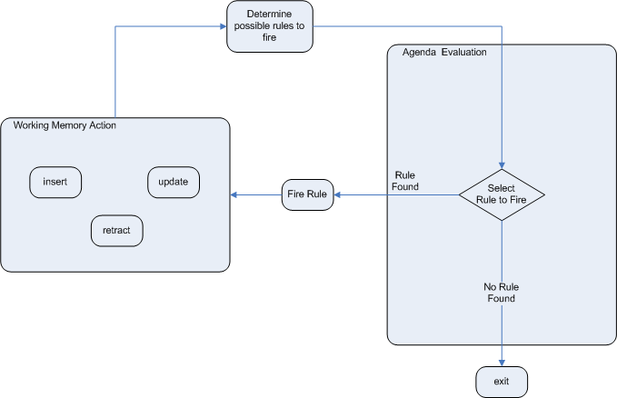

这个过程重复，直到议程清晰，在这种情况下控制返回到调用应用程序。 当规则运行时操作正在发生时，没有规则被触发。

==== 规则匹配和冲突集

===== 现金流量示例

到目前为止，数据和匹配过程是简单而小巧的。 为了将事情混合起来，我们将探索一个新的例子来处理日期期间的现金流量计算。 发动机的状态将在关键阶段示例性地示出，以帮助更好地理解发动机罩下的实际情况。 将使用三个类，如下所示。 这将有助于我们增加对模式匹配的理解并进一步加入。 然后我们将用这个来说明执行控制的不同技术。

[source,java]
----
public class CashFlow {
    private Date   date;
    private double amount;
    private int    type;
    long           accountNo;
    // getter and setter methods here
}

public class Account {
    private long   accountNo;
    private double balance;
    // getter and setter methods here
}

public AccountPeriod {
    private Date start;
    private Date end;
    // getter and setter methods here
}
----

现在，您已经知道如何创建KieBases以及如何实例化事实来填充KieSession，所以将使用表来显示插入的数据的状态，因为它使事情变得更加清楚。 下表显示为“Account”插入单个事实。 还插入了一系列借方和贷方作为该账户的“CashFlow”对象，延伸了两个季度。

.CashFlows and Account
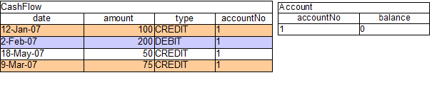

两个规则可以用来确定该季度的借方和贷方，并更新账户余额。 以下两条规则限制了给定时间段内某个账户的现金流量。 请注意使用简短语法的“&&”，以避免两次重复字段名称。

[source,sql]
----
select * from Account acc,
              Cashflow cf,
              AccountPeriod ap
where acc.accountNo == cf.accountNo and
      cf.type == CREDIT and
      cf.date >= ap.start and
      cf.date <= ap.end
----

[source,java]
----
trigger : acc.balance += cf.amount
----

[source,sql]
----
select * from Account acc,
              Cashflow cf,
              AccountPeriod ap
where acc.accountNo == cf.accountNo and
      cf.type == DEBIT and
      cf.date >= ap.start and
      cf.date <= ap.end
----

[source,java]
----
trigger : acc.balance -= cf.amount
----

如果AccountPeriod设置为第一季度，我们将限制``增加贷方余额``的规则在两行数据上触发，``减少借方余额``以对一行数据进行操作。

.会计周期，现金流量和账户
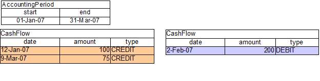

上面的两个现金流量表代表两个规则的匹配数据。 数据在插入阶段被匹配，正如你在上一章中发现的那样，它不会直接触发，而只是在``fireAllRules()``被调用之后。 同时，规则及其匹配的数据被放置在议程上，并被称为“行为匹配”或“规则实例”。 议程是一个规则匹配表，只要fireAllRules()被调用，它就能够触发并执行其后果。 议程上的规则匹配被称为冲突集，其执行是由冲突解决策略决定的。 请注意，到目前为止的执行顺序被认为是任意的。

.现金流和账户
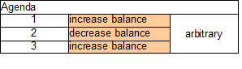

所有上述激活的规则被执行后，账户的余额为-25。

.现金流和账户
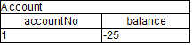

如果账户期限更新到第二季度，我们只有一行匹配的数据，因此在议程上只有一个规则匹配。

规则执行的结果导致了25的余额。

.现金流和账户
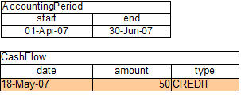

.现金流和账户
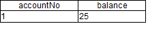

===== 解决冲突

如果你不希望规则执行的顺序是任意的呢？ 如果议程上有一个或多个规则匹配，则说明它们之间存在冲突，并使用冲突解决策略来确定执行顺序。 Drools战略非常简单，基于一个显着的价值，它为一个规则赋予了优先权。 每个规则的默认值为0，值越高，优先级越高。

作为一般规则，不要指望以任何特定顺序开火的规则，并且制定规则而不必担心“flow”。 然而，当需要流程时，除了显着性之外还有许多可能性：议程组，规则流程组，激活组和控制/信号量事实。

Drools 6.0 规则根据源文件中的salience之后的数字来确定优先级。

===== Salience

为了说明salience，我们添加一个规则来打印帐户余额，我们希望在对所有帐户应用所有借记和贷项之后执行此规则。 我们通过给这个规则分配一个负的salience来达到这个目的，以便在默认salience 0的所有规则之后触发。

[source,java]
----
rule "Print balance for AccountPeriod"
        salience -50
    when
        ap : AccountPeriod()
        acc : Account()
    then
        System.out.println( acc.accountNo + " : " + acc.balance );
end
----

下表描述了由此产生的议程。 这三个借记和贷记规则显示为任意顺序，而打印规则排在最后，以后执行。

.现金流和账户
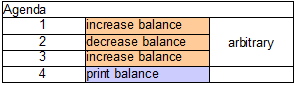

===== 议程组agenda group

议程组允许您将规则放入组中，并将这些组放入堆栈。 该堆栈有push/pop 的能力。 调用“setFocus”将组放入堆栈：

[source,java]
----
ksession.getAgenda().getAgendaGroup( "Group A" ).setFocus();
----

议程总是评估堆栈的顶部。 当所有的规则已经为一个组激发，它从堆栈弹出，并评估下一个组。

[source,java]
----
rule "increase balance for credits"
  agenda-group "calculation"
when
  ap : AccountPeriod()
  acc : Account( $accountNo : accountNo )
  CashFlow( type == CREDIT,
            accountNo == $accountNo,
            date >= ap.start && <= ap.end,
            $amount : amount )
then
  acc.balance  += $amount;
end
----

[source,java]
----
rule "Print balance for AccountPeriod"
  agenda-group "report"
when
  ap : AccountPeriod()
  acc : Account()
then
  System.out.println( acc.accountNo +
                      " : " + acc.balance );
end
----

首先把重点放在“report”组，然后把重点放在“calculation”上，我们确保首先评估组。

[source,java]
----
Agenda agenda = ksession.getAgenda();
agenda.getAgendaGroup( "report" ).setFocus();
agenda.getAgendaGroup( "calculation" ).setFocus();
ksession.fireAllRules();
----

===== 规则流程

Drools还具有ruleflow-group属性，允许工作流程图声明性地指定何时允许激发规则。 下面的截图是从Eclipse使用Drools插件。 它有两个规则流组节点，确保计算规则在报告规则之前执行。

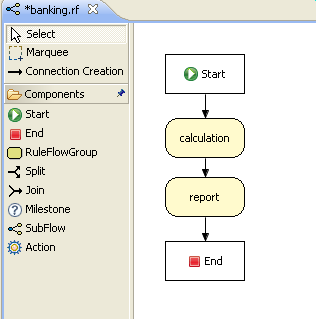

在规则中使用ruleflow-group属性如下所示。

[source,java]
----
rule "increase balance for credits"
  ruleflow-group "calculation"
when
  ap : AccountPeriod()
  acc : Account( $accountNo : accountNo )
  CashFlow( type == CREDIT,
            accountNo == $accountNo,
            date >= ap.start && <= ap.end,
            $amount : amount )
then
  acc.balance  += $amount;
end
----

[source,java]
----
rule "Print balance for AccountPeriod"
  ruleflow-group "report"
when
  ap : AccountPeriod()
  acc : Account()
then
  System.out.println( acc.accountNo +
                      " : " + acc.balance );
end
----

=== 推理

==== 巴士通行证例子

现在推论有一个不好的名字，因为它与业务用例无关，而且太复杂而无用。 的确，人为的和复杂的例子都是在推论中出现的，但是这也不应该损害简单有用的存在。 但更重要的是，正确使用推理可以提供更敏捷，更不容易出错的业务规则，这些规则更容易维护。

那么推理是什么？ 当我们通过使用以前的知识获得某些东西的知识时，就会推断出什么 例如，给定一个具有年龄字段和规定年龄政策控制的规则的人的事实，我们可以推断出一个人是成年人还是孩子，并据此采取行动。

[source,java]
----
rule "Infer Adult"
when
  $p : Person( age >= 18 )
then
  insert( new IsAdult( $p ) )
end
----

由于前面的规则，每个18岁以上的人都会为他们插入一个IsAdult的实例。 这个事实是特殊的，因为它被称为关系。 我们可以在任何规则中使用这个推断关系：

[source,java]
----
$p : Person()
IsAdult( person == $p )
----

所以现在我们知道推论是什么，并且有一个基本的例子，这是如何促进良好的规则设计和维护？

让孩子成年后负责发放身份证的政府部门，以下简称ID部门。 他们可能有一个决策表，其中包括这样的逻辑，它说当一个在伦敦的成年人是18岁或以上，发卡：

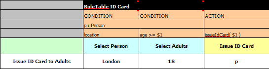

但身份证件部门并没有制定成人的政策。这是在中央政府一级完成的。如果中央政府将这个年龄改为21岁，这将启动变革管理过程。有人必须联系身份证件部门，确保他们的系统得到更新，以便法律上线。

这种变更管理流程和部门之间的沟通对于敏捷环境来说并不理想，而且变更成本高昂且容易出错。此外，信用卡部门正在管理更多的信息，而不是需要通过其“规模管理”的“单一”方法意识到这一点。我的意思是，它并不关心明确的年龄>= 18信息决定某人是否是成年人，而只关心他们是否是成年人。

相比之下，让我们采取一种方法，将创作责任分开（脱离），使中央政府和身份证部门都保持自己的规则。

确定谁是成年人是中央政府的工作。 如果他们改变法律，他们只是用新的规则来更新他们的中央仓库，

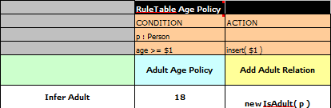

如前所述，IsAdult事实是从政策规则中推断出来的。 它封装了看似随意的一段逻辑时间▸= 18，并为其含义提供了语义抽象。 现在，如果有人使用上述规则，他们不再需要知道明确的信息，决定某人是否是成年人。 他们可以使用推断的事实：

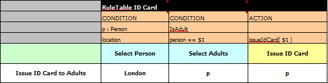

虽然这个例子是非常微小的，但它说明了一些重要的观点。我们从知识工程的单一和漏洞入手开始。我们创建了一个包含所有可能的信息的决策表，泄露了ID部门不关心也不想管理的来自中央政府的信息。

我们首先将知识过程分离开来，这样每个部门只负责知道什么。然后，我们使用推断的事实IsAdult封装了这个变动的知识。术语IsAdult的使用还给以前的任意逻辑时间▸= 18提供了语义抽象。

所以在进行知识工程时，一般的经验法则是：

*   **坏的**
        *   单一Monolithic
        *   泄露Leaky
*   **好的**
    **   解除对知识的责任
    **   封装知识
    **   为这些封装提供语义抽象

=== 用逻辑对象维护真相

==== 概述

定期插入后，你必须明确地收回事实。有了__逻辑__断言，断言的事实将会自动撤回，因为断言它的条件不再是真实的。实际上，它更加聪明，因为只有当没有任何单一条件支持逻辑断言时才会收回。

__声明__一个正规的插入，就像“陈述事实”所暗示的直觉意义一样。使用一个HashMap和一个计数器，我们追踪一个特定的平等是多少次;这意味着我们计算有多少不同的实例是相等的。

当我们在RHS执行期间__逻辑__插入一个对象的时候，我们被说成是__正当的__，并且被认为是通过触发规则来证明的。对于每个逻辑插入，只能有一个相等的对象，并且每个随后的相等的逻辑插入增加该逻辑断言的对齐计数器。创建规则的LHS取消了正当理由，计数器也相应减少。一旦我们没有更多的理由，逻辑对象自动收回。

如果我们尝试__逻辑__插入一个对象时，有一个相等的__声明__对象，这将失败，并返回null。如果我们__声明__一个对象具有一个现有的平等的对象，我们重写事实;这个覆盖如何工作__取决于__配置设置WM_BEHAVIOR_PRESERVE。当属性设置为discard时，我们使用现有的句柄，并用新的对象替换现有的实例，这是默认行为;否则我们重写它，同时我们创建一个新的FactHandle。

这可能会在第一次阅读时感到困惑，所以希望下面的流程图有所帮助。当它说它返回一个新的FactHandle时，这也表示对象是通过网络传播的。

.声明插入
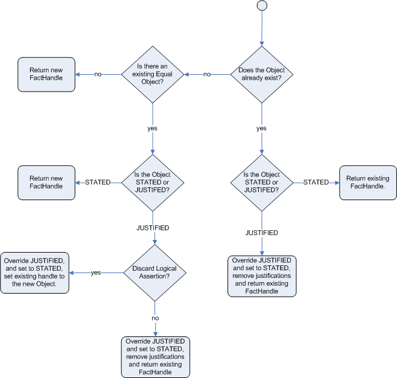

.逻辑插入
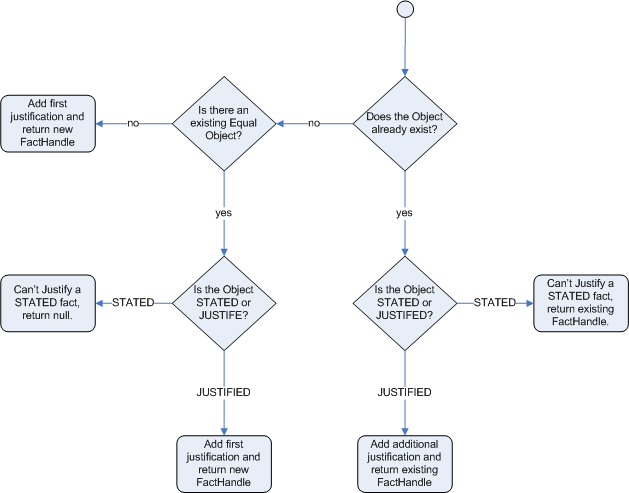

===== 有推理和TMS的公共汽车通行证例子

前面的例子是发行身份证超过18岁，在这个例子中，我们现在发行巴士通行证，无论是儿童或成人通行证。

[source,java]
----
rule "Issue Child Bus Pass" when
    $p : Person( age < 16 )
then
    insert(new ChildBusPass( $p ) );
end

rule "Issue Adult Bus Pass" when
    $p : Person( age >= 16 )
then
    insert(new AdultBusPass( $p ) );
end
----

像以前一样，上面的例子被认为是单一的，漏洞和提供差的关注分离。

像以前一样，我们可以提供一个更强大的应用程序，使用推理来区分问题。注意这次我们不只是插入推断的对象，我们使用“insertLogical”：

[source,java]
----
rule "Infer Child" when
    $p : Person( age < 16 )
then
    insertLogical( new IsChild( $p ) )
end

rule "Infer Adult" when
    $p : Person( age >= 16 )
then
    insertLogical( new IsAdult( $p ) )
end
----

“insertLogical”是Drools真相维护系统（TMS）的一部分。当一个事实被逻辑插入时，这个事实取决于“when”从句的真实性。这意味着，当规则成为错误时，事实会自动收回。由于这两个规则是相互排斥的，所以这个效果特别好。所以在上面的规则中，如果这个人在16岁以下，它会插入一个IsChild的事实，一旦这个人是16岁或以上，IsChild的事实就会自动收回，并且插入了IsAdult的事实。

回到代码发出巴士通行证，这两个规则可以在逻辑上插入ChildBusPass和AdultBusPass事实，因为TMS +支持链接一系列级联的逻辑插入。

[source,java]
----
rule "Issue Child Bus Pass" when
    $p : Person( )
         IsChild( person == $p )
then
    insertLogical(new ChildBusPass( $p ) );
end

rule "Issue Adult Bus Pass" when
    $p : Person( age >= 16 )
         IsAdult( person =$p )
then
    insertLogical(new AdultBusPass( $p ) );
end
----

现在当一个人从15岁变成16岁时，不仅IsChild事实自动缩回，他的ChildBusPass事实也是如此。对于奖励积分，我们可以将这个与'not'条件元素结合起来处理通知，在这种情况下，请求返回通行证。所以当TMS自动收回ChildBusPass对象时，这个规则触发并发送一个请求给这个人：

[source,java]
----
rule "Return ChildBusPass Request "when
    $p : Person( )
         not( ChildBusPass( person == $p ) )
then
    requestChildBusPass( $p );
end
----

===== 重要说明：Java对象的等价

注意到真理维护（和逻辑断言）完全可以工作，这是很重要的，你的Fact对象（可能是JavaBeans）必须正确地覆盖equals和hashCode方法（来自java.lang.Object）。由于事实维护系统需要知道两个不同物理对象的值是否相等，因此按照Java标准，必须正确覆盖__both__等于和hashCode。

两个对象是相等的，当且仅当它们的equals方法相互返回true，并且它们的hashCode方法返回相同的值。有关更多详细信息，请参阅Java API（但请记住，__MUST__必须覆盖equals和hashCode）。

TMS行为不受标识vs等价的时间配置的影响，TMS始终是等价的。

===== 从工作记忆中删除陈述或逻辑断言

默认情况下，当从工作记忆中删除一个事实时，Drools尝试从既定事实集合中删除它，并且在逻辑断言的情况下也从真值维护系统TMS中删除它。但是，使用delete方法的重载，也可以只从2.中删除它。例如，调用：

----
``ksession.delete( factHandle, FactHandle.State.LOGICAL );``
----

这个事实只有在逻辑断言的情况下才会被删除，但是如果它是一个陈述的事实则不会被删除。在这种情况下，如果事实已经说明了它的删除失败了，并且被忽略了。

=== 电子表格中的决策表

决策表是一种“精确而紧凑”（参考自Wikipedia）表示条件逻辑的方式，非常适合__商业__级规则。

Drools支持电子表格格式的管理规则。支持的格式是Excel（XLS）和CSV，这意味着可以使用各种电子表格程序（例如Microsoft Excel，OpenOffice.org Calc等）。预计基于网络的决策表编辑器将被包括在不久的将来版本中。

决策表是一个旧的概念（用软件来说），但是多年来已经证明是有用的。简而言之，在Drools中，决策表是一种生成从输入到电子表格中的数据驱动的规则的方法。数据采集和处理的电子表格的所有常用功能都可以利用。

==== 何时使用决策表

如果存在可以表示为规则模板和数据的规则，则将决策表视为一个行为过程：决策表的每一行都提供与模板结合生成规则的数据。

许多企业已经使用电子表格来管理数据，计算等。如果您乐于继续这种方式，您也可以通过这种方式来管理您的业务规则。这也假设您很乐于在__xls__或__csv__文件中管理规则包。决策表不建议用于不遵循一组模板的规则，也不建议使用少量规则（或者对Excel或OpenOffice.org等软件不喜欢）。它们是理想的，可以控制规则的__参数__可以编辑，而不需要直接暴露规则。

决策表还提供了一定程度的基础对象模型的隔离。

==== 概述

下面是一些真实世界决策表的例子（稍作修改以保护无辜者）。

.使用Excel来编辑决策表
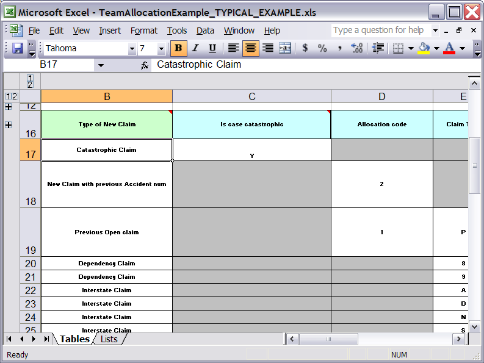

.一个规则行中多种行为
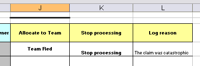

.使用OpenOffice.org
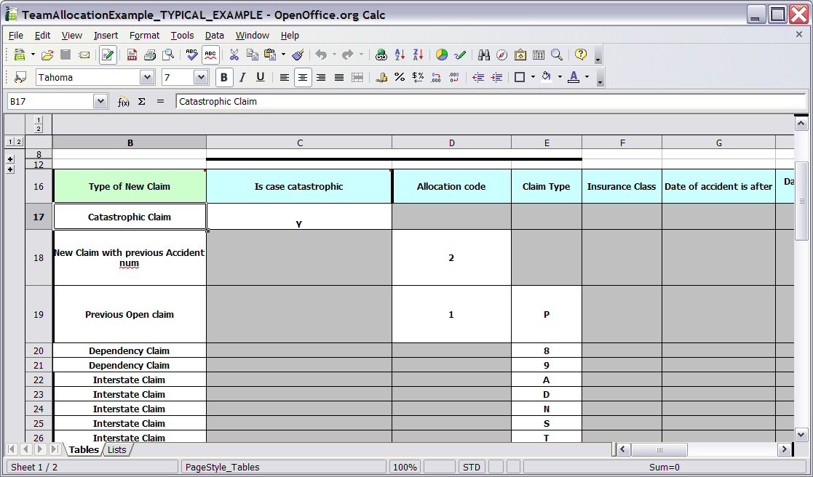

在上面的例子中，决策表的技术方面已经崩溃了（使用标准的电子表格功能）。

规则从第17行开始，每一行产生一个规则。条件在列C，D，E等中，动作在屏幕外。单元格中的值非常简单，它们的含义由行16中的标题指示。列B只是一个描述。通常使用颜色来明确表格的不同区域的含义。

[NOTE]
====
请注意，虽然决策表看起来像自上而下，但情况并非如此。理想情况下，规则的编写不考虑行的顺序，仅仅因为这使得维护更容易，因为行不需要一直移动。
====

由于每一行都是一个规则，所以适用相同的原则。由于规则引擎处理事实，任何匹配的规则都可能触发。 （有些人对此感到困惑，在规则触发时模拟一个非常简单的决策表就可以清除议程，只有第一个匹配才会执行一个动作。）另请注意，在一个电子表格中可以有多个表。这样，可以将规则分组在共享通用模板的位置，然而在一天结束时，它们全部组合成一个规则包。决策表本质上是一种自动生成DRL规则的工具。

.使用多个表进行分组的规则
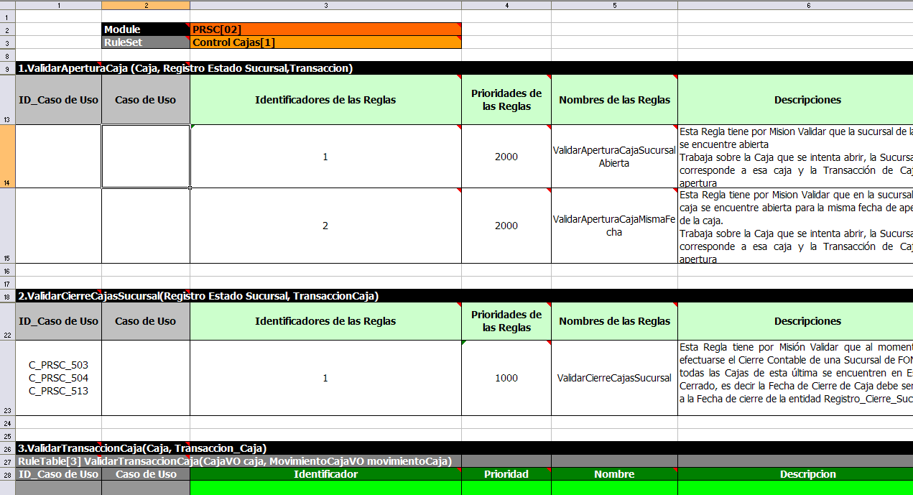

==== 决策表如何工作

要记住的关键是，决策表中的每一行都是一个规则，该行中的每一列都是该规则的条件或动作。

.行和列
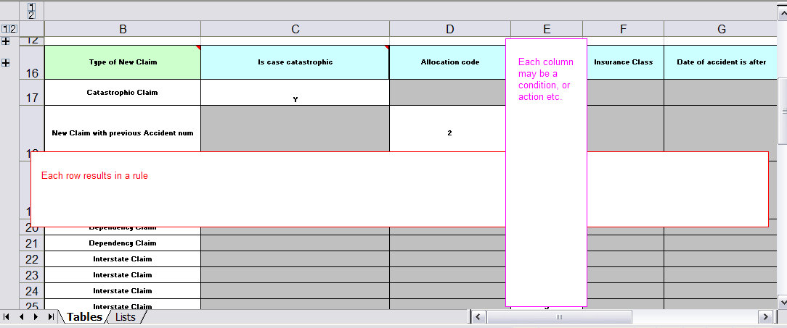

电子表格查找RuleTable关键字以指示规则表（起始行和列）的开始。 其他关键字也用于定义其他包级别属性（稍后介绍）。 将关键字保留在一列是很重要的。 按照惯例，第二列（“B”）用于这个，但它可以是任何列（约定左边留有空白的备注）。 在下面的图中，C实际上是它开始的列。 左边的所有内容都被忽略。

如果我们扩大隐藏的部分，它开始变得更有意义它是如何工作的; 请注意C列中的关键字。

.展开规则模板
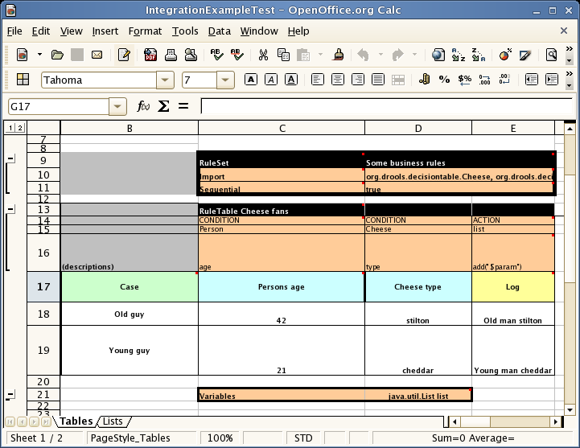

现在可以看到使其工作的隐藏的魔法。 RuleSet关键字指示将在__rule package__中使用的名称，该名称将包含所有规则。 此名称是可选的，使用默认值，但__必须__在单元格右边有__RuleSet__关键字。

列C中可见的其他关键字是“导入”和“顺序”，稍后将对其进行介绍。 RuleTable关键字是很重要的，因为它表示将遵循一些规则，基于一些规则模板。 RuleTable关键字后面有一个名称，用于为生成的规则的名称添加前缀。 附加表单名称和行号以保证唯一的规则名称。

[WARNING]
====
与表格名称结合使用的表格名称在同一KieBase中的所有电子表格文件中必须是唯一的。 如果不是这样，一些规则可能会有相同的名称，只有其中一个会被应用。 要显示这样被忽略的规则，https://docs.jboss.org/drools/release/7.4.1.Final/drools-docs/html_single/index.html#_changingthedefaultbuildresultresultseverity [引发此类规则名称冲突的严重性]。
====

RuleTable的列表示规则开始的列; 左侧的列将被忽略。

[NOTE]
====
通常，关键字组成名称 - 值对。
====

参考第14行（RuleTable之后的那一行），关键字CONDITION和ACTION表示下面各列中的数据适用于规则的LHS部分或RHS部分。 规则上还有其他属性，也可以选择这种方式设置。

第15行包含__ObjectTypes__的声明。 该行中的内容是可选的，但是如果该选项未被使用，则该行必须留空; 然而这个选项通常被认为是相当有用的。 使用此行时，下面单元格（第16行）中的值将成为该对象类型的约束。 在上面的例子中，它生成了“Person（age ==”42“）”和“Cheese（type ==”stilton“）”，其中42和“stilton”来自第18行。 ，“==”是隐含的; 如果只给出一个字段名称，翻译者就会假定它是生成完全匹配的。

[NOTE]
====
一个ObjectType声明可以跨越列（通过合并的单元格），这意味着合并范围以下的所有列将被合并到一个模式中，一次匹配一个事实的一个模式中，而非包含 相同的ObjectType，但导致不同的模式，可能匹配不同或相同的事实。
====

第16行包含规则模板本身。 他们可以使用“$ param”占位符来表示下面单元格的数据应该插入的位置。 （对于多次插入，请使用“$ 1”，“$ 2”等，表示下面单元格中逗号分隔列表中的参数。 它可能包含该栏目的文字说明。

行18和行19显示的数据将与行15中的模板组合（插值），以生成规则。 如果一个单元格不包含数据，则其模板将被忽略。 （这意味着某些条件或操作不适用于该规则行。）读取规则行直到出现空行。 一张表中可以存在多个RuleTables。 第20行包含另一个关键字和一个值。 像这样的关键字的行位置并不重要（大多数人把它们放在顶部），但是它们的列应该与RuleTable或RuleSet关键字出现的位置相同。 在我们的情况下，列C被选择为重要的，但是可以使用任何其他列。

在上面的例子中，规则会像下面一样呈现（因为它使用“ObjectType”行）：

[source,java]
----
//row 18
rule "Cheese_fans_18"
when
    Person(age=="42")
    Cheese(type=="stilton")
then
    list.add("Old man stilton");
end
----

[NOTE]
====
“age ==”42“”和“type ==”stilton“”的约束被解释为单个约束，被添加到上面单元格的相应ObjectType中。 如果上面的单元格是跨越的，那么在一个“列”上可能有多个约束。
====

[WARNING]
====
非常大的决策表可能有非常大的内存要求。
====

==== 电子表格语法

===== 电子表格结构

有两种类型的矩形区域定义用于生成DRL文件的数据。 一个由标记为“RuleSet”的单元标记，定义除规则以外的所有DRL项目。 另一个可能会重复发生，并且位于以“RuleTable”开头的单元格的右下方。 这些领域代表了实际的决策表，每个领域产生了一套类似结构的规则。

一个规则集区域可以包含单元对，一个在RuleSet下面，包含一个关键字，指定在同一行中的另一个关键字中包含的值。

规则表区域的列定义了从中派生的规则左侧的模式和约束，规则后果的动作以及单个规则属性的值。因此，规则表区域应该包含一个或多个列，条件和操作，以及规则属性的列的任意选择，每个列最多一列。前面四行跟着标记有“RuleTable”单元格的行被标记为标题区域，主要用于定义构建规则的代码。它是这四个标题行下面的任何额外的行，产生另一个规则，其数据提供规则表标题中定义的代码的变化。

所有关键字不区分大小写。

只有第一张工作表被检查决策表。

===== 规则集条目

规则集区域中的条目可以定义DRL构造（规则除外），并指定规则属性。 尽管可以重复使用结构的条目，但是每个规则属性最多只能给出一次，并且它适用于所有规则，除非它被“规则表”区域内定义的相同属性取代。

条目必须以垂直堆叠的单元对序列给出。 第一个包含关键字和右边的值，如下表所示。 只要由“RuleSet”标记的列被维护为包含关键字的那一列，这个单元格对的序列就可以被空行或甚至规则表中断。

.规则集区域中的条目
|====
|关键字|值|用法
| RuleSet | 生成的DRL文件的包名称。可选，默认是``_lele_table_``。 |必须是第一个入口。
| Sequential | "true" or "false". 如果是“true”，则使用显着性来确保规则从上到下起火。 |可选，最多一次。如果省略，则不执行射击命令。
| SequentialMaxPriority | 整数数值|可选，最多一次。在顺序模式下，此选项用于设置突出显示的起始值。如果省略，则默认值为65535。
| SequentialMinPriority | 整数数值|可选，最多一次。在顺序模式下，此选项用于检查是否违反了最小显着性值。如果省略，则默认值为0。
| EscapeQuotes | "true" or "false". 如果是“true”，那么引号就会被转义，从而在DRL中出现。 |可选，最多一次。如果省略，引号将被转义。
| NumericDisabled | "true" or "false". 如果是“true”，则字符串表示形式用于DRL，而不是来自Numeric单元格的double值可选，最多一次。如果省略，则使用double值。
| Import | 要导入的Java类的逗号分隔列表。 |可选，可以重复使用。
|变量| DRL全局变量的声明，即一个后跟一个变量名的类型。多个全局定义必须用逗号分隔。 |可选，可以重复使用。
| Variables |  DRL全局变量的声明，即一个后跟一个变量名的类型。多个全局定义必须用逗号分隔。 |可选，可以重复使用。
| Functions | 一个或多个函数定义，根据DRL语法。 |可选，可以重复使用。
| Queries | 一个或多个查询定义，根据DRL语法。 |可选，可以重复使用。
| Declare | 个或多个声明类型，根据DRL语法。 |可选，可以重复使用。
|====

[WARNING]
|====
在某些语言环境中，MS Office，LibreOffice和OpenOffice会对不同的双引号进行编码，这会导致编译错误，通常很难看出差异，例如：`“A”`会失败， 但`"A"`会起作用。
|====

[NOTE]
====
要定义适用于生成的DRL文件中所有规则的规则属性，可以使用下表中的任何条目。 但是请注意，必须使用正确的关键字。 而且，每个属性只能使用一次。
====

.规则集区域中的规则属性条目
|====
| Keyword   | Initial   | Value
| PRIORITY  | P         |一个定义规则“显着性”值的整数。由“顺序”标志覆盖。
| DURATION  | D         |定义规则的“持续时间”值的长整数值。
| TIMER     | T         |定时器定义。请参阅“定时器和日历”。
| ENABLED   | B         |一个布尔值。 “真”使规则成为可能; “false”会禁用规则。
| CALENDARS | E         |日历定义。请参阅“定时器和日历”。
| NO-LOOP   | U         |一个布尔值。 “真”禁止由于其结果所做的更改而循环的规则。
| LOCK-ON-ACTIVE | L    |一个布尔值。 “true”禁止在同一个规则流或议程组中设置此标志的所有规则的额外激活。
| AUTO-FOCUS | F        |一个布尔值。对于议程组中的规则而言，“真实”会导致规则的激活，从而自动将焦点集中到组中。
| ACTIVATION-GROUP | X  |识别激活（或XOR）组的字符串。激活组中只有一个规则将被触发，即第一个激活组将取消同一组内其他规则的任何激活。
| AGENDA-GROUP | G      |一个标识一个议程组的字符串，必须通过赋予其“焦点”来激活，这是控制规则组之间流动的一种方式。
| RULEFLOW-GROUP | R    |标识规则流组的字符串。
|====

===== 规则表

所有规则表都以一个包含“RuleTable”的单元格开始，可选地在同一个单元格中跟随一个字符串。该字符串用作从该规则表派生的所有规则的名称的起始部分，附加行号以区分。 （这个自动命名可以通过使用NAME列来覆盖。）定义此Rule Table规则的所有其他单元格位于该单元格的下方和右侧。

下一行定义了列的类型，每列产生一部分条件或结果，或者提供一些规则属性，规则名称或注释。下表显示了哪些列标题可用;根据显示前一节中给出的规则属性条目的表格，可以使用额外的列。请注意，每个属性列最多只能使用一次。对于列标题，请使用关键字或任何其他以这些表格的“初始”列中给出的字母开头的单词。

.规则表中的列标题
|====
| Keyword | Initial | Value | Usage
| NAME | N | 提供从该行生成的规则的名称。 默认值是根据RuleTable标签和行号之后的文本构造的。| 最多只有一列
| DESCRIPTION | I | 一个文本，在生成的规则中产生一个注释。| 最多只有一列
| CONDITION | C | 代码片段和插值，用于在条件中的模式中构建约束。| 每个规则表至少有一个
| ACTION | A | 代码片断和插值用于构建规则后果的操作。| 每个规则表至少有一个
| METADATA | @ | 代码片断和插值用于构建规则的元数据条目。| 可选，任意数量的列
|====

给定一个标题为CONDITION的列，连续行中的单元格产生一个条件元素。

*   CONDITION下面的第一个单元格中的文本发展成规则条件的模式，下一行中的代码段成为约束条件。如果单元格与一个或多个邻居合并，则形成具有多个约束的单个模式：将所有约束合并到一个带括号的列表中，并附加到该单元格中的文本。单元格可能会留空，这意味着下一行中的代码片段必须单独生成有效的条件元素。
    要包含没有约束的模式，可以将模式写在另一个模式的文本前面。
    模式可以写有或没有一个空的括号。 “from”子句可以附加到模式。
    如果模式以“eval”结尾，代码片段应该产生布尔表达式，以包含在“eval”之后的一对括号中。
*   CONDITION下面的第二个单元格中的文本分两步处理。
    1.  这个单元格中的代码片段是通过插入列中更靠下的单元格中的值来修改的。如果要使用“==”创建一个由下面的单元格的值组成的约束条件，则仅字段选择器就足够了。任何其他比较运算符都必须被指定为代码片段中的最后一项，并且下面单元格的值被附加。对于所有其他约束形式，您必须标记位置以包含符号“$ param”的单元格的内容。通过在下面的单元格中使用符号“$ 1”，“$ 2”等和逗号分隔值列表，可以实现多重插入。
根据模式`forall(``__delimiter__``）{``__snippet__``}`的文本的文本通过对每个单元格中的逗号分隔值列表的每个值重复__snippet__来展开在下面插入值代替符号``$``并且通过给定的__delimiter__加入这些扩展。请注意，该构造可能被其他文本包围。
    2.  如果前一行中的单元格不是空的，则将完成的代码片段添加到该单元格的条件元素中。一对括号是自动提供的，如果将多个约束添加到合并单元格中的模式，则会自动提供分隔逗号。
        如果上面的单元格是空的，插入的结果将按原样使用。
*   CONDITION下方的第三个单元格中的文本仅用于文档。它应该用来向读者指出专栏的目的。
*   从第四行开始，非空白条目提供如上所述的插值数据。空白单元格导致省略该规则的条件元素或约束条件。
    给出一个以行动为首的专栏，连续行中的单元格产生一个行动陈述。
*   ACTION下面的第一个单元格中的文本是可选的。如果存在，则将其解释为对象引用。
*   ACTION下面第二个单元格中的文本分两步处理。
    1.  这个单元格中的代码片段是通过插入列中更靠下的单元格中的值来修改的。对于单数插入，用符号“$ param”标记包含单元格内容的位置。通过在下面的单元格中使用符号“$ 1”，“$ 2”等和逗号分隔值列表，可以实现多重插入。
    没有内插的方法调用可以通过没有任何标记符号的文本来实现。在这种情况下，请使用下面一行中的任何非空白条目来包含该语句。
    这个构造也可以在这里找到。
    2.如果第一个单元格不是空的，其文本，后面是一个句点，第二个单元格中的文本和终止分号被串联在一起，产生一个方法调用，作为结果的一个动作语句添加。
    如果上面的单元格是空的，插入的结果将按原样使用。
*   ACTION下面的第三个单元格中的文本仅用于文档。它应该用来向读者指出专栏的目的。
*   从第四行开始，非空白条目提供如上所述的插值数据。空白单元格导致省略此规则的操作语句。

[NOTE]
在大多数情况下，使用“$ 1”而不是“$ param”工作，但如果替换文本包含逗号，则会失败：然后，只插入第一个逗号前面的部分。 明智地使用这个“缩写”。

给定一个以METADATA开头的列，连续行中的单元格将为生成的规则生成元数据注释。

*   METADATA下面第一个单元格中的文本被忽略。
*   如上所述，METADATA下面的第二个单元格中的文本使用来自规则行单元格的值进行插值。元数据标记字符“@”是自动添加的，因此它不应该包含在这个单元格的文本中。
*   METADATA下面的第三个单元格中的文本仅用于文档。它应该用来向读者指出专栏的目的。
*   从第四行开始，非空白条目提供如上所述的插值数据。空白单元格导致省略此规则的元数据注释。

===== 例子

以下示例说明了各种插值。
例85.插值单元格数据
如果模板是“Foo（bar == $ param）”，单元格是“42”，那么结果是“Foo（bar == 42）”。

如果模板是“Foo（bar <$ 1，baz == $ 2）”，而单元格包含“42,43”，则结果将是“Foo（bar <42，baz == 43） 。

模板`forall（&&）{bar！= $}`与一个包含`42,43`的单元格产生`bar！= 42 && bar！= 43`。

下一个例子演示了定义模式类型的单元和下面的代码片段的共同作用。

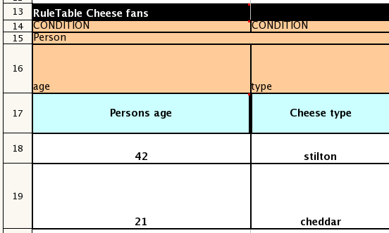

 296/5000该电子表格部分显示了Person类型声明如何跨越2列，因此这两个约束将以Person（age == ...，type == ...）的形式出现。 由于只有字段名称存在于片段中，因此意味着平等测试。  

在下面的例子中使用了标志符号$ param。

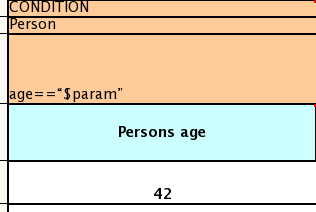

这个列的结果是模式Person（age ==“42”））。 您可能已经注意到标记和运算符“==”是多余的。

下一个例子说明了一个尾随的插入标记可以省略。

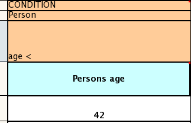

在这里，从单元格中附加值是隐含的，导致Person（年龄<42））。

您可以提供绑定变量的定义，如下例所示。

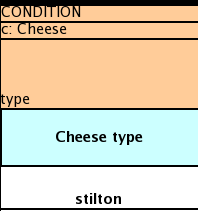

这里的结果是c：Cheese（type ==“stilton”）。 请注意，报价是自动提供的。 实际上，任何东西都可以放在对象类型的行中。 除了绑定变量的定义之外，它也可以是一个附加的模式，可以直接插入。

下面显示了插入单个值的操作语句的简单构造。

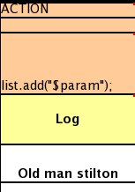

ACTION标题下面的单元格留空。 使用这种风格，任何事情都可以放在结果中，而不仅仅是一个方法调用。 （同样的技术也适用于CONDITION列。）

下面是一个综合的例子，展示了各种列标题的使用。 在列标题之下没有任何值是错误的（如在NO-LOOP列中）：在这里，属性不会被应用在任何规则中。

.关键字用于导入，标题等的示例用法
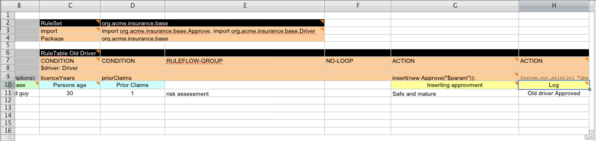

最后，这里是一个导入，变量和函数的例子。

.功能关键字的使用示例等
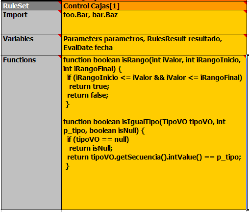

同一单元格中的多个软件包名称必须用逗号分隔。此外，类型和变量名称对必须用逗号分隔。但是，函数必须按照出现在DRL文件中的方式编写。这应该与“RuleSet”关键字出现在同一列;它可以在所有规则行之上，之间或之下。

[NOTE]
It may be more convenient to use Import, Variables, Functions and Queries repeatedly rather than packing several definitions into a single cell.

==== 创建和集成基于电子表格的决策表

使用基于电子表格的决策表的API位于drools-decisiontables模块中。实际上只有一个类可以看：SpreadsheetCompiler。这个类将采取各种格式的电子表格，并在DRL中生成规则（然后可以以正常的方式使用）。 SpreadsheetCompiler可以用来生成部分规则文件（如果需要的话），然后在事实之后将其组装成一个完整的规则包（如果需要，可以将规则的技术和非技术方面分开）。

要开始，可以使用示例电子表格作为基础。或者，如果正在使用插件（Rule Workbench IDE），则向导可以从模板生成电子表格（编辑它需要使用xls兼容的电子表格编辑器）。

.IDE中的向导
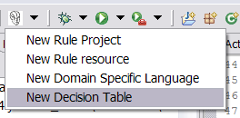

==== 管理决策表中的业务规则

===== 工作流程和协作

电子表格是完善的商业工具（使用了25年以上）。决策表适合密切IT和领域专家之间的合作，同时使业务分析人员明确业务规则，这是一个理想的分离关注点。

通常，编写规则的整个过程（提出一个新的决策表）将是这样的：

1. 业务分析师采用模板决策表（从存储库或从IT）

2. 决策表业务语言描述被输入到表格中

3. 决策表规则（行）被输入（大致）

4. 决策表交给技术资源，他将业务语言（描述）映射到脚本（当然，这可能涉及软件开发，如果是新的应用程序或数据模型）

5. 技术人员交回业务分析师的修改。

6. 业务分析师可以根据需要继续编辑规则行（移动列周围也很好等）。

7. 同时，技术人员可以为规则开发测试用例（与业务分析人员联系），因为一旦系统运行，这些测试用例可用于验证规则和规则更改。

===== 使用电子表格功能

Excel等应用程序的功能可用于帮助将数据输入电子表格，例如验证字段。存储在其他工作表中的列表可用于为单元格提供有效的值列表，如下图所示。

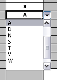

一些应用程序提供了有限的能力来保存更改的历史记录，但是建议使用另一种版本控制方法。当规则随时间发生变化时，旧版本将被归档（许多开源解决方案，例如Subversion或Git）。

==== 规则模板

与决策表（但不一定需要电子表格）相关的是“规则模板”（在drools-templates模块中）。这些使用任何表格数据源作为规则数据的来源 - 填充模板以生成许多规则。这既可以用于更灵活的电子表格，也可以用于现有数据库中的规则（以开发模板为代价来生成规则）。

使用规则模板，数据与规则是分开的，并且规则的哪一部分是数据驱动的没有限制。所以尽管你可以在决策表中做所有事情，但你也可以做以下的事情：

* 将数据存储在数据库（或其他格式）

* 有条件地根据数据中的值生成规则

* 为规则的任何部分使用数据（例如条件运算符，类名称，属性名称）

* 通过相同的数据运行不同的模板。例如，显示了一个更经典的决策表，但没有规则元数据的任何隐藏行（所以电子表格只包含生成规则的原始数据）。

.模板数据
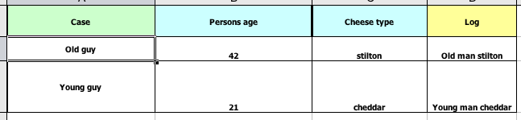

请参阅上述电子表格示例下载中的ExampleCheese.xls。

如果这是一个常规决策表，那么在行1之前以及包含规则元数据的行1和行2之间将存在隐藏行。使用规则模板，数据与规则完全分开。这有两个方便的后果 - 您可以将多个规则模板应用于相同的数据，并且您的数据根本不依赖于您的规则。那么模板是什么样的？

[source,java]
----
1  template header
2  age
3  type
4  log
5
6  package org.drools.examples.templates;
7
8  global java.util.List list;
9
10 template "cheesefans"
11
12 rule "Cheese fans_@{row.rowNumber}"
13 when
14    Person(age == @{age})
15    Cheese(type == "@{type}")
16 then
17    list.add("@{log}");
18 end
19
20 end template
----

上述程序清单的注释：

*   第1行：所有规则模板以``template header``开始。
*   第2-4行：在标题之后是按照它们在数据中出现的顺序排列的列表。在这种情况下，我们称第一列时间，第二种类型和第三个日志。
*   第5行：空行表示列定义的结束。
*   第6-9行：标准规则标题文本。这是DRL的标准规则，将出现在生成的DRL的顶部。将package语句和任何导入以及全局和函数定义放入本节。
*   第10行：关键字模板表示规则模板的开始。模板文件中可以有多个模板，但每个模板都应该有唯一的名称。
*   第11-18行：规则模板 - 详见下文。
*   第20行：关键字结束模板表示模板的结尾。

规则模板依靠MVEL使用语法@ {token_name}进行替换。目前有一个内置的表达式：@ {row.rowNumber}，它为每一行数据提供唯一的编号，并使您能够生成唯一的规则名称。对于每一行数据，都会生成一个规则，用数据中的值代替模板中的令牌。

规则模板必须包含在扩展名为.drt的文件中，并且在定义kmodule.xml文件中的kbase时与相应的决策表相关联，如下例所示

[source,java]
----
<?xml version="1.0" encoding="UTF-8"?>
<kmodule xmlns="http://drools.org/xsd/kmodule">
  <kbase name="TemplatesKB" packages="org.drools.examples.templates">
    <ruleTemplate dtable="org/drools/examples/templates/ExampleCheese.xls"
                  template="org/drools/examples/templates/Cheese.drt"
                  row="2" col="2"/>
      <ksession name="TemplatesKS"/>
      </kbase>
</kmodule>
----

通过上面的示例数据，将生成以下规则文件：

[source,java]
----
package org.drools.examples.templates;

global java.util.List list;

rule "Cheese fans_1"
when
  Person(age == 42)
  Cheese(type == "stilton")
then
  list.add("Old man stilton");
end

rule "Cheese fans_2"
when
  Person(age == 21)
  Cheese(type == "cheddar")
then
  list.add("Young man cheddar");
end
----

此时，名为“TemplatesKS”的KieSession包含从模板生成的规则，可以简单地从KieContainer创建，并用作其他KieSession。

[source,java]
----
KieSession ksession = kc.newKieSession( "TemplatesKS" );

// now create some test data
ksession.insert( new Cheese( "stilton", 42 ) );
ksession.insert( new Person( "michael", "stilton", 42 ) );
final List<String> list = new ArrayList<String>();
ksession.setGlobal( "list", list );

ksession.fireAllRules();
----

=== 记录日志

照亮作为规则引擎的黑盒子的一种方法是玩日志级别。

一切都记录到SLF4J，这是一个简单的日志记录门面，可以将任何日志委托给Logback，Apache Commons Logging，Log4j或java.util.logging。将日志适配器的依赖关系添加到您选择的日志框架中。如果你还没有使用任何日志框架，你可以通过添加这个Maven依赖项来使用Logback：

[source,java]
----
    <dependency>
      <groupId>ch.qos.logback</groupId>
      <artifactId>logback-classic</artifactId>
      <version>1.x</version>
    </dependency>
----

[NOTE]
如果您正在开发超轻型环境，请使用slf4j-nop或slf4j-simple。

在包org.drools上配置日志记录级别。例如：

在Logback中，将其配置到您的logback.xml文件中：

[source,java]
----
<configuration>

    <logger name="org.drools" level="debug"/>

    ...

<configuration>
----

在Log4J中，将其配置到您的log4j.xml文件中：

[source,java]
----
<log4j:configuration xmlns:log4j="http://jakarta.apache.org/log4j/">

    <category name="org.drools">
      <priority value="debug" />
    </category>

    ...

</log4j:configuration>
----