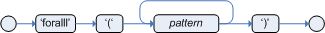
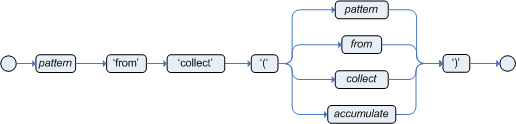
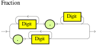
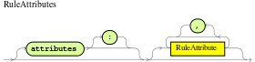
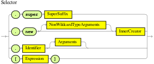

== 规则语言参考

=== 概述

Drools有一个“本地”的规则语言。这种格式在标点符号上非常轻，并且通过“扩展器”支持自然语言和领域特定的语言，使语言能够变形到您的问题领域。本章主要与本机规则格式一致。用于表示语法的图表被称为“铁路”图表，它们基本上是语言术语的流程图。技术上非常热衷的也可以参考__DRL.g__这是规则语言的Antlr3语法。如果您使用Rule Workbench，则可以通过内容帮助为您完成许多规则结构，例如，输入“ru”并按Ctrl +空格键，即可为您构建规则结构。

==== 规则文件

规则文件通常是扩展名为.drl的文件。在DRL文件中，您可以拥有多个规则，查询和函数，以及一些资源声明，如规则和查询分配并使用的导入，全局变量和属性。但是，您也可以将规则分散在多个规则文件中（在这种情况下，建议使用扩展名.rule，但不要求） - 跨文件传播规则可以帮助管理大量规则。 DRL文件只是一个文本文件。

规则文件的整体结构是：

.例子107. 规则文件
[source,java]
----
package package-name

imports

globals

functions

queries

rules
----

声明元素的顺序并不重要，除了声明的包名称必须是规则文件中的第一个元素。所有的元素都是可选的，所以你将只使用你需要的元素。我们将在下面的章节中讨论它们中的每一个。

==== 是什么使规则

对于急不可耐，就像早期的看法一样，规则有如下粗略的结构：

[source,java]
----
rule "name"
    attributes
    when
        LHS
    then
        RHS
end
----

这真的很简单。大部分标点符号是不需要的，即使是“name”的双引号也是可选的，换行符也是如此。属性很简单（总是可选的）提示规则应该如何表现。 LHS是规则的条件部分，它遵循下面所述的某种语法。 RHS基本上是一个允许执行方言特定语义代码的块。

值得注意的是，空白并不重要，在域特定的语言中，__except__是逐行处理的，而空格对于域语言来说可能是重要的。

=== 关键词

Drools 5引入了__hard__和__soft__关键字的概念。

硬关键字是保留的，在命名规则文本中使用的域对象，属性，方法，函数和其他元素时，不能使用任何硬关键字。

以下是编写规则时必须避免的作为标识符的hard关键字列表：

*   ``true``

*   ``false``

*   ``null``

软关键字只是在其上下文中被识别，使您可以在任何其他地方使用这些词，但如果可能的话，仍然建议避免使用这些词，以避免混淆。以下是soft关键字的列表：

*   ``lock-on-active``

*   ``date-effective``

*   ``date-expires``

*   ``no-loop``

*   ``auto-focus``

*   ``activation-group``

*   ``agenda-group``

*   ``ruleflow-group``

*   ``entry-point``

*   ``duration``

*   ``package``

*   ``import``

*   ``dialect``

*   ``salience``

*   ``enabled``

*   ``attributes``

*   ``rule``

*   ``extend``

*   when

*   then

*   ``template``

*   ``query``

*   ``declare``

*   ``function``

*   ``global``

*   ``eval``

*   ``not``

*   ``in``

*   ``or``

*   ``and``

*   ``exists``

*   ``forall``

*   accumulate

*   collect

*   from

*   ``action``

*   ``reverse``

*   ``result``

*   ``end``

*   over

*   ``init``
当然，你可以在骆驼的情况下把这些（硬和软）单词作为方法名称的一部分，就像notSomething（）或accumulateSomething（）一样 - 这个方案没有问题。

尽管上面的三个硬关键字不太可能用于现有的域模型，但是如果您绝对需要将它们用作标识符而不是关键字，则DRL语言提供了在规则文本上转义硬关键字的功能。为了逃避一个词，只需将其放在严重的口音，如下所示：

----
``Holiday( `true` == "yes" ) // please note that Drools will resolve that reference to the method Holiday.isTrue()``
----

=== 注释

注释是规则引擎忽略的文本部分。当遇到它们时，它们被剥离出来，除了语义代码块之外，像规则的RHS。

==== 单行注释

要创建单行注释，可以使用“//”。解析器将在注释符号后忽略行中的任何内容。例：

[source,java]
----
rule "Testing Comments"
when
    // this is a single line comment
    eval( true ) // this is a comment in the same line of a pattern
then
    // this is a comment inside a semantic code block
end
----

[WARNING]
'#' 的注释已经被删除。

==== 多行注释

.多行注释


多行注释用于在语义代码块内部和外部注释文本块。 例：

[source,java]
----
rule "Test Multi-line Comments"
when
    /* this is a multi-line comment
       in the left hand side of a rule */
    eval( true )
then
    /* and this is a multi-line comment
       in the right hand side of a rule */
end
----

=== 错误消息

Drools 5引入了标准化的错误消息。 这个标准化旨在帮助用户以更简单快捷的方式找到并解决问题。 在本节中，您将学习如何识别和解释这些错误消息，并且您还将收到一些关于如何解决与之相关的问题的提示。

==== 消息格式

标准化包括错误消息格式，为了更好地解释这种格式，我们使用下面的例子：

.错误信息格式


**1st Block:** 该区域标识错误代码。

**2nd Block:** 行和列信息。

**3rd Block:** 描述问题的一些文本。

**4th Block:** 这是第一个上下文。通常表示发生错误的规则，函数，模板或查询。这个块不是强制性的。

**5th Block:** 标识发生错误的模式。这个块不是强制性的。

==== 错误消息说明

===== 101：没有可行的选择

表示最常见的错误，即解析器进入决策点但无法识别替代方法。这里有些例子：

[source,java]
----
1: rule one
2:   when
3:     exists Foo()
4:     exits Bar()  // "exits"
5:   then
6: end
----

上面的例子产生这个消息：

*   [ERR 101] Line 4:4 在规则一输入“退出”时没有可行的选择

乍一看这似乎是有效的语法，但它不是(exits != exists)。我们来看下一个例子：

[source,java]
----
1: package org.drools.examples;
2: rule
3:   when
4:     Object()
5:   then
6:     System.out.println("A RHS");
7: end
----

现在上面的代码生成这个消息：

*   [ERR 101] Line 3:2 输入'WHEN'

这个消息意味着解析器遇到了令牌**WHEN**，实际上是一个硬关键字，但是由于规则名称丢失，所以它在错误的地方。

当你犯一个简单的词汇错误时，错误“没有可行的选择”也会出现。这里是一个词汇问题的例子：


[source,java]
----
1: rule simple_rule
2:   when
3:     Student( name == "Andy )
4:   then
5: end
----

上面的代码没有关闭引号，因此解析器生成这个错误信息：

*   [ERR 101] Line 0:-1 模式Student中规则simple_rule的输入'<eof>'没有可行的替代方法。

[NOTE]
通常行和列信息是准确的，但在某些情况下（如未封闭的引号），解析器会生成一个0：-1的位置。在这种情况下，你应该检查你是否忘记关闭引号，撇号或括号。

===== 不匹配的输入

这个错误表明解析器正在寻找它在当前输入位置找不到的特定符号。这里有一些样品：

[source,java]
----
1: rule simple_rule
2:   when
3:     foo3 : Bar(
----

上面的例子产生这个消息：

*   [ERR 102] Line 0:-1 模式Bar中规则simple_rule中的-1不匹配输入'<eof>'期待`）`为了解决这个问题，有必要完成规则声明。

[NOTE]
通常当你得到一个0：-1的位置，这意味着解析器到达了源代码的末尾。

以下代码会生成多个错误消息：

[source,java]
----
1: package org.drools.examples;
2:
3: rule "Avoid NPE on wrong syntax"
4:   when
5:     not( Cheese( ( type == "stilton", price == 10 ) || ( type == "brie", price == 15 ) ) from $cheeseList )
6:   then
7:     System.out.println("OK");
8: end
----

这些是与这个来源有关的错误：

*   [ERR 102] Line 5:36 在Cheese模式中，规则里错误的输入','或者意料外的')'会导致"Avoid NPE on wrong syntax"

*   [ERR 101] Line 5:57 规则中没有可匹配的'type'会出现"Avoid NPE on wrong syntax"。

*   [ERR 102] Line 5:106 不匹配的输入'）'期待'然后'在规则“避免NPE在错误的语法”
请注意，第二个问题与第一个有关。要修复它，只需用AND运算符（'&&'）替换逗号（'，'）即可。

[NOTE]
在某些情况下，您可能会收到多条错误消息。尝试从第一个开始一个接一个地修复。一些错误消息仅仅是作为其他错误的结果而产生的。

===== 谓词失败

验证语义谓词评估为false。通常这些语义谓词被用来识别软关键字。这个例子显示了这种情况：

[source,java]
----
 1: package nesting;
 2: dialect "mvel"
 3:
 4: import org.drools.compiler.Person
 5: import org.drools.compiler.Address
 6:
 7: fdsfdsfds
 8:
 9: rule "test something"
10:   when
11:     p: Person( name=="Michael" )
12:   then
13:     p.name = "other";
14:     System.out.println(p.name);
15: end
----

有了这个例子，我们得到这个错误信息：

*   [ERR 103] Line 7:0 规则'rule_key'失败谓词：{（validateIdentifierKey（DroolsSoftKeywords.RULE））}？在规则
** fdsfdsfds **文本无效，解析器无法将其标识为软关键字“rule”。

[NOTE]
这个错误非常类似于102：不匹配的输入，但通常涉及软关键字。

===== 不允许拖尾分号

这个错误与``eval``子句相关，在那里它的表达式不能以分号结尾。检查这个例子：

[source,java]
----
1: rule simple_rule
2:   when
3:     eval(abc();)
4:   then
5: end
----

由于eval内的分号，我们得到这个错误信息：

*   [ERR 104] Line 3:4 规则simple_rule中不允许使用尾随分号

这个问题很容易解决：只要删除分号。

===== 提前退出

认识者在语法上达到了一个至少与一种选择相匹配的亚规则，但是亚规则与任何东西都不匹配。简单地说：解析器已经进入了一个没有出路的分支。这个例子说明了它：

[source,java]
----
1: template test_error
2:   aa s  11;
3: end
----

这是与以上示例相关的消息：

*   [ERR 105] Line 2:2 需要（...）+循环与模板test_error中输入'aa'的内容不匹配

要解决这个问题，有必要删除数字值，因为它既不是一个有效的数据类型，它可能会开始一个新的模板插槽，也不可能启动任何其他规则文件构造。

==== 其他讯息

任何其他信息意味着发生了不好的事情，所以请联系开发团队。

=== 包

包是一系列规则和其他相关的结构，比如导入和全局变量。包成员通常是相互关联的 - 比如HR规则。一个包表示一个名称空间，对于给定的规则分组，这个名称空间在理想情况下是唯一的。包名称本身就是名称空间，并且不以任何方式与文件或文件夹相关联。

可以从多个规则源组装规则，并且有一个顶级程序包配置，所有规则都保存在下面（组装规则时）。虽然，不可能合并到以不同名称声明的相同包资源中。但是，单一的规则库可能包含多个构建于其上的包。一个常见的结构是将包中的所有规则与包声明在同一个文件中（所以这是完全自包含的）。

下面的流程图显示了可能组成一个包的所有组件。请注意，__must__包有一个名称空间，并使用标准的Java约定来声明包名;即没有空间，不同于允许空格的规则名称。按照元素的顺序，它们可以以任何顺序出现在规则文件中，除了“package”语句之外，它必须位于文件的顶部。在所有情况下，分号都是可选的。

.包


请注意，任何规则属性（如规则属性部分所述）也可以在包级别编写，取代属性的默认值。 修改的默认值仍然可以由规则中的属性设置替换。

==== 导入

.导入
image::images/Image-261117-014523.010.png[]

导入语句像Java中的import语句一样工作。 您需要为要在规则中使用的任何对象指定完全限定的路径和类型名称。 Drools自动从同名的Java包中导入类，也从包java.lang中导入类。

==== global

.全局


在全局范围内定义全局变量。它们用于使应用程序对象可用于规则。通常，它们用于提供规则使用的数据或服务，尤其是规则后果中使用的应用程序服务，以及从规则中返回数据（例如规则后果中添加的日志或值），或规则与应用程序进行交互，做回调。全局不能被插入到工作记忆中，因此全局决不应该被用来建立规则中的条件，除非它具有一个不变的价值。引擎不能通知全局变量的值，也不会跟踪它们的变化。在约束中错误地使用全局变量可能会产生令人惊讶的结果 - 这是令人吃惊的。

如果多个包声明具有相同标识符的全局变量，则它们必须是相同的类型，并且它们都将引用相同的全局值。

为了使用全局变量，你必须：

1. 在你的规则文件中声明你的全局变量并在规则中使用它。例如：

[source,java]
----
global java.util.List myGlobalList;

    rule "Using a global"
when
    eval( true )
then
    myGlobalList.add( "Hello World" );
end
----

2. 在工作记忆中设置全局值。在向工作记忆声明任何事实之前，设置所有全局值是一个最佳实践。例：

[source,java]
----
List list = new ArrayList();
KieSession kieSession = kiebase.newKieSession();
kieSession.setGlobal( "myGlobalList", list );
----

请注意，这些只是您从应用程序传递到工作内存的对象的命名实例。这意味着你可以传入你想要的任何对象：你可以传入一个服务定位器，或者一个服务本身。使用新元素，现在通常将Hibernate会话作为全局进行传递，以允许从指定的Hibernate查询中提取数据。

一个例子可能是电子邮件服务的一个实例。在调用规则引擎的集成代码中，获取您的emailService对象，然后将其设置在工作内存中。在DRL中，您声明您具有EmailService类型的全局，并将其命名为“email”。那么在你的规则后果中，你可以使用诸如email.sendSMS（number，message）之类的东西。

全局并不是为了在规则之间共享数据而设计的，它们决不能用于这个目的。规则总是对工作内存状态产生原因和反应，所以如果你想将规则中的数据传递给规则，把数据作为事实断言到工作内存中。

当更改全局变量所保存的数据时必须小心，因为规则引擎不知道这些变化，因此不能对它们做出反应。

=== 函数

.函数


函数是将语义代码放入规则源文件中的一种方式，与普通的Java类相反。他们不能做任何事情比你能用辅助类做什么。 （事实上，编译器会在后台为你生成帮助类。）在规则中使用函数的主要优点是可以将逻辑全部保存在一个地方，并且可以根据需要更改函数（可以是好的或坏的东西）。函数对于调用结果（那么）对规则的一部分的行为最为有用，特别是如果该特定行为被一遍又一遍地使用，可能每个规则只有不同的参数。

典型的函数声明如下所示：

[source,java]
----
function String hello(String name) {
    return "Hello "+name+"!";
}
----

请注意，使用了function关键字，尽管它并不是Java的一部分。函数的参数是按照方法定义的，如果不需要，则不需要参数。返回类型的定义与常规方法一样。

或者，您可以在助手类中使用静态方法，例如Foo.hello（）。 Drools支持使用函数导入，所以你需要做的是：

[source,java]
----
import function my.package.Foo.hello
----

无论定义或导入函数的方式如何，都可以通过调用函数的名称，结果或语义代码块来使用函数。例：

[source,java]
----
rule "using a static function"
when
    eval( true )
then
    System.out.println( hello( "Bob" ) );
end
----

=== 类型声明

.元数据


.类型声明


类型声明在规则引擎中有两个主要目标：允许声明新的类型，并允许为类型声明元数据。

*   **声明新的类型:** Drools使用简单的Java对象作为事实开箱即用。然而，有时用户可能希望将模型直接定义到规则引擎，而不必担心使用Java等较低级别的语言来创建模型。在其他时候，已经建立了一个领域模型，但是最终用户希望或者需要用在推理过程中主要使用的其他实体来补充这个模型。

*   **声明元数据:** 事实可能具有与其相关的元信息。元信息的例子包括任何类型的数据，这些数据不是由事实属性表示的，并且在该事实类型的所有实例中是一致的。这个元信息可以在运行时由引擎查询并用于推理过程。

==== 声明新的类型

为了声明一个新的类型，你所要做的就是使用关键字declare，接着是字段列表和关键字end。一个新的事实必须有一个字段列表，否则引擎将在类路径中寻找一个现有的事实类，如果没有找到，会引发一个错误。

.声明一个新的事实类型：Address
[source,java]
----
declare Address
   number : int
   streetName : String
   city : String
end
----

前面的例子声明了一个名为Address的新的事实类型。这个事实类型将有三个属性：数字，街道名称和城市。每个属性的类型都可以是任何有效的Java类型，包括由用户创建的任何其他类，甚至以前声明的其他事实类型。

例如，我们可能想要声明另一个事实类型Person：

.声明一个新的事实类型：Person
[source,java]
----
declare Person
    name : String
    dateOfBirth : java.util.Date
    address : Address
end
----

正如我们在前面的例子中看到的那样，dateOfBirth的类型是java.util.Date，来自Java API，而地址是之前定义的事实类型Address。

如前所述，您可以避免每次使用import子句编写完全限定名称的类。

.避免使用导入来使用完全限定的类名
[source,java]
----
import java.util.Date

declare Person
    name : String
    dateOfBirth : Date
    address : Address
end
----

当你声明一个新的事实类型时，Drools将在编译时生成一个字节码来实现一个表示事实类型的Java类。生成的Java类将是类型定义的一对一Java Bean映射。所以，对于前面的例子，生成的Java类将是：

.为前一个Person事实类型声明生成的Java类
[source,java]
----
public class Person implements Serializable {
    private String name;
    private java.util.Date dateOfBirth;
    private Address address;

    // empty constructor
    public Person() {...}

    // constructor with all fields
    public Person( String name, Date dateOfBirth, Address address ) {...}

    // if keys are defined, constructor with keys
    public Person( ...keys... ) {...}

    // getters and setters
    // equals/hashCode
    // toString
}
----

由于生成的类是一个简单的Java类，因此可以在规则中透明地使用它，就像任何其他事实一样。

.在规则中使用声明的类型
[source,java]
----
rule "Using a declared Type"
when<
    $p : Person( name == "Bob" )
then
    // Insert Mark, who is Bob's mate.
    Person mark = new Person();
    mark.setName("Mark");
    insert( mark );
end
----

===== 声明枚举类型

DRL也支持枚举类型的声明。这样的类型声明需要额外的关键字enum，后跟以逗号分隔的以逗号分隔的允许值列表。

[source,java]
----
rule "Using a declared Type"
when
    $p : Person( name == "Bob" )
then
    // Insert Mark, who is Bob's mate.
    Person mark = new Person();
    mark.setName("Mark");
    insert( mark );
end
----

编译器将使用静态方法valueOf（）和values（）以及实例方法ordinal（），compareTo（）和name（）生成一个有效的Java枚举。

复杂的枚举也是部分支持的，声明内部字段类似于常规类型声明。请注意，从版本6.x开始，枚举字段不支持其他声明的类型或枚举。

[source,java]
----
declare enum DaysOfWeek
   SUN("Sunday"),MON("Monday"),TUE("Tuesday"),WED("Wednesday"),THU("Thursday"),FRI("Friday"),SAT("Saturday");

   fullName : String
end
----

枚举可以在规则中使用

.在规则中使用声明枚举
[source,java]
----
rule "Using a declared Enum"
when
   $p : Employee( dayOff == DaysOfWeek.MONDAY )
then
   ...
end
----

==== 声明元数据
元数据可以分配给Drools中的几个不同的结构：事实类型，事实属性和规则。 

Drools使用at符号（'@'）来引入元数据，它总是使用以下形式：

----
``@metadata_key( metadata_value )``
----

括号内的metadata_value是可选的。

例如，如果你想声明一个像``author``这样的元数据属性，其值是__Bob__，你可以简单地写：

.声明一个元数据属性
----
``@author( Bob )``
----

Drools允许声明任意的元数据属性，但是一些对引擎有特殊的意义，而另外一些只是在运行时查询。 Drools允许为事实类型和事实属性声明元数据。在事实类型的属性之前声明的任何元数据被分配给事实类型，而在属性之后声明的元数据被分配给该特定属性。

.为事实类型和属性声明元数据属性
[source,java]
----
import java.util.Date

declare Person
    @author( Bob )
    @dateOfCreation( 01-Feb-2009 )

    name : String @key @maxLength( 30 )
    dateOfBirth : Date
    address : Address
end
----

在前面的例子中，为事实类型（``author``和``dateOfCreation``）声明了两个元数据项，并且为name属性（``@key``和``@maxLength ``）。请注意，@ key``元数据没有要求的值，所以括号和值被忽略了。

===== 预定义的类级别注释

一些注释具有由引擎解释的预定义的语义。以下是一些预定义的注释及其含义的列表。

====== @role（<fact | event>）

@role注释定义了引擎应该如何处理该类型的实例：或者作为常规事实，或者作为事件。它接受两个可能的值：

*   事实：这是默认的，声明类型是作为一个常规事实来处理的。

*   事件：声明这个类型是作为一个事件来处理的。

以下示例声明股票经纪人应用程序中的事实类型StockTick将作为事件处理。

.将事实类型声明为一个事件
[source,java]
----
import some.package.StockTick

declare StockTick
    @role( event )
end
----

这同样适用于在线声明的事实。如果StockTick是在DRL本身中声明的事实类型，而不是先前存在的类，则代码将是：

.声明一个事实类型并为其分配事件角色
[source,java]
----
declare StockTick
    @role( event )

    datetime : java.util.Date
    symbol : String
    price : double
end
----

====== @typesafe（<boolean>）

默认情况下，所有类型声明都是在启用类型安全性的情况@typesafe（false）提供了一种方法来通过允许回退来覆盖这种行为，在所有约束生成为MVEL约束并动态执行时键入不安全评估。处理没有任何泛型或混合类型集合的集合时，这可能很重要。

====== @timestamp（<attribute name>）

每个事件都有一个相关的时间戳分配给它。默认情况下，会话时钟读取给定事件的时间戳，并在事件插入工作存储器时分配给该事件。虽然有时候，事件有时间戳作为自己的属性之一。在这种情况下，用户可以告诉引擎使用事件属性中的时间戳，而不是从会话时钟中读取。

----
``@timestamp( <attributeName> )``
----

要告诉引擎什么属性用作事件时间戳的来源，只需将属性名称作为参数列入@timestamp标签。

.声明VoiceCall时间戳属性
[source,java]
----
declare VoiceCall
    @role( event )
    @timestamp( callDateTime )
end
----

====== @duration（<attribute name>）

Drools支持事件语义：时间点事件和基于时间间隔的事件。时间点事件表示为持续时间为零的基于时间间隔的事件。默认情况下，所有事件的持续时间为零。用户可以通过声明事件类型中的哪个属性包含事件的持续时间来为事件赋予不同的持续时间。

----
``@duration( <attributeName> )``
----

所以，对于我们的VoiceCall事实类型，声明将是：

.声明VoiceCall持续时间属性
[source,java]
----
declare VoiceCall
    @role( event )
    @timestamp( callDateTime )
    @duration( callDuration )
end
----

====== @expires（<time interval>）

[WARNING]
只有在STREAM模式下运行引擎时才会考虑该标记。另外，关于在内存管理部分使用这个标签的效果的补充讨论。这里包括完整性。

工作记忆中的一段时间后，事件可能会自动失效。通常情况下，根据知识库中的现有规则，事件不能再匹配和激活任何规则。尽管可以明确定义一个事件应该到期的时间。

----
``@expires( <timeOffset> )``
----

__timeOffset__的值是以下形式的时间间隔：

----
``[#d][#h][#m][#s][#[ms]]``
----

其中__ [] __表示可选参数，__ \ #__表示数值。

因此，要声明VoiceCall事实在插入工作存储器1小时35分钟后应该过期，用户将写：

.声明VoiceCall事件的到期偏移量
[source,java]
----
declare VoiceCall
    @role( event )
    @timestamp( callDateTime )
    @duration( callDuration )
    @expires( 1h35m )
end
----

@expires策略将优先并覆盖从知识库中时间约束和滑动窗口计算得出的隐式到期偏移量。

====== @propertyChangeSupport

实现对Javabean（tm）规范中定义的属性更改的支持的事实现在可以注释，以便引擎注册自己以侦听事实属性的更改。 Drools 4 API中insert（）方法中使用的布尔参数已被弃用，并且不存在于drools-api模块中。

.@propertyChangeSupport
[source,java]
----
declare Person
    @propertyChangeSupport
end
----

====== @propertyReactive

使这个类型的属性反射。细节请参阅细粒度属性更改侦听器部分。

===== 预定义的属性级别注释

如前所述，Drools还支持类型属性中的注释。以下是预定义属性注释的列表。

====== @key

将属性声明为关键属性对生成的类型有两个主要影响：

1.该属性将用作类型的关键标识符，因此，在比较此类型的实例时，生成的类将实现equals（）和hashCode（）方法，并考虑该属性。

2. Drools将生成一个使用所有关键属性作为参数的构造函数。

.类型的@key声明的例子
[source,java]
----
declare Person
    firstName : String @key
    lastName : String @key
    age : int
end
----

对于前面的例子，Drools将生成equals（）和hashCode（）方法，它们将检查firstName和lastName属性，以确定Person的两个实例是否彼此相等，但不会检查age属性。它也会生成一个以firstName和lastName为参数的构造函数，允许使用如下代码创建实例：

.使用键构造函数创建一个实例
----
``Person person = new Person( "John", "Doe" );``
----

====== @position

模式支持类型声明的位置参数。

位置参数是您不需要指定字段名称的位置参数，因为位置映射到已知的命名字段。即Person（name ==“mark”）可以被重写为Person（“mark”;）。分号“;”是非常重要的，以便引擎知道它之前的一切是一个位置的论点。否则，我们可能会认为它是一个布尔表达式，分号后可以这样解释。您可以通过使用分号“;”混合模式上的位置和命名参数。分开他们。尚未绑定的位置中使用的任何变量都将绑定到映射到该位置的字段。

[source,java]
----
declare Cheese
    name : String
    shop : String
    price : int
end
----

默认顺序是声明的顺序，但是这可以使用@position覆盖

[source,java]
----
declare Cheese
    name : String @position(1)
    shop : String @position(2)
    price : int @position(0)
end
----

org.drools.definition.type包中的@Position注释可用于注释类路径上的原始pojos。目前只有类的字段可以注释。支持类的继承，但不支持方法的接口。

示例模式，有两个约束和一个绑定。记住分号';'用于区分名称参数部分的位置部分。位置参数支持变量和文字以及仅使用文字的表达式，但不支持变量。

[source,java]
----
Cheese( "stilton", "Cheese Shop", p; )
Cheese( "stilton", "Cheese Shop"; p : price )
Cheese( "stilton"; shop == "Cheese Shop", p : price )
Cheese( name == "stilton"; shop == "Cheese Shop", p : price )
----

当bean相互扩展时@Position被继承;虽然不推荐，但是两个字段可能具有相同的位置值，并不是所有的连续值都需要声明。如果一个@position被重复，那么使用继承（超类中的字段具有优先级）和声明顺序来解决冲突。如果缺少@position值，则选择没有显式@position（如果有的话）的第一个字段来填补空白。一如往常，冲突是通过继承和申报秩序来解决的。

[source,java]
----
declare Cheese
    name : String
    shop : String @position(2)
    price : int @position(0)
end

declare SeasonedCheese extends Cheese
    year : Date @position(0)
    origin : String @position(6)
    country : String
end
----

在这个例子中，字段顺序是：price（超类中的@position 0），year（@position 0中的子类），name（没有@position的第一个字段），shop（@position 2），country（第二个字段没有@position），origin。

==== 为现有类型声明元数据

Drools允许为现有类型声明元数据属性，就像为新的事实类型声明元数据属性一样。唯一的区别是在该声明中没有字段。

例如，如果有一个类org.drools.examples.Person，并且想为其声明元数据，可以写下面的代码：

.为现有类型声明元数据
[source,java]
----
import org.drools.examples.Person

declare Person
    @author( Bob )
    @dateOfCreation( 01-Feb-2009 )
end
----

除了使用导入之外，还可以通过完全限定的名称来引用类，但是由于类也将在规则中引用，所以添加导入并在任何地方使用简短的类名通常较短。
.使用完全限定的类名来声明元数据
[source,java]
----
declare org.drools.examples.Person
    @author( Bob )
    @dateOfCreation( 01-Feb-2009 )
end
----

==== 声明类型的参数化构造函数

使用声明类型的参数生成构造函数。

例如：对于如下所示的声明类型：

[source,java]
----
declare Person
    firstName : String @key
    lastName : String @key
    age : int
end
----

编译器将隐含地生成3个构造函数：一个不带参数，一个带有@key字段，另一个带有所有字段。

[source,java]
----
Person() // parameterless constructor
Person( String firstName, String lastName )
Person( String firstName, String lastName, int age )
----

==== 非类型安全类

@typesafe（<boolean>）已被添加到类型声明中。默认情况下，所有类型声明都是在启用类型安全性的情况@typesafe（false）提供了一种方法来通过允许回退来覆盖这种行为，在所有约束生成为MVEL约束并动态执行时键入不安全评估。处理没有任何泛型或混合类型集合的集合时，这可能很重要。

==== 从应用程序代码访问已声明的类型

声明类型通常在规则文件中使用，而在规则和应用程序之间共享模型时使用Java模型。尽管有时候，应用程序可能需要访问和处理来自声明类型的事实，尤其是当应用程序正在包装规则引擎并为规则管理提供更高级别，特定于域的用户界面时。

在这种情况下，生成的类可以像往常一样使用Java Reflection API进行处理，但是，正如我们所知，通常需要大量的工作才能获得小的结果。因此，Drools为应用程序可能想要处理的最常见的事实提供了一个简化的API。

要认识到的第一件重要的事情是，宣布的事实将属于宣布的包裹。因此，例如，在下面的例子中，Person将属于org.drools.examples包，所以生成的类的完全限定名是org.drools.examples.Person。

.在org.drools.examples包中声明一个类型
[source,java]
----
package org.drools.examples

import java.util.Date

declare Person
    name : String
    dateOfBirth : Date
    address : Address
end
----

如前所述，声明类型是在知识库编译时生成的，即，应用程序只能在应用程序运行时访问它们。因此，这些类不能直接从应用程序中引用。

然后Drools提供了一个接口，用户可以通过该接口处理来自应用程序代码的声明类型：org.drools.definition.type.FactType。通过这个接口，用户可以在声明的事实类型中实例化，读写字段。

.通过API处理声明的事实类型
[source,java]
----
// get a reference to a knowledge base with a declared type:
KieBase kbase = ...

// get the declared FactType
FactType personType = kbase.getFactType( "org.drools.examples",
                                         "Person" );

// handle the type as necessary:
// create instances:
Object bob = personType.newInstance();

// set attributes values
personType.set( bob,
                "name",
                "Bob" );
personType.set( bob,
                "age",
                42 );

// insert fact into a session
KieSession ksession = ...
ksession.insert( bob );
ksession.fireAllRules();

// read attributes
String name = personType.get( bob, "name" );
int age = personType.get( bob, "age" );
----

API还包含其他有用的方法，例如一次设置所有属性，从Map中读取值或一次读取所有属性到Map中。

尽管API类似于Java反射（但使用起来简单得多），但它并不使用下面的反射，依赖于使用生成的字节码实现的更高性能的访问器。

==== 类型声明'extends'

类型声明现在支持继承的“extends”关键字。

为了扩展由DRL声明的子类型在Java中声明的类型，请在不带任何字段的declare语句中重复超类型。

[source,java]
----
import org.people.Person

declare Person end

declare Student extends Person
    school : String
end

declare LongTermStudent extends Student
    years : int
    course : String
end
----

=== 规则

.规则


条规则规定当左手侧（LHS）中指定的一组特定条件发生时，则执行查询被指定为右手侧（RHS）中的动作列表。用户的一个常见问题是“为什么要使用when而不是if？” “when”被选择为“if”，因为“if”通常是程序执行流程的一部分，在特定的时间点需要检查一个条件。

规则必须有一个名称，在其规则包中是唯一的。如果您在相同的DRL中定义了两次规则，则在加载时会产生错误。如果添加包含规则名称的DRL，它将替换以前的规则。如果规则名称有空格，则需要用双引号括起来（最好总是使用双引号）。

属性 - 如下所述 - 是可选的。他们最好每行写一个。

规则的LHS遵循when关键字（最好在新行上），RHS同样遵循then关键字（理想情况下换行符）。该规则由关键字end结束。规则不能嵌套。

.规则语法概述
[source,java]
----
rule "<name>"
    <attribute>*
when
    <conditional element>*
then
    <action>*
end
----

.一个简单的规则
[source,java]
----
rule "Approve if not rejected"
  salience -100
  agenda-group "approval"
    when
        not Rejection()
        p : Policy(approved == false, policyState:status)
        exists Driver(age > 25)
        Process(status == policyState)
    then
        log("APPROVED: due to no objections.");
        p.setApproved(true);
end
----

==== 规则属性

规则属性提供了一种声明方式来影响规则的行为。有些是非常简单的，而另一些则是复杂子系统的一部分，比如ruleflow。为了充分利用Drools，你应该确保你对每个属性有一个正确的理解。

.规则属性


``no-loop``

默认值：false

类型: Boolean

当规则的结果修改事实时，可能会导致规则再次激活，导致无限循环。将no-loop设置为true将跳过为具有当前事实集合的规则创建另一个Activation。

``ruleflow-group``

默认值: N/A

类型: String

Ruleflow是一个Drools功能，可以让你控制规则的触发。仅当组的活动时，由同一个ruleflow-group标识符组装的规则才会触发。

``lock-on-active``

默认值: ``false``

类型: Boolean

每当规则流组变为活动状态或者议程组收到焦点时，该组中的任何规则锁定激活设置为true的规则将不再被激活;不管更新的起源如何，匹配规则的激活都被丢弃。这是一个更强大的无循环版本，因为现在不仅可以由规则本身引起变化。对于计算规则而言，如果您有一些修改事实的规则，并且不希望任何规则重新匹配并再次触发，那么这是理想的计算规则。只有在规则流程组不再活动或者议程组失去焦点的情况下，那些锁定活动设置为true的规则才会再次成为其激活被列入议程的条件。

``salience``

默认值: ``0``

类型: integer

每个规则都有一个整数显着属性，默认为零，可以是负值也可以是正值。显着性是优先级的一种形式，当在激活队列中排序时，具有较高显着性值的规则被赋予较高的优先级。

Drools还支持动态显着性，您可以使用涉及绑定变量的表达式。

.动态显着性
[source,java]
----
rule "Fire in rank order 1,2,.."
        salience( -$rank )
    when
        Element( $rank : rank,... )
    then
        ...
end
----

``agenda-group``

默认值: MAIN

类型: String

议程组允许用户划分议程提供更多的执行控制。只有获得焦点的议程小组的规则才被允许开除。

``auto-focus``

默认值: ``false``

类型: Boolean

如果在自动对焦值为true并且规则的议程组尚未具有焦点的情况下激活规则，则会给予焦点，从而允许规则可能触发。

``activation-group``

默认值: N/A

类型: String

属于同一个激活组的规则（由该属性的字符串值标识）将只能单独激活。更确切地说，激活组中的第一条规则将会取消组中所有规则的所有悬而未决的激活，即阻止它们发射。

注意：这个叫Xor组，但是从技术上说它不是Xor。你可能还听到人们提到异或集团;只需在激活组中使用该术语即可。

``dialect``

默认值：如包所指定

类型: String

可能的值: "java" 或者 "mvel"

方言种类是在LHS或RHS代码块中用于任何代码表达的语言。目前有两种方言可用，Java和MVEL。虽然可以在包级别指定方言，但是此属性允许为规则覆盖包定义。

``date-effective``

默认值: N/A

类型: String, 包含日期和时间定义

如果当前日期和时间在日期有效属性之后，则规则只能激活。

``date-expires``

默认值: N/A

类型: String, 包含日期和时间定义

如果当前日期和时间在date-expires属性之后，则规则无法激活。

``duration``

默认值：没有默认值

type: long

持续时间表明规则将在指定的持续时间后触发，如果仍然如此。

.一些属性的例子
[source,java]
----
rule "my rule"
  salience 42
  agenda-group "number 1"
    when ...
----

==== 定时器和日历

规则现在支持基于时间间隔和基于cron的定时器，它们取代了现在弃用的持续时间属性。

.示例计时器属性使用
[source,java]
----
timer ( int:  <repeat interval>? )
timer ( int: 30s )
timer ( int: 30s 5m )

timer ( cron: <cron expression> )
timer ( cron:* 0/15 * * * ? )
----

Interval（由“int：”指示）定时器遵循java.util.Timer对象的语义，具有初始延迟和可选的重复间隔。 Cron（由“cron：”表示）定时器遵循标准的Unix cron表达式：

.一个Cron例子
[source,java]
----
rule "Send SMS every 15 minutes"
    timer (cron:* 0/15 * * * ?)
when
    $a : Alarm( on == true )
then
    channels[ "sms" ].insert( new Sms( $a.mobileNumber, "The alarm is still on" );
end
----

定时器控制的规则在匹配时变为激活状态，对于每个单独的匹配则变为一次。根据定时器的设置重复执行其结果。一旦条件不匹配，就停止。

即使在控制从调用返回给FireUntilHalt之后，也会执行后果。而且，发动机对工作记忆的任何变化都保持反应。例如，删除涉及触发定时器规则执行的Fact会导致重复执行终止，或插入一个事实，以便某些规则匹配将导致该规则触发。但是，引擎并不是一直活跃的，只有在一个规则触发后，无论出于何种原因。因此，在下一次执行定时器控制的规则之前，不会发生对异步插入的反应。处理会话会终止所有计时器活动。

相反，当规则引擎默认运行在被动模式（即：使用fireAllRules而不是fireUntilHalt）时，它不会触发定时规则的后果，除非fireAllRules不再被调用。但是，可以通过使用TimedRuleExecutionOption配置KieSession来更改此默认行为，如以下示例所示。

.配置KieSession自动执行定时规则
[source,java]
----
KieSessionConfiguration ksconf = KieServices.Factory.get().newKieSessionConfiguration();
ksconf.setOption( TimedRuleExecutionOption.YES );
KSession ksession = kbase.newKieSession(ksconf, null);
----

也可以对定时规则进行更细粒度的控制，这些规则必须自动执行。要做到这一点，有必要设置一个FILTERED TimedRuleExecutionOption，它允许定义一个回调来过滤这些规则，就像下一个例子中所做的那样。

.配置一个过滤器来选择自动执行哪些定时规则
[source,java]
----
KieSessionConfiguration ksconf = KieServices.Factory.get().newKieSessionConfiguration();
conf.setOption( new TimedRuleExecutionOption.FILTERED(new TimedRuleExecutionFilter() {
    public boolean accept(Rule[] rules) {
        return rules[0].getName().equals("MyRule");
    }
}) );
----

对于间隔计时器，也可以将延迟和间隔定义为表达式而不是固定值。为此，有必要使用表达式计时器（由“expr：”表示），如下例所示：

.一个表达式计时器示例
[source,java]
----
declare Bean
    delay   : String = "30s"
    period  : long = 60000
end

rule "Expression timer"
    timer( expr: $d, $p )
when
    Bean( $d : delay, $p : period )
then
end
----

在这种情况下，表达式$ d和$ p可以使用规则的模式匹配部分中定义的任何变量，并且可以是任何可以在持续时间内解析的字符串，也可以是将在内部长时间内转换的任何数值表示以毫秒表示的持续时间。

间隔和表达式定时器都可以有3个可选参数，名称分别为“start”，“end”和“repeat-limit”。当使用这些参数中的一个或多个参数时，定时器定义的第一部分必须跟有分号“;”并且参数必须用逗号“，”分隔，如下例所示：

.一个带有开始和结束的间隔定时器
----
``timer (int: 30s 10s; start=3-JAN-2010, end=5-JAN-2010)``
----

开始和结束参数的值可以是日期，表示日期或长的字符串，或者更一般的任何数字，将在Java日期中进行转换，应用以下转换：

----
``new Date( ((Number) n).longValue() )``
----

相反，repeat-limit只能是一个整数，它定义了定时器允许的最大重复次数。如果同时设定了结束和重复限制参数，则当两者中的第一个匹配时，计时器将停止。

启动参数的使用意味着定时器阶段的定义，其中阶段的开始由启动本身加上最终的延迟给出。换句话说，在这种情况下，定时规则将在以下时间被安排：

----
``start + delay + n*period``
----

达到重复限制时间，不迟于结束时间戳（以先到者为准）。例如具有以下间隔计时器的规则。

----
``timer ( int: 30s 1m; start="3-JAN-2010" )``
----

将于2010年1月3日午夜后的每分钟30秒进行。这也意味着，例如，如果您在2010年2月3日午夜打开系统，则不会立即安排，但会保留定时器定义的阶段，因此将在30秒后首次安排午夜。

如果由于某种原因系统暂停（例如，会话被序列化，然后在一段时间之后反序列化），规则将仅被安排一次以从缺失的激活中恢复（不管我们错过了多少次激活），并且随后将再次安排与计时器相位。

日历用于控制规则何时可以触发。 Calendar API模仿于http://www.quartz-scheduler.org/[Quartz]：

.调整Quartz日历

----
``Calendar weekDayCal = QuartzHelper.quartzCalendarAdapter(org.quartz.Calendar quartzCal)``
----

日历是用“KieSession”注册的：

.注册一个日历
----
``ksession.getCalendars().set( "weekday", weekDayCal );``
----

它们可以与包括定时器在内的常规规则和规则结合使用。规则属性“日历”可能包含一个或多个以字符串文字形式书写的以逗号分隔的日历名称。

.一起使用日历和定时器
[source,java]
----
rule "weekdays are high priority"
   calendars "weekday"
   timer (int:0 1h)
when
    Alarm()
then
    send( "priority high - we have an alarm" );
end

rule "weekend are low priority"
   calendars "weekend"
   timer (int:0 4h)
when
    Alarm()
then
    send( "priority low - we have an alarm" );
end
----

==== 左手边（when）语法

===== 什么是左手边？

左手边（LHS）是规则的条件部分的通用名称。它由零个或多个条件元素组成。如果LHS为空，则会将其视为始终为true的条件元素，并在创建新的WorkingMemory会话时激活一次。

.左手边


.没有条件元素的规则
[source,java]
----
rule "no CEs"
when
    // empty
then
    ... // actions (executed once)
end

// The above rule is internally rewritten as:

rule "eval(true)"
when
    eval( true )
then
    ... // actions (executed once)
end
----

条件元素适用于一个或多个模式（在下面介绍）。最常见的条件元素是“和”。因此，当规则的LHS中有多个模式没有任何连接时，这是隐含的：

.隐式and
[source,java]
----
rule "2 unconnected patterns"
when
    Pattern1()
    Pattern2()
then
    ... // actions
end

// 上面的规则在内部被重写为：

rule "2 and connected patterns"
when
    Pattern1()
    and Pattern2()
then
    ... // actions
end
----

[WARNING]
一个“and”不能有一个领先的声明绑定（不像例如）。这是显而易见的，因为一个声明一次只能引用一个单一的事实，当“and”被满足时，它就会匹配这两个事实 - 声明绑定哪个事实？

----
// 编译错误
$person : (Person( name == "Romeo" ) and Person( name == "Juliet"))
----

===== 模式（条件元素）

====== 什么是模式？

模式元素是最重要的条件元素。它可以匹配插入工作存储器的每个事实。

一个模式包含零个或多个约束，并有一个可选的模式绑定。下面的铁路图显示了这个语法。

.模式
image::images/Image-261117-093851.075.png[]

以最简单的形式，没有约束，模式匹配给定类型的事实。在下面的例子中，类型是Cheese，这意味着模式将与工作内存中的所有Person对象相匹配：

----
Person()
----

该类型不一定是某个事实对象的实际类。模式可能涉及超类甚至是接口，从而可能与来自许多不同类的事实匹配。

----
Object() // 匹配工作内存中的所有对象
----

模式括号内部是所有动作发生的地方：它定义了该模式的约束。例如，与年龄有关的限制：

----
Person( age == 100 )
----

[NOTE]
出于向后兼容性的原因，可以使用后缀模式';'字符。但不建议这样做。

====== 模式绑定

为了引用匹配的对象，使用一个模式绑定变量，如$p。

.具有绑定变量的模式
[source,java]
----
rule ...
when
    $p : Person()
then
    System.out.println( "Person " + $p );
end
----

带前缀的美元符号（$）只是一个约定;在有助于轻松区分变量和字段的复杂规则中可能有用，但这不是强制性的。

===== 约束（模式的一部分）

====== 什么是约束？

约束是一个返回true或false的表达式。这个例子有一个约束，状态5小于6：

----
``Person( 5 < 6 )  // 只是一个例子，因为这样的约束在实际模式中是无用的
----

实质上，这是一个带有一些增强（比如属性访问）的Java表达式和一些差异（比如``==``的``equals()``语义）。让我们深入了解一下。

====== Java Bean（POJO）的属性访问

任何bean属性都可以直接使用。使用标准的Java bean getter公开一个bean属性：一个方法getMyProperty（）（或者一个基本布尔值的isMyProperty（）），它不接受任何参数并返回一些东西。例如：age属性在DRL中被写为age，而不是getter getAge（）：

[source,java]
----
Person( age == 50 )

// this is the same as:
Person( getAge() == 50 )
----

Drools使用标准的JDK Introspector类来完成这个映射，所以它遵循标准的Java bean规范。

[NOTE]
我们建议使用属性访问（age）而不是使用getter（getAge（）），因为通过字段索引提高了性能。

[NOTE]
属性访问器不得以可能影响规则的方式更改对象的状态。请记住，规则引擎在调用之间有效地缓存它的匹配结果，以使其更快。

----
public int getAge() {
    age++; // Do NOT do this
    return age;
}
----

----
public int getAge() {
    Date now = DateUtil.now(); // Do NOT do this
    return DateUtil.differenceInYears(now, birthday);
}
----

为了解决后一种情况，插入一个将当前日期包装到工作内存中的事实，并根据需要在fireAllRules之间更新该事实。

[NOTE]
以下回退适用：如果找不到属性的getter，则编译器将使用属性名称作为方法名称并且不带参数：

----
Person( age == 50 )

// If Person.getAge() does not exists, this falls back to:
Person( age() == 50 )
----

嵌套属性访问也被支持：

[source,java]
----
Person( address.houseNumber == 50 )

// this is the same as:
Person( getAddress().getHouseNumber() == 50 )
----

嵌套属性也被索引。

[WARNING]
在有状态会话中，当使用嵌套访问器时要小心，因为工作内存不知道任何嵌套值，并且不知道它们什么时候改变。将其任何父引用插入到工作内存中时，请考虑它们不可变。或者，如果您希望修改嵌套值，则应将所有外部事实标记为已更新。在上例中，当houseNumber更改时，具有该地址的任何人员必须标记为已更新。

====== Java表达式

您可以使用任何返回布尔值的Java表达式作为模式括号内的约束条件。 Java表达式可以与其他表达式增强功能（如属性访问）混合使用：

----
``Person( age == 50 )``
----

可以像使用任何逻辑或数学表达式一样使用圆括号来改变评估优先级：

----
``Person( age > 100 && ( age % 10 == 0 ) )``
----

可以重用Java方法：

----
``Person( Math.round( weight / ( height * height ) ) < 25.0 )``
----

[NOTE]
至于属性访问器，方法不能以可能影响规则的方式改变对象的状态。任何在LHS中执行的方法都应该是只读方法。

----
``Person( incrementAndGetAge() == 10 ) // Do NOT do this``
----

[NOTE]
规则调用之间不应该改变事实的状态（除非在每次更改时将这些事实标记为工作内存）：

----
``Person( System.currentTimeMillis() % 1000 == 0 ) // Do NOT do this``
----

普通Java运算符优先级适用，请参阅下面的运算符优先级列表。

[NOTE]
除了==和！=以外，所有的操作符都具有普通的Java语义。

``==``运算符具有无效的equals（）语义：

----
// Similar to: java.util.Objects.equals(person.getFirstName(), "John")
// so (because "John" is not null) similar to:
// "John".equals(person.getFirstName())
Person( firstName == "John" )
----

“！=”运算符具有无效的“！equals（）”语义：

----
``// Similar to: !java.util.Objects.equals(person.getFirstName(), "John")
Person( firstName != "John" )``
----

如果字段和值是不同的类型，总是尝试类型强制;如果尝试了一个不好的胁迫，就会抛出异常。例如，如果在数字评估器中提供“ten”作为字符串，则引发异常，而“10”将强制为数字10.强制总是倾向于字段类型而不是值类型：

----
``Person( age == "10" ) // "10" is coerced to 10``
----

====== 逗号分隔符AND

逗号字符（'`，`'）用于分隔约束组。它具有隐含的__ AND__连接语义。

[source,java]
----
// Person is at least 50 and weighs at least 80 kg
Person( age > 50, weight > 80 )
----

[source,java]
----
// Person is at least 50, weighs at least 80 kg and is taller than 2 meter.
Person( age > 50, weight > 80, height > 2 )
----

[NOTE]
虽然 ``&&`` 和``,``操作符具有相同的语义，但它们被解析为不同的优先级：``&&``运算符在``||``运算符之前。 ``&&``和 ``||`` 操作符都在``,`` 操作符之前。请参阅下面的运营商优先级列表。

逗号运算符在顶层约束条件下应该是首选，因为它使得约束更容易阅读，引擎通常能够更好地优化它们。

逗号（``，``）运算符不能嵌入复合约束表达式中，如括号：

[source,java]
----
Person( ( age > 50, weight > 80 ) || height > 2 ) // Do NOT do this: compile error

// Use this instead
Person( ( age > 50 && weight > 80 ) || height > 2 )
----

====== 绑定变量

属性可以绑定到一个变量：

[source,java]
----
// 2 persons of the same age
Person( $firstAge : age ) // binding
Person( age == $firstAge ) // constraint expression
----

前缀的美元符号（``$``）只是一个约定;在有助于轻松区分变量和字段的复杂规则中可能有用。

[NOTE]
出于向后兼容性的原因，允许（但不推荐）将约束绑定和约束表达式混合在一起：

----
// Not recommended
Person( $age : age * 2 < 100 )
----

----
// Recommended (separates bindings and constraint expressions)
Person( age * 2 < 100, $age : age )
----

使用运算符“==”的绑定变量限制提供了非常快的执行，因为它使用散列索引来提高性能。

====== Unification

Drools不允许绑定到相同的声明。然而，这是推导查询统一的一个重要方面。虽然位置参数总是使用统一处理，但引入了一个特殊的统一符号“：=”，用于名为arguments的命名参数。下面“统一”两个人的年龄论点。

[source,java]
----
Person( $age := age )
Person( $age := age)
----

实质上，统一将为第一次出现声明一个绑定，并将其约束为序列出现的绑定字段的相同值。

====== 嵌套对象的分组访问器

通常情况下，有必要访问嵌套对象的多个属性，如下例所示

----
Person( name == "mark", address.city == "london", address.country == "uk" )
----

这些嵌套对象的访问器可以用一个'.(...)'语法分组，以提供更多的可读规则

----
Person( name == "mark", address.( city == "london", country == "uk") )
----

注意'.'前缀，这是区分方法调用的嵌套对象约束所必需的。

====== 内联casts和coercion

处理嵌套对象时，也需要将其转换为子类型。 可以通过＃符号来做到这一点，如下所示：

----
Person( name == "mark", address#LongAddress.country == "uk" )
----

这个例子将地址转换为LongAddress，使其获取者可用。如果转换不可能（instanceof返回false），则评估将被视为错误。还支持完全限定名称：

----
Person( name == "mark", address#org.domain.LongAddress.country == "uk" )
----

可以在同一个表达式中使用多个内联强制转换：

----
Person( name == "mark", address#LongAddress.country#DetailedCountry.population > 10000000 )
----

此外，既然我们也支持运营商的实例，如果使用这个运算符，我们将在该模式内推断其结果以进一步使用该领域：

----
Person( name == "mark", address instanceof LongAddress, address.country == "uk" )
----

====== 特殊的字面支持

除了普通的Java文本（包括Java 5枚举）之外，这个文字也被支持：

====== 日期文字

日期格式“dd-mmm-yyyy”是默认支持的。您可以通过提供一个替代的日期格式掩码来定制这个名称为“drools.dateformat”的系统属性。如果需要更多控制，请使用限制

.日期文字限制
----
``Cheese( bestBefore < "27-Oct-2009" )``
----

====== List和Map的访问

可以通过索引直接访问“List”值：

[source,java]
----
// Same as childList(0).getAge() == 18
Person( childList[0].age == 18 )
----

也可以通过键直接访问“Map”值：

[source,java]
----
// Same as credentialMap.get("jsmith").isValid()
Person( credentialMap["jsmith"].valid )
----

====== 缩略联合关系条件

这允许您使用限制连接符``&&``或``||``在字段上放置多个限制。 允许通过圆括号分组，导致递归语法模式。

.缩略联合关系条件


.缩写联合关系条件与词义


[source,java]
----
// Simple abbreviated combined relation condition using a single &&
Person( age > 30 && < 40 )
----

[source,java]
----
// Complex abbreviated combined relation using groupings
Person( age ( (> 30 && < 40) ||
              (> 20 && < 25) ) )
----

[source,java]
----
// Mixing abbreviated combined relation with constraint connectives
Person( age > 30 && < 40 || location == "london" )
----

====== 特殊的DRL操作符

.操作符


将试图强制为评估者和现场的正确价值。

====== 运算符``< ⇐ > >=``

这些运算符可以用于具有自然排序的属性。例如，对于日期字段，<表示之前，对于字符串字段，意味着按字母顺序较低。

----
``Person( firstName < $otherFirstName )``
----

----
``Person( birthDate < $otherBirthDate )``
----

只适用于可比较的属性。

====== 无效的解引用操作符

``!.``运算符允许以无效的方式取消拒绝。更详细的说，匹配算法需要``!.``左边的值。运算符不为空以便为模式匹配本身提供肯定的结果。换句话说，模式：

----
``Person( $streetName : address!.street )``
----

将在内部翻译成：

----
``Person( address != null, $streetName : address.street )``
----

====== 操作符``matches``

匹配任何有效的Java正则表达式的字段。通常，regexp是一个字符串文字，但也可以使用解析为有效正则表达式的变量。

.正则表达式约束
----
``Cheese( type matches "(Buffalo)?\\S*Mozzarella" )``
----

[NOTE]
就像在Java中一样，写成字符串文字的正则表达式需要转义``\\``。

只适用于字符串属性。对``null``值使用``matches``总是计算为false。

====== 操作符``not matches``

如果字符串与正则表达式不匹配，则运算符返回true。相同的规则适用于匹配运算符。例：

.正则表达式约束
----
``Cheese( type not matches "(Buffalo)?\\S*Mozzarella" )``
----

只适用于字符串属性。对``null``值使用``not matches``总是计算为true。

====== 操作符``contains``

运算符contains用于检查是一个Collection或一个元素的字段是否包含指定的值。

.包含集合
[source,java]
----
CheeseCounter( cheeses contains "stilton" ) // contains with a String literal
CheeseCounter( cheeses contains $var ) // contains with a variable
----

仅适用于``Collection``属性。

``contains``的运算符也可以用来代替String.contains（）约束检查。

.包含字符串文字
[source,java]
----
Cheese( name contains "tilto" )
Person( fullName contains "Jr" )
String( this contains "foo" )
----

====== 操作符``not contains``

不包含的操作符用于检查作为Collection或元素的字段是否不包含指定的值。

.与集合的文字约束
[source,java]
----
CheeseCounter( cheeses not contains "cheddar" ) // not contains with a String literal
CheeseCounter( cheeses not contains $var ) // not contains with a variable
----

仅适用于``Collection``属性。

[NOTE]
为了向后兼容，``excludes``运算符作为``not contains``的同义词被支持。

``not contains``的操作符也可以代替``String.contains()``的约束检查的逻辑否定 - 即：``! String.contains()``。

.包含字符串文字
[source,java]
----
Cheese( name not contains "tilto" )
Person( fullName not contains "Jr" )
String( this not contains "foo" )
----

====== 操作符``memberOf``

操作员memberOf用于检查一个字段是否是一个集合或元素的成员;该集合必须是一个变量。

.与``Collection``的文字约束
----
``CheeseCounter( cheese memberOf $matureCheeses )``
----

====== 操作符``not memberOf``

操作符``not memberOf``用于检查一个字段是否不是``collection``的成员或``elements``，该集合必须是一个变量。

.与集合的文字约束
----
``CheeseCounter( cheese not memberOf $matureCheeses )``
----

====== 操作符``soundslike``

这个操作符类似于``matches``，但是它检查一个单词是否具有与给定值几乎相同的声音（使用英语发音）。这是基于Soundex算法（见http://en.wikipedia.org/wiki/Soundex）。

。用soundslike测试
[source,java]
----
// match cheese "fubar" or "foobar"
Cheese( name soundslike 'foobar' )
----

====== 操作符``str``

这个运算符``str``用于检查一个``String``的字段是以一个特定的值开始还是以一个特定的值结束。它也可以用来检查字符串的长度。

----
Message( routingValue str[startsWith] "R1" )
----

----
Message( routingValue str[endsWith] "R2" )
----

----
Message( routingValue str[length] 17 )
----

====== 操作符``in``与``notin``（复合价值限制）

在有多个可能值匹配的地方使用复合值限制。目前只有评估人员支持这一点。该运算符的第二个操作数必须是用逗号分隔的值列表，用括号括起来。值可以作为变量，文字，返回值或限定标识符给出。两个评估者实际上是语法糖，内部重写为使用操作符``!=``和``==``的多个限制列表。

.compoundValueRestriction


.使用“in”的复合限制
[source,java]
----
Person( $cheese : favouriteCheese )
Cheese( type in ( "stilton", "cheddar", $cheese ) )
----
----
``n", "cheddar", $cheese ) )``
----

====== 内联eval运算符(不建议使用)

.内联Eval运算符


内联eval约束可以使用任何有效的方言表达式，只要它产生一个原始布尔值即可。表达式必须随时间不变。任何以前绑定的变量，可以使用当前或之前的模式; autovivification也被用来自动创建字段绑定变量。如果找到的标识符不是当前变量，则构建器会查看标识符是否是当前对象类型的字段，如果是，则字段绑定是作为同名变量自动创建的。这被称为inline eval内的字段变量的autovivification。

这个例子将会发现男性比女性大2岁的所有男女成对;可变时期是自动创建过程在第二个模式中自动创建的。

.返回值运算符
[source,java]
----
Person( girlAge : age, sex = "F" )
Person( eval( age == girlAge + 2 ), sex = 'M' ) // eval() is actually obsolete in this example
----

[NOTE]
内联评估已经过时，因为它们的内部语法现在已经被直接支持。建议不要使用它们。只需编写表达式，而不用在其周围包装eval（）。

====== 运算符优先级

运营商在这个优先级评估：

.运算符优先级
|====
| 运算符类型 | 运算符 | 说明
| （嵌套/空安全）属性访问 | ``.````!.`` | 不是普通的Java语义
| List/Map 访问 | ``[ ]`` | 不是普通的Java语义
| 约束绑定 | ``:`` | 不是普通的Java语义
| multiplicative | ``\*`` ``/`` ``%`` | 
| additive | ``\+`` ``-`` | 
| shift | ``<<`` ``>>`` ``>>>`` | 
| relational | ``<`` ``>`` ``⇐`` ``>=`` ``instanceof`` | 
| equality | ``==`` ``!=`` | 不使用普通的Java（__not__）相同的语义：使用（__not__）相等于语义。 __equals__ semantics instead.
| non-short circuiting AND | ``&`` | 
| non-short circuiting exclusive OR | ``^`` | 
| non-short circuiting inclusive OR | ``\|`` | 
| logical AND | ``&&`` | 
| logical OR | ``\|\|`` | 
| ternary | ``? :`` | 
| Comma separated AND | ``,`` | 不是普通的Java语义
|====

===== 位置参数

模式现在支持类型声明的位置参数。

位置参数是您不需要指定字段名称的位置参数，因为位置映射到已知的命名字段。即Person（name ==“mark”）可以被重写为Person（“mark”;）。分号“;”是非常重要的，以便引擎知道它之前的一切是一个位置的论点。否则，我们可能会认为它是一个布尔表达式，分号后可以这样解释。您可以通过使用分号“;”混合模式上的位置和命名参数。分开他们。尚未绑定的位置中使用的任何变量都将绑定到映射到该位置的字段。

[source,java]
----
declare Cheese
    name : String
    shop : String
    price : int
end
----

示例模式，有两个约束和一个绑定。记住分号';'用于区分名称参数部分的位置部分。位置参数支持变量和文字以及仅使用文字的表达式，但不支持变量。位置参数总是使用统一来解决。

[source,java]
----
Cheese( "stilton", "Cheese Shop", p; )
Cheese( "stilton", "Cheese Shop"; p : price )
Cheese( "stilton"; shop == "Cheese Shop", p : price )
Cheese( name == "stilton"; shop == "Cheese Shop", p : price )
----

给定先前声明的绑定的位置参数将限制使用统一的参数;这些被称为输入参数。如果绑定不存在，它将创建绑定到position参数所代表的字段的声明;这些被称为输出参数。

===== 细粒度的属性变化监听器

在给定对象上调用modify（）（请参阅modify语句部分）时，将触发知识库中匹配对象类型的所有模式的重估。这可能会导致不必要的和无用的评估，并在最坏的情况下导致无限递归。避免它的唯一解决方法是将您的对象分成与原始对象具有1对1关系的较小对象。

这已经被引入，以提供一种更容易和更一致的方式来克服这个问题。事实上，它允许模式匹配只对给定模式内实际约束或绑定的属性进行修改。这将有助于性能和递归，避免人造物体分裂。

这个特性是默认启用的，但是如果你需要或者想要在特定的bean上关闭它，你可以使用@classReactive注释它。这个注解在DRL类型声明中都有效：

[source,java]
----
declare Person
@classReactive
    firstName : String
    lastName : String
end
----

和Java类：

[source,java]
----
@ClassReactive
    public static class Person {
    private String firstName;
    private String lastName;
}
----

例如，通过使用此功能，如果您有如下规则：

[source,java]
----
rule "Every person named Mario is a male" when
    $person : Person( firstName == "Mario" )
then
    modify ( $person )  { setMale( true ) }
end
----

您将不必为其添加无回路属性，以避免无限递归，因为引擎认识到模式匹配是在“firstName”属性上完成的，而规则的RHS修改了“男性”属性。请注意，此功能对update（）不起作用，这是我们促进modify（）的原因之一，因为它在语句中封装了字段更改。而且，在Java类中，还可以注释任何方法来说明其调用实际上会修改其他属性。比如在前面的Person类中，你可以使用如下方法：

[source,java]
----
@Modifies( { "firstName", "lastName" } )
public void setName(String name) {
    String[] names = name.split("\\s");
    this.firstName = names[0];
    this.lastName = names[1];
}
----

这意味着如果一个规则具有如下的RHS：

----
modify($person) { setName("Mario Fusco") }
----

它将正确地认识到，属性'firstName'和'lastName'的值可能已经被修改并且相应地采取行动，而不是重新评估限制在它们上的模式。此刻@Modifies的使用不允许在字段上，但只能在方法上使用。这与最常见的情况是一致的，在前面的例子中，@Modify将用于与Person.setName（）中的类字段无关的方法。另外请注意，@Modifies不是传递的，这意味着如果另一个方法在内部调用Person.setName（），它不足以用@Modifies（{“name”}）注释它，但是有必要使用@修改（{“firstName”，“lastName”}）即使在它上面。很可能@Modifies传递性将在下一个版本中实现。

关于嵌套访问器，引擎只会通知顶级域。换句话说，模式匹配如：

----
Person ( address.city.name == "London )
----

只有修改Person对象的“地址”属性才会被重新评估。同样，约束分析目前严格限制在模式内部。另一个例子可以帮助澄清这一点。 LHS如下所示：

[source,java]
----
$p : Person( )
Car( owner = $p.name )
----

不会听取人名的修改，而这个人会做：

[source,java]
----
Person( $name : name )
Car( owner = $name )
----

为了克服这个问题，可以使用@watch注释一个模式，如下所示：

[source,java]
----
$p : Person( ) @watch ( name )
Car( owner = $p.name )
----

事实上，使用@watch注释一个模式可以让你修改这个模式将会反应的属性的推断集合。请注意，@watch注释中指定的属性实际上被添加到自动推断的属性中，但是也可以显式排除其中的一个或多个，并将它们的名称加上`!`并使模式分别使用wildcrds * and !* 来监听模式中使用的所有类型或属性。所以，举个例子，你可以在一个规则的LHS中注释一个模式，例如：

[source,java]
----
// listens for changes on both firstName (inferred) and lastName
Person( firstName == $expectedFirstName ) @watch( lastName )

// listens for all the properties of the Person bean
Person( firstName == $expectedFirstName ) @watch( * )

// listens for changes on lastName and explicitly exclude firstName
Person( firstName == $expectedFirstName ) @watch( lastName, !firstName )

// listens for changes on all the properties except the age one
Person( firstName == $expectedFirstName ) @watch( *, !age )
----

由于在使用@ClassReactive注释的类型的模式上使用这个注释是没有意义的，所以如果你尝试这样做，规则编译器会引发编译错误。同样，@watch中相同属性的重复使用（例如：@watch（firstName，！firstName））将以编译错误结束。在下一个版本中，我们将通过分析甚至在模式之外自动检测更聪明的属性。

也可以仅在特定类型的模型上启用此功能，或者通过使用KnowledgeBuilderConfiguration的选项完全禁止此功能。特别是这个新的PropertySpecificOption可以具有以下3个值之一：

[source,java]
----
- DISABLED => 该功能关闭，所有其他相关的注释被忽略
- ALLOWED => 类型不属性反应，除非它们没有用@PropertyReactive注解（这是@ClassReactive的对偶）
- ALWAYS => 所有类型都是财产反应。这是默认行为
----

因此，例如，要使默认情况下禁用属性反应性的KnowledgeBuilder：

[source,java]
----
KnowledgeBuilderConfiguration config = KnowledgeBuilderFactory.newKnowledgeBuilderConfiguration();
config.setOption(PropertySpecificOption.ALLOWED);
KnowledgeBuilder kbuilder = KnowledgeBuilderFactory.newKnowledgeBuilder(config);
----

在这最后一种情况下，可以通过@PropertyReactive注释来重新启用特定类型的属性反应性特性。

重要的是要注意，属性反应性只能在规则结果内进行修改时自动使用。相反，程序化更新不知道对象的属性已被更改，因此无法使用此功能。

要解决此限制，可以在更新语句中选择性地指定已修改对象中已更改的属性的名称，如下例所示：

[source,java]
----
Person me = new Person("me", 40);
FactHandle meHandle = ksession.insert( me );

me.setAge(41);
me.setAddress("California Avenue");
ksession.update( meHandle, me, "age", "address" );
----

===== 基本的条件元素

====== 条件元素``and``

条件元素``"and"``用于将其他条件元素分组为逻辑连接。 Drools支持前缀``and``和中缀``and``。

.infixAnd
image::images/Image-261117-104804.569.png[]

传统的中缀``and``支持：

[source,java]
----
//infixAnd
Cheese( cheeseType : type ) and Person( favouriteCheese == cheeseType )
----

还支持用括号显式分组：

[source,java]
----
//infixAnd with grouping
( Cheese( cheeseType : type ) and
  ( Person( favouriteCheese == cheeseType ) or
    Person( favouriteCheese == cheeseType ) )
----

[NOTE]
符号&&（作为``and``的替代）已被弃用。 但是在向后兼容的语法中仍然支持它。

.prefixAnd


前缀 ``and`` 也支持:

[source,java]
----
(and Cheese( cheeseType : type )
     Person( favouriteCheese == cheeseType ) )
----

LHS的根元素是一个隐含的前缀``and``，不需要指定：

.隐式根前缀``and``
[source,java]
----
when
    Cheese( cheeseType : type )
    Person( favouriteCheese == cheeseType )
then
    ...
----

====== 条件元素``or``

条件元素``or``用于将其他条件元素分组成逻辑和。 Drools支持前缀``or``和中缀``or``。

.infixOr


传统中缀``or``支持：

[source,java]
----
//infixOr
Cheese( cheeseType : type ) or Person( favouriteCheese == cheeseType )
----

还支持用括号显式分组：

[source,java]
----
//infixOr with grouping
( Cheese( cheeseType : type ) or
  ( Person( favouriteCheese == cheeseType ) and
    Person( favouriteCheese == cheeseType ) )
----

[NOTE]
符号|| （作为或的替代）已被弃用。 但是在向后兼容的语法中仍然支持它。

.prefixOr


前缀 ``or`` 也支持：

[source,java]
----
(or Person( sex == "f", age > 60 )
    Person( sex == "m", age > 65 )
----

[NOTE]
条件元素的行为或不同于连接||在现场限制条件下的约束和限制。引擎实际上并不了解条件元素或。相反，通过一些不同的逻辑转换，一条规则被改写为一些子规则。这个过程最终导致一个规则，它有一个单独的或者作为每个CE的根节点和一个子规则。每个子规则都可以像任何正常规则一样激活和开火;这些规则之间没有特殊的行为或相互作用。 - 这可能是最新的规则作者混淆。

条件元素``or``还允许可选的模式绑定。这意味着每个生成的子规则都会将其模式绑定到模式绑定。每个模式必须分别绑定，使用同名变量：

----
``pensioner : ( Person( sex == "f", age > 60 ) or Person( sex == "m", age > 65 ) )``
----

[source,java]
----
(or pensioner : Person( sex == "f", age > 60 )
    pensioner : Person( sex == "m", age > 65 ) )
----

由于条件元素``or``导致多个子规则生成，每个可能的逻辑结果一个，上面的例子将导致内部生成两个规则。这两条规则在工作记忆中独立工作，这意味着双方都可以match, activate 和 fire - 没有捷径。

考虑条件元素的最佳方法或者是生成两个``or``更多类似规则的捷径。当你这么想的时候，很明显，如果一个规则有两个或更多的条件是真的，那么可能有多个激活。

====== 条件元素``not``

.not


CE``not``一阶逻辑的非存在量词，并检查工作存储器中是否存在某种东西。 认为"not"是指“不得有......”。

关键字``not``可以在它适用的CE周围加括号。 在最简单的情况下（如下图），您可以选择省略括号。

.没有总线
----
not Bus()
----

.没有红色的Busses
[source,java]
----
// Brackets are optional:
not Bus(color == "red")
// Brackets are optional:
not ( Bus(color == "red", number == 42) )
// "not" with nested infix and - two patterns,
// brackets are requires:
not ( Bus(color == "red") and
      Bus(color == "blue") )
----

====== 条件元素``exists``

.exists


``exists``的CE是一阶逻辑的存在量词，并检查工作存储器中是否存在某事物。把``exists``看作是“至少有一个......”的意思。它不同于仅仅拥有自己的模式，更像是“为...的每一个”。如果使用存在模式，那么无论工作内存中与存在模式内的条件相匹配的数据量多少，该规则最多只能激活一次。因为只有存在很重要，所以不会建立任何约束。

``exists``的关键字必须在它所适用的CE周围加括号。在最简单的情况下（如下），您可以省略括号。

.至少有一个Bus
----
``exists Bus()``
----

.至少有一个红色Bus
[source,java]
----
exists Bus(color == "red")
// brackets are optional:
exists ( Bus(color == "red", number == 42) )
// "exists" with nested infix and,
// brackets are required:
exists ( Bus(color == "red") and
         Bus(color == "blue") )
----

===== 先进的条件元素

====== 条件元素``forall``

.forall


条件元素``forall``完成了Drools中的一阶逻辑支持。当与第一个模式匹配的``forall``事实匹配所有剩余的模式时，条件元素评估为真。例：

[source,java]
----
rule "All English buses are red"
when
    forall( $bus : Bus( type == 'english')
                   Bus( this == $bus, color = 'red' ) )
then
    // all English buses are red
end
----

在上述规则中，我们“选择”所有类型为“english”的Bus对象。那么，对于每一个符合这种模式的事实，我们评估下面的模式，如果它们匹配，所有的CE将评估为真。

为了说明在工作记忆中给定类型的所有事实都必须匹配一组约束，为了简单起见，可以用单个模式写出全部事实。例：

.单一模式Forall
[source,java]
----
rule "All Buses are Red"
when
    forall( Bus( color == 'red' ) )
then
    // all Bus facts are red
end
----

另一个例子显示了多个模式的内部``forall``：

.多``forall``模式
[source,java]
----
rule "all employees have health and dental care programs"
when
    forall( $emp : Employee()
            HealthCare( employee == $emp )
            DentalCare( employee == $emp )
          )
then
    // all employees have health and dental care
end
----

Forall可以嵌套在其他CE中。例如，可以在一个不是CE的内部使用。请注意，只有单个模式具有可选的括号，因此必须使用嵌套的括号括起来：

.将Forall和Not CE结合起来
[source,java]
----
rule "not all employees have health and dental care"
when
    not ( forall( $emp : Employee()
                  HealthCare( employee == $emp )
                  DentalCare( employee == $emp ) )
        )
then
    // not all employees have health and dental care
end
----

作为一个方面说明，所有（p1 p2 p3 ...）等同于书写：

----
not(p1 and not(and p2 p3...))
----

此外，重要的是要注意，``forall``是范围分隔符。因此，它可以使用任何以前绑定的变量，但是没有绑定的变量可以在其外部使用。

====== 条件元素``from``

.from


条件元素使用户能够指定一个任意的数据源，以便通过LHS模式进行匹配。这允许引擎对不在工作存储器中的数据进行推理。数据源可以是绑定变量的子字段或方法调用的结果。这是一个强大的结构，可以与其他应用程序组件和框架集成在一起。一个常见的例子是与使用hibernate命名查询的数据库按需检索的数据集成。

用于定义对象源的表达式是遵循常规MVEL语法的任何表达式。因此，它允许您轻松使用对象属性导航，执行方法调用以及访问地图和集合元素。

下面是一个推理和绑定另一个模式子字段的简单例子：

[source,java]
----
rule "validate zipcode"
when
    Person( $personAddress : address )
    Address( zipcode == "23920W") from $personAddress
then
    // zip code is ok
end
----

凭借Drools引擎中新的表现力的所有灵活性，您可以通过多种方式切分和解决这个问题。这是相同的，但显示了如何使用图表符号与'从'：

[source,java]
----
rule "validate zipcode"
when
    $p : Person( )
    $a : Address( zipcode == "23920W") from $p.address
then
    // zip code is ok
end
----

先前的例子是使用单一模式的评估。 CE也支持返回对象集合的对象源。在这种情况下，from将遍历集合中的所有对象，并尝试单独匹配每个对象。例如，如果我们想要一个对订单中的每个项目应用10％折扣的规则，我们可以这样做：

[source,java]
----
rule "apply 10% discount to all items over US$ 100,00 in an order"
when
    $order : Order()
    $item  : OrderItem( value > 100 ) from $order.items
then
    // apply discount to $item
end
----

上面的例子将导致规则为每个给定顺序的值大于100的每个项目触发一次。

但是，使用from时尤其要注意与锁定活动规则属性结合使用，因为这可能会产生意外的结果。考虑前面提供的例子，但现在稍微修改如下：

[source,java]
----
rule "Assign people in North Carolina (NC) to sales region 1"
ruleflow-group "test"
lock-on-active true
when
    $p : Person( )
    $a : Address( state == "NC") from $p.address
then
    modify ($p) {} // Assign person to sales region 1 in a modify block
end

rule "Apply a discount to people in the city of Raleigh"
ruleflow-group "test"
lock-on-active true
when
    $p : Person( )
    $a : Address( city == "Raleigh") from $p.address
then
    modify ($p) {} // Apply discount to person in a modify block
end
----

在上面的例子中，北卡罗来纳州罗利的人员应该被分配到销售区域1并且获得折扣;也就是说，你会期望这两个规则激活和触发。相反，你会发现，只有第二个规则触发。

如果要打开审计日志，您还会看到，当第二个规则触发时，会停用第一条规则。由于规则属性“锁定活动”会阻止规则在一组事实发生更改时创建新的激活，所以第一条规则无法重新激活。虽然事实并没有改变，但是每次评估时，使用from都会为所有的意图和目的返回一个新的事实。

首先，重新审视为什么要使用上述模式。您可能在不同的规则流组中有许多规则。当规则修改RuleFlow下游的工作内存和其他规则（在不同的规则流组中）需要重新评估时，修改的使用至关重要。但是，您不需要在同一个规则流组中的其他规则以递归方式将激活彼此放在一起。在这种情况下，无回路属性是无效的，因为它只会阻止规则以递归方式激活自己。因此，你诉诸于锁定活动。

有几种方法可以解决这个问题：

* 避免使用可以将所有事实断言为工作内存或在约束表达式中使用嵌套对象引用（如下所示）。

* 将在修改块中使用的变量放置在您的条件（LHS）中的最后一个句子。

* 避免使用锁定活动时，您可以明确地管理同一个规则流组中的规则如何相互激活（如下所述）。

首选的解决方案是最大限度地减少从什么时候开始直接将所有事实置入工作记忆中的使用。在上面的例子中，Person和Address实例都可以被声明为工作内存。在这种情况下，因为图形非常简单，所以更简单的解决方案是修改规则，如下所示：

[source,java]
----
rule "Assign people in North Carolina (NC) to sales region 1"
ruleflow-group "test"
lock-on-active true
when
    $p : Person(address.state == "NC" )
then
    modify ($p) {} // Assign person to sales region 1 in a modify block
end

rule "Apply a discount to people in the city of Raleigh"
ruleflow-group "test"
lock-on-active true
when
    $p : Person(address.city == "Raleigh" )
then
    modify ($p) {} //Apply discount to person in a modify block
end
----

现在，你会发现这两个规则如预期的那样开火。但是，如上所述访问嵌套的事实并不总是可能的。考虑一个例子，其中一个人拥有一个或多个地址，并且您希望使用存在量词来匹配至少有一个满足特定条件的地址的人。在这种情况下，你不得不求助于``from``来推理集合。

有几种方法可以使用``from``来实现这一点，并不是所有的方法都会使用``lock-on-active``来表示一个问题。例如，“from”的以下用法会导致两个规则按预期触发：

[source,java]
----
rule "Assign people in North Carolina (NC) to sales region 1"
ruleflow-group "test"
lock-on-active true
when
    $p : Person($addresses : addresses)
    exists (Address(state == "NC") from $addresses)
then
    modify ($p) {} // Assign person to sales region 1 in a modify block
end

rule "Apply a discount to people in the city of Raleigh"
ruleflow-group "test"
lock-on-active true
when
    $p : Person($addresses : addresses)
    exists (Address(city == "Raleigh") from $addresses)
then
    modify ($p) {} // Apply discount to person in a modify block
end
----

但是，以下稍微不同的方法显示问题：

[source,java]
----
rule "Assign people in North Carolina (NC) to sales region 1"
ruleflow-group "test"
lock-on-active true
when
    $assessment : Assessment()
    $p : Person()
    $addresses : List() from $p.addresses
    exists (Address( state == "NC") from $addresses)
then
    modify ($assessment) {} // Modify assessment in a modify block
end

rule "Apply a discount to people in the city of Raleigh"
ruleflow-group "test"
lock-on-active true
when
    $assessment : Assessment()
    $p : Person()
    $addresses : List() from $p.addresses
    exists (Address( city == "Raleigh") from $addresses)
then
    modify ($assessment) {} // Modify assessment in a modify block
end
----

在上面的例子中，$ addresses变量是使用“from”返回的。这个例子还引入了一个新的对象，评估，在这种情况下突出一个可能的解决方案。如果在条件（LHS）中分配的$评估变量被移至每个规则中的最后一个条件，则两个规则都会按预期启动。

尽管上面的例子演示了如何将“from”与“lock-on-active”结合起来使用，在这种情况下不会发生规则激活的损失，但是它们具有依赖于LHS上的条件顺序的缺点。此外，对于规则作者而言，解决方案在追踪哪些条件可能产生问题方面呈现出更大的复杂性。

更好的选择是把更多的事实说成工作记忆。在这种情况下，一个人的地址可能被断言到工作记忆中，并且使用“from”将不是必需的。

然而，有些情况下，将所有的数据存入工作内存是不现实的，我们需要找到其他解决方案。另一种选择是重新评估对“锁定活动”的需求。 “锁定活动”的替代方案是直接管理同一规则流程组内的规则如何通过在每个规则中包含条件来防止规则在修改工作内存时递归地彼此激活。例如，在上述向罗利公民申请折扣的情况下，可以将条件添加到检查折扣是否已经被应用的规则中。如果是这样，则该规则不会被激活。

[NOTE]
包含from子句的模式不能跟随以括号开头的其他模式，如下例所示

----
``rule R when
  $l : List( )
  String() from $l
  (String() or Number())
then end``
----

这是因为在这种情况下，DRL解析器将from表达式读为“from $ l（String（）or Number（））”，并且不可能从函数调用中消除这个表达式的歧义。直接解决这个问题的方法是将括号中的from子句也包括进来，如下所示：

----
``rule R when
  $l : List( )
  (String() from $l)
  (String() or Number())
then end``
----

====== 条件元素``collect``

.collect


条件元素``collect``允许规则推理从给定源或工作内存获得的对象的集合。在First Oder Logic术语中，这是基数量词。一个简单的例子：

[source,java]
----
import java.util.ArrayList

rule "Raise priority if system has more than 3 pending alarms"
when
    $system : System()
    $alarms : ArrayList( size >= 3 )
              from collect( Alarm( system == $system, status == 'pending' ) )
then
    // Raise priority, because system $system has
    // 3 or more alarms pending. The pending alarms
    // are $alarms.
end
----

在上面的例子中，规则将查找每个给定系统的工作内存中的所有未决警报，并将它们分组到ArrayLists中。如果给定系统发现3个或更多警报，则规则将会触发。

collect的结果模式可以是任何实现java.util.Collection接口的具体类，并提供默认的no-arg公共构造函数。这意味着，只要它实现了java.util.Collection接口并提供默认的无参数公共构造函数，就可以使用Java集合（如ArrayList，LinkedList，HashSet等）或您自己的类。

源模式和结果模式都可以被约束为任何其他模式。

收集CE之前绑定的变量处于源和结果模式的范围内，因此可以使用它们来约束源模式和结果模式。但是请注意，collect是绑定的作用域分隔符，因此在其内部进行的任何绑定都不可用于其外部。

Collect来自CE的嵌套。以下示例是“collect”的有效使用：

[source,java]
----
import java.util.LinkedList;

rule "Send a message to all mothers"
when
    $town : Town( name == 'Paris' )
    $mothers : LinkedList()
               from collect( Person( gender == 'F', children > 0 )
                             from $town.getPeople()
                           )
then
    // send a message to all mothers
end
----

====== 条件元素``accumulate``

.accumulate


条件元素“accumulate”是“collect”的一种更加灵活和强大的形式，因为它可以用来做“collect”做的事情，也可以达到CE“collect” `不能实现。累积允许规则迭代对象的集合，对每个元素执行自定义操作，最后返回结果对象。

Accumulate支持使用预定义的累加函数，或使用内联自定义代码。内联自定义代码应该尽量避免，因为规则作者难以维护，并经常导致代码重复。累积函数更容易测试和重用。

Accumulate CE还支持多种不同的语法。如下所述，首选的语法是最高级别的累积，但是为了向后兼容，支持所有其他语法。

====== Accumulate CE（首选语法）

顶级累加语法是最紧凑和灵活的语法。简化语法如下所示：

----
accumulate( <source pattern>; <functions> [;<constraints>] )
----

例如，计算给定传感器的最小值，最大值和平均温度读数的规则，并且如果最小温度低于20摄氏度并且平均值超过70C度，则会发出警报，可以使用下面的方式使用累积来写入：

[NOTE]
DRL语言将“acc”定义为“accumulate”的同义词。作者可能更倾向于使用“acc”作为较少的详细关键字，或者使用完整关键字“accumulate”来表示可读性。

[source,java]
----
rule "Raise alarm"
when
    $s : Sensor()
    accumulate( Reading( sensor == $s, $temp : temperature );
                $min : min( $temp ),
                $max : max( $temp ),
                $avg : average( $temp );
                $min < 20, $avg > 70 )
then
    // raise the alarm
end
----

在上面的例子中，最小值，最大值和平均值是累积函数，并将计算每个传感器的所有读数的最小值，最大值和平均值。

Drools附带一些内置的累积功能，包括：

*   average

*   min

*   max

*   count

*   sum

*   variance

*   standardDeviation

*   collectList

*   collectSet

这些常用函数接受任何表达式作为输入。例如，如果有人想计算订单中所有项目的平均利润，则可以使用``average``函数来编写规则：

[source,java]
----
rule "Average profit"
when
    $order : Order()
    accumulate( OrderItem( order == $order, $cost : cost, $price : price );
                $avgProfit : average( 1 - $cost / $price ) )
then
    // average profit for $order is $avgProfit
end
----

累加功能都是可插拔的。这意味着，如果需要，可以轻松地将自定义域特定功能添加到引擎，并且规则可以开始使用它们而不受任何限制。要实现一个新的累加函数，所有需要做的就是创建一个实现org.kie.api.runtime.rule.AccumulateFunction接口的Java类。作为累积函数实现的一个例子，下面是``average``函数的实现：

[source,java]
----
/**
 * An implementation of an accumulator capable of calculating average values
 */
public class AverageAccumulateFunction implements org.kie.api.runtime.rule.AccumulateFunction<AverageAccumulateFunction.AverageData> {

    public void readExternal(ObjectInput in) throws IOException, ClassNotFoundException {

    }

    public void writeExternal(ObjectOutput out) throws IOException {

    }

    public static class AverageData implements Externalizable {
        public int    count = 0;
        public double total = 0;

        public AverageData() {}

        public void readExternal(ObjectInput in) throws IOException, ClassNotFoundException {
            count   = in.readInt();
            total   = in.readDouble();
        }

        public void writeExternal(ObjectOutput out) throws IOException {
            out.writeInt(count);
            out.writeDouble(total);
        }

    }

    /* (non-Javadoc)
     * @see org.kie.api.runtime.rule.AccumulateFunction#createContext()
     */
    public AverageData createContext() {
        return new AverageData();
    }

    /* (non-Javadoc)
     * @see org.kie.api.runtime.rule.AccumulateFunction#init(java.io.Serializable)
     */
    public void init(AverageData context) {
        context.count = 0;
        context.total = 0;
    }

    /* (non-Javadoc)
     * @see org.kie.api.runtime.rule.AccumulateFunction#accumulate(java.io.Serializable, java.lang.Object)
     */
    public void accumulate(AverageData context,
                           Object value) {
        context.count++;
        context.total += ((Number) value).doubleValue();
    }

    /* (non-Javadoc)
     * @see org.kie.api.runtime.rule.AccumulateFunction#reverse(java.io.Serializable, java.lang.Object)
     */
    public void reverse(AverageData context, Object value) {
        context.count--;
        context.total -= ((Number) value).doubleValue();
    }

    /* (non-Javadoc)
     * @see org.kie.api.runtime.rule.AccumulateFunction#getResult(java.io.Serializable)
     */
    public Object getResult(AverageData context) {
        return new Double( context.count == 0 ? 0 : context.total / context.count );
    }

    /* (non-Javadoc)
     * @see org.kie.api.runtime.rule.AccumulateFunction#supportsReverse()
     */
    public boolean supportsReverse() {
        return true;
    }

    /* (non-Javadoc)
     * @see org.kie.api.runtime.rule.AccumulateFunction#getResultType()
     */
    public Class< ? > getResultType() {
        return Number.class;
    }

}
----

正如我们所期望的那样，该函数的代码非常简单，因为所有“脏”的集成工作都是由引擎完成的。最后，要使用规则中的函数，作者可以使用“import accumulate”语句导入它：

----
import accumulate <class_name> <function_name>
----

例如，如果一个实现了类“some.package.VarianceFunction”的函数来实现“方差”函数，并希望在规则中使用它，他将执行以下操作：

.导入和使用自定义“方差”累加函数的示例
[source,java]
----
import accumulate some.package.VarianceFunction variance

rule "Calculate Variance"
when
    accumulate( Test( $s : score ), $v : variance( $s ) )
then
    // the variance of the test scores is $v
end
----

[NOTE]
内置函数（总和，平均等）由引擎自动导入。只有用户定义的自定义累加功能需要显式导入。

[NOTE]
为了向后兼容，Drools仍然支持通过配置文件和系统属性来配置累加功能，但这是一个不推荐的方法。为了使用配置文件或系统属性配置上一个示例中的差异函数，用户可以像下面这样设置一个属性：

----
drools.accumulate.function.variance = some.package.VarianceFunction
----

请注意，``drools.accumulate.function.``是一个必须始终使用的前缀，``variance``是函数在drl文件中的使用方式，``some.package.VarianceFunction``是实现函数行为的类的完全限定名。

====== Alternate语法：带返回类型的单个函数

随着时间的推移，积累的语法也在不断演变，目标是变得更加紧凑和表达。尽管如此，Drools仍然支持以前的语法，以实现向后兼容的目的。

如果规则在给定的累积中使用单个累加函数，则作者可以为结果对象添加模式，并使用“from”关键字将其链接到累加结果。例如：对超过100美元的订单实行10％折扣的规则可以通过以下方式写入：

[source,java]
----
rule "Apply 10% discount to orders over US$ 100,00"
when
    $order : Order()
    $total : Number( doubleValue > 100 )
             from accumulate( OrderItem( order == $order, $value : value ),
                              sum( $value ) )
then
    // apply discount to $order
end
----

在上面的例子中，accumulate元素只使用一个函数（sum），所以规则作者选择显式地为累积函数（Number）的结果类型写一个模式，并在其中写入约束。在使用这种语法之前，没有什么问题比之前介绍的紧凑的语法，除了有点冗长。还要注意，不允许在同一个累计语句中使用返回类型和绑定函数。

编译时检查是为了确保使用``from``关键字的模式可以从所使用的累加函数的结果中分配。

使用这种语法，``from``绑定到由累积函数返回的单个结果，并且不会迭代。

在上面的例子中，``$total``绑定到accumulate sum（）函数返回的结果。

然而，作为另一个例子，如果accumulate函数的结果是一个集合，那么“from``”仍然绑定到单个结果，并且不会迭代：

[source,java]
----
rule "Person names"
when
  $x : Object() from accumulate(MyPerson( $val : name );
                                collectList( $val ) )
then
  // $x is a List
end
----

绑定的``$ x：Object（）``是List本身，由collectList accumulate函数返回。

这是一个突出的重要区别，因``from``关键字也可以单独使用累加来遍历集合的元素：

[source,java]
----
rule "Iterate the numbers"
when
    $xs : List()
    $x : Integer() from $xs
then
  // $x matches and binds to each Integer in the collection
end
----

虽然这种语法仍然支持向后兼容的目的，但是出于这个和其他原因，我们鼓励规则制定者使用而不是Accumulate CE首选语法（在前面的章节中描述），以避免任何潜在的陷阱，如这些示例所描述的。

====== 用内联自定义代码累积

[NOTE]
使用内联自定义代码进行累积不是一个好的做法，原因有很多，包括维护和测试使用规则的困难，以及无法重用代码。 实现自己的累积函数非常简单明了，易于单元测试和使用。 这种累积形式仅支持向后兼容性。

另一种可能的累加语法是定义内联自定义代码，而不是使用累加函数。 正如前面提到的警告所指出的那样，尽管出于所述的原因，这是不鼓励的。

内嵌自定义代码的“accumulate”CE的一般语法是：

[source,java]
----
<result pattern> from accumulate( <source pattern>,
                                  init(<init code>),
                                  action( <action code> ),
                                  reverse( <reverse code> ),
                                  result( <result expression> ) )
----

每个元素的含义如下：

*   __<source pattern>__: 源模式是引擎将尝试匹配每个源对象的常规模式。


*   __<init code>__: 这是所选方言中的代码的语义块，将对每个元组执行一次。

*   __<action code>__: 这是选定方言中的代码语义块，将针对每个源对象执行。

*   __<reverse code>__: 这是所选方言中可选的代码语义块，如果存在的话将针对不再与源模式匹配的每个源对象执行。这个代码块的目的是撤销在__ <action code> __块中完成的任何计算，以便引擎可以在源对象被修改或删除时进行递减计算，极大地提高了这些操作的性能。

*   __<result expression>__: 这是在所有源对象迭代之后执行的所选方言中的语义表达式。

*   __<result pattern>__: 这是引擎试图匹配从__ <结果表达式> __返回的对象的常规模式。如果匹配，则“accumulate”条件元素的计算结果为__true__，引擎继续评估规则中的下一个CE。如果不匹配，则“累计”CE计算结果为__false__，引擎停止对该规则的CE进行评估。

我们看一个例子比较容易理解：

[source,java]
----
rule "Apply 10% discount to orders over US$ 100,00"
when
    $order : Order()
    $total : Number( doubleValue > 100 )
             from accumulate( OrderItem( order == $order, $value : value ),
                              init( double total = 0; ),
                              action( total += $value; ),
                              reverse( total -= $value; ),
                              result( total ) )
then
    // apply discount to $order
end
----

在上面的例子中，对于工作存储器中的每个“Order”，引擎将执行__init code__，将总变量初始化为零。然后它将遍历所有OrderItem对象，为每个对象执行__action__（在本例中，它将所有项目的值总和到总变量中）。迭代所有的OrderItem对象后，它将返回对应于__result表达式___的值（在上面的例子中，变量“total”的值）。最后，引擎将尝试将结果与“Number”模式进行匹配，如果double值大于100，则规则将会触发。

该示例使用Java作为语义方言，因此请注意，在init，action和reverse代码块中强制使用分号作为语句分隔符。其结果是一个表达，因此，它不承认“;”。如果用户使用任何其他方言，他必须遵守该方言的特定语法。

如前所述，__reverse code__是可选的，但强烈建议用户编写它，以便从__更新和删除上的improved性能中受益__。

“accumulate”CE可用于对源对象执行任何操作。以下示例实例化并填充自定义对象：

[source,java]
----
rule "Accumulate using custom objects"
when
    $person   : Person( $likes : likes )
    $cheesery : Cheesery( totalAmount > 100 )
                from accumulate( $cheese : Cheese( type == $likes ),
                                 init( Cheesery cheesery = new Cheesery(); ),
                                 action( cheesery.addCheese( $cheese ); ),
                                 reverse( cheesery.removeCheese( $cheese ); ),
                                 result( cheesery ) );
then
    // do something
end
----

===== 条件元素``eval``

.eval


条件元素“eval”本质上是一个可以执行的任何语义代码（返回一个原始布尔值）的全部。这段代码可以引用在规则的LHS中绑定的变量，以及规则包中的函数。过度使用eval会降低规则的声明性，并可能导致性能不佳的引擎。尽管可以在模式中的任何地方使用“eval”，但最好的做法是将其作为规则的LHS中的最后一个条件元素添加。

Evals不能被索引，因此没有Field Constraints那么高效。但是，这使得它们适用于函数返回随时间变化的值，这在Field Constraints中是不允许的。

对于熟悉Drools 2.x谱系的人来说，旧的Drools参数和条件标签相当于将变量绑定到适当的类型，然后在eval节点中使用它。

[source,java]
----
p1 : Parameter()
p2 : Parameter()
eval( p1.getList().containsKey( p2.getItem() ) )
----

[source,java]
----
p1 : Parameter()
p2 : Parameter()
// call function isValid in the LHS
eval( isValid( p1, p2 ) )
----

===== 线路图


image::images/Image-261117-111725.465.png[]


image::images/Image-261117-111956.080.png[]


image::images/Image-261117-112030.662.png[]


image::images/Image-261117-112227.138.png[]


image::images/Image-261117-112353.785.png[]




image::images/Image-261117-112537.170.png[]


image::images/Image-261117-112654.050.png[]


image::images/Image-261117-113300.718.png[]








==== 右手边(then)

===== 用法

右手边（RHS）是规则的后果或行动部分的通用名称;这部分应该包含一个要执行的动作列表。在规则的RHS中使用命令式或条件式代码是不好的做法;作为一个规则应该是原子性的 - “当这个，然后做这个”，而不是“当这个，也许这样做”。规则的RHS部分也应该保持小，从而保持它的声明性和可读性。如果你发现你在RHS中需要命令和/或有条件的代码，那么也许你应该把这个规则分解成多个规则。 RHS的主要目的是插入，删除或修改工作内存数据。为了解决这个问题，你可以使用一些方便的方法来修改工作记忆。而不必首先引用工作内存实例。

``update(`__object，handle__`);``会告诉引擎一个对象已经改变了（绑定到LHS上的东西），规则可能需要重新考虑。

``update(`__object__`);``也可以使用;在这里，知识助手将通过身份检查，为您查找传递对象的事实处理。 （请注意，如果您将Property Change Listener提供给要插入到引擎中的Java bean，则可以避免在对象更改时调用update（）。在事实的字段值发生变化之后，您必须在更改另一个事实之前调用update，否则将导致规则引擎中的索引出现问题。 modify关键字避免了这个问题。

``insert(new`__Something__`());``会把你创建的新对象放到工作内存中。

``insertLogical(new`__Something__`());``与插入类似，但是当没有更多的事实来支持当前触发规则的真实情况时，该对象将被自动删除。

``delete(`__handle__`);``从工作内存中删除一个对象。

这些便捷方法基本上是宏，它们提供了对KnowledgeHelper实例的快捷方式，可以让你从规则文件中访问工作内存。预定义的``KnowledgeHelper``类型的``drools``可以让你调用其他一些有用的方法。 （请参阅“KnowledgeHelper”接口文档以获取更多高级操作）。

* 调用drools.halt()会立即终止规则的执行。这是将控制返回到当前会话与“fireUntilHalt（）”一起工作的要求。

* 方法``insert(Object o)``，`update（Object o）`和`delete（Object o）``也可以在``drools``上调用，但由于频繁使用，可以在没有对象引用的情况下调用。

* ``drools.getWorkingMemory（）``返回WorkingMemory对象。

* ``drools.setFocus（String s）``将焦点设置到指定的议程组。

* 从规则的RHS调用的``drools.getRule().getName()``返回规则的名称。

* ``drools.getTuple()``返回与当前执行规则相匹配的元组，``drools.getActivation()``传递相应的激活。 （这些调用对于日志记录和调试很有用。）
完整的知识运行时API通过另一个预定义的变量``kcontext``，类型`KieContext`暴露出来。它的方法``getKieRuntime（）``提供了一个KieRuntime类型的对象，而这个对象又提供了大量的方法，其中很多方法对RHS逻辑的编码非常有用。

* 调用``kcontext.getKieRuntime().halt()``立即终止规则的执行。

* 访问者``getAgenda()``返回一个对这个会话的``Agenda``的引用，这个引用又可以访问各种规则组：激活组，议程组和规则流组。一个相当常见的范例是激活一些议程组，这可以用冗长的呼叫来完成：

[source,java]
----
// give focus to the agenda group CleanUp
kcontext.getKieRuntime().getAgenda().getAgendaGroup( "CleanUp" ).setFocus();
----

（你可以使用drools.setFocus（“CleanUp”）实现同样的功能。）

*   要运行一个查询，你需要调用getQueryResults（String query），这样你可以处理结果，如https://docs.jboss.org/drools/release/7.4.1.Final/drools -docs / html_single / index.html中＃_querysection [查询]。使用``kcontext.getKieRuntime（）.getQueryResults（）``或使用``drools.getKieRuntime（）.getQueryResults（）``是从规则的RHS运行查询的正确方法，也是唯一受支持的方法。

*   一组处理事件管理的方法可以让您为工作内存和议程添加和删除事件监听器。

*   getKieBase（）方法返回KieBase对象，系统中所有知识的中枢，以及当前会话的发起者。

*   你可以用``setGlobal（...）``，``getGlobal（...）``和``getGlobals（）``来管理全局变量。

*   getEnvironment（）方法返回运行时的“Environment”，这与您所了解的操作系统环境非常相似。

===== ``modify``声明

这种语言扩展提供了事实更新的结构化方法。它将更新操作与一些setter调用结合起来，以改变对象的字段。这是“modify”语句的语法模式：

[source,java]
----
modify ( <fact-expression> ) {
    <expression> [ , <expression> ]*
}
----

带括号的__ <fact-expression> __必须产生一个事实对象引用。块中的表达式列表应该由给定对象的setter调用组成，不需要通常的对象引用，编译器会自动添加前缀。

该例子说明了一个简单的事实修改。

.一个修改语句
[source,java]
----
rule "modify stilton"
when
    $stilton : Cheese(type == "stilton")
then
    modify( $stilton ){
        setPrice( 20 ),
        setAge( "overripe" )
    }
end
----

使用修改语句的优点在与细粒度属性更改监听器结合使用时尤其明显。请参阅相应章节了解更多详情。

==== 有条件的命名后果

有时，对每个规则有一个单一结果的限制可能会有所限制，并导致冗长而难以保持重复，如下例所示：

[source,java]
----
rule "Give 10% discount to customers older than 60"
when
    $customer : Customer( age > 60 )
then
    modify($customer) { setDiscount( 0.1 ) };
end

rule "Give free parking to customers older than 60"
when
    $customer : Customer( age > 60 )
    $car : Car ( owner == $customer )
then
    modify($car) { setFreeParking( true ) };
end
----

已经有可能通过使第二个规则扩展第一个规则来部分地克服这个问题，如下所示：

[source,java]
----
rule "Give 10% discount to customers older than 60"
when
    $customer : Customer( age > 60 )
then
    modify($customer) { setDiscount( 0.1 ) };
end

rule "Give free parking to customers older than 60"
    extends "Give 10% discount to customers older than 60"
when
    $car : Car ( owner == $customer )
then
    modify($car) { setFreeParking( true ) };
end
----

无论如何，这个特性使得可以在单个规则中定义除默认规则以外的更多的标签化后果，例如，前两个规则可以像下面这样只被压缩一个：

[source,java]
----
rule "Give 10% discount and free parking to customers older than 60"
when
    $customer : Customer( age > 60 )
    do[giveDiscount]
    $car : Car ( owner == $customer )
then
    modify($car) { setFreeParking( true ) };
then[giveDiscount]
    modify($customer) { setDiscount( 0.1 ) };
end
----

一旦在知识库中发现一个60岁以上的客户，这个最后的规则有两个结果，一个是默认的，另一个是使用关键字do激活的名为“giveDiscount”的名字，无论他拥有什么一辆汽车与否。命名结果的激活也可以通过附加条件来保护，如在这个进一步的例子中：

[source,java]
----
rule "Give free parking to customers older than 60 and 10% discount to golden ones among them"
when
    $customer : Customer( age > 60 )
    if ( type == "Golden" ) do[giveDiscount]
    $car : Car ( owner == $customer )
then
    modify($car) { setFreeParking( true ) };
then[giveDiscount]
    modify($customer) { setDiscount( 0.1 ) };
end
----

if语句中的条件总是在它之前的模式上进行评估。最后，更复杂一点，示例显示了如何使用嵌套的if / else语句切换不同的条件：

[source,java]
----
rule "Give free parking and 10% discount to over 60 Golden customer and 5% to Silver ones"
when
    $customer : Customer( age > 60 )
    if ( type == "Golden" ) do[giveDiscount10]
    else if ( type == "Silver" ) break[giveDiscount5]
    $car : Car ( owner == $customer )
then
    modify($car) { setFreeParking( true ) };
then[giveDiscount10]
    modify($customer) { setDiscount( 0.1 ) };
then[giveDiscount5]
    modify($customer) { setDiscount( 0.05 ) };
end
----

这里的目的是给黄金客户提供10％的折扣和一个免费的停车位，但是只有5％的折扣（没有免费停车）。这个结果是通过使用关键字break而不是do来激活名为“giveDiscount5”的后果来实现的。事实上，只是在议程中安排了一个结果，允许剩下的LHS继续按常规进行评估，而中断也阻碍了进一步的模式匹配评估。请注意，当然，激活一个没有任何中断条件的命名后果是没有意义的（并且会产生一个编译时错误），否则LHS部分跟在它之后将永远不可达。

==== 关于自动装箱和原始类型的注意事项

Drools尝试保留原始对象或对象封装形式的数字，因此在代码块或表达式中使用时绑定到int基元的变量将不再需要手动拆箱;不像Drools 3.0那里所有的原始图片都是自动复制的，需要手动拆箱。绑定到对象包装的变量将保持为对象;现有的JDK 1.5和JDK 5规则处理自动装箱和拆箱在这种情况下适用。在评估现场限制时，系统试图将其中一个值强制为可比较的格式;所以一个原语可以和一个对象包装器相媲美。

=== 查询

.query


查询是一种简单的方法来搜索工作内存中符合规定条件的事实。因此，它只包含规则LHS的结构，所以既不指定“何时”也不指定“那么”。查询有一组可选的参数，每个参数都可以选择输入。如果没有给出类型，则假定类型为Object。引擎会根据需要尝试强制这些值。查询名称对于KieBase是全球性的;所以不要将相同名称的查询添加到同一个RuleBase的不同包中。

要返回结果，请使用``ksession.getQueryResults（“name”）``，其中“name”是查询的名称。这将返回一个查询结果列表，它允许您检索与查询匹配的对象。

第一个例子为所有30岁以上的人提供了一个简单的查询。第二个例子使用参数，将年龄限制与位置相结合。

.查询30岁以上的人
[source,java]
----
query "people over the age of 30"
    person : Person( age > 30 )
end
----

.查询x年龄以及y年的人
[source,java]
----
query "people over the age of x"  (int x, String y)
    person : Person( age > x, location == y )
end
----

我们使用标准的“for”循环遍历返回的QueryResults。每个元素都是一个QueryResultsRow，我们可以用它来访问元组中的每一列。这些列可以通过绑定声明名称或索引位置来访问。

.查询30岁以上的人
[source,java]
----
QueryResults results = ksession.getQueryResults( "people over the age of 30" );
System.out.println( "we have " + results.size() + " people over the age  of 30" );

System.out.println( "These people are are over 30:" );

for ( QueryResultsRow row : results ) {
    Person person = ( Person ) row.get( "person" );
    System.out.println( person.getName() + "\n" );
}
----

为更紧凑的代码添加了对位置语法的支持。默认情况下，类型声明中声明的类型顺序与参数位置匹配。但是可以使用@position注释覆盖这些。这允许模式与位置参数一起使用，而不是更详细的命名参数。

[source,java]
----
declare Cheese
    name : String @position(1)
    shop : String @position(2)
    price : int @position(0)
end
----

org.drools.definition.type包中的@Position注释可用于注释类路径上的原始pojos。目前只有类的字段可以注释。支持类的继承，但不支持接口或方法。下面的isContainedIn查询演示了在模式中使用位置参数的方法; `Location（x，y;）`而不是`Location（thing == x，location == y）.`

查询现在可以调用其他查询，这与可选的查询参数结合提供派生查询风格反向链接。参数支持位置和命名语法。也可以混合使用位置和名称，但位置必须先来，用分号隔开。文字表达式可以作为查询参数传递，但在这个阶段，您不能将表达式与变量混合使用。以下是调用另一个查询的查询的示例。请注意，这里的'z'将始终是'out'变量。 '？'符号表示查询只是拉取的，一旦结果返回，您将不会收到进一步的结果，因为基础数据的变化。

[source,java]
----
declare Location
    thing : String
    location : String
end

query isContainedIn( String x, String y )
    Location(x, y;)
    or
    ( Location(z, y;) and ?isContainedIn(x, z;) )
end
----

如前所述，您可以使用实时“open”查询来响应地从查询结果中随时间接收更改，作为查询变更的基础数据。注意，“look”规则不使用“？”来调用查询。

[source,java]
----
query isContainedIn( String x, String y )
    Location(x, y;)
    or
    ( Location(z, y;) and isContainedIn(x, z;) )
end

rule look when
    Person( $l : likes )
    isContainedIn( $l, 'office'; )
then
   insertLogical( $l 'is in the office' );
end
----

Drools支持派生查询的统一，简而言之，这意味着参数是可选的。可以使用静态字段org.drools.core.runtime.rule.Variable.v从Java中调用未指定参数的查询 - 请注意，您必须使用“v”而不是变量的替代实例。这些被称为“out”的论点。请注意，查询本身并没有在编译时声明参数是在还是在外，这可以在每次使用时纯粹在运行时定义。以下示例将返回办公室中包含的所有对象。

[source,java]
----
results = ksession.getQueryResults( "isContainedIn", new Object[] {  Variable.v, "office" } );
l = new ArrayList<List<String>>();
for ( QueryResultsRow r : results ) {
    l.add( Arrays.asList( new String[] { (String) r.get( "x" ), (String) r.get( "y" ) } ) );
}
----

该算法使用堆栈来处理递归，所以方法堆栈不会炸毁。

也可以将查询的字段用作查询的输入参数，如下所示：

[source,java]
----
query contains(String $s, String $c)
    $s := String( this.contains( $c ) )
end

rule PersonNamesWithA when
    $p : Person()
    contains( $p.name, "a"; )
then
end
----

一般来说，任何类型的有效表达式都可以用在：

[source,java]
----
query checkLength(String $s, int $l)
    $s := String( length == $l )
end

rule CheckPersonNameLength when
    $i : Integer()
    $p : Person()
    checkLength( $p.name, 1 + $i + $p.age; )
then
end
----

以下内容尚未支持：

* 列表和地图统一

* 表达式统一 - pred（X，X + 1，X * Y / 7）

=== 域特定语言

域特定语言（或DSL）是创建专用于您的问题域的规则语言的一种方式。一组DSL定义由DSL“语句”到DRL结构的转换组成，可让您使用所有基础规则语言和引擎功能。给定一个DSL，你可以在DSL规则（或DSLR）文件中编写规则，将其转换成DRL文件。

DSL和DSLR文件是纯文本文件，您可以使用任何文本编辑器来创建和修改它们。但是也有DSL和DSLR编辑器，无论是在IDE中还是在基于Web的BRMS中，也可以使用这些编辑器，尽管它们可能不会提供完整的DSL功能。

==== 何时使用DSL

DSL可以作为规则创作（和规则制定者）与由领域对象和规则引擎的本地语言和方法建模产生的技术复杂性之间的分离层。如果您的规则需要由不是程序员的领域专家（如业务分析员）阅读和验证，则应考虑使用DSL;它隐藏了实现细节，并着重于规则逻辑。 DSL语句也可以作为条件元素和结果动作的“模板”，在规则中重复使用，可能会有细微的变化。您可以将DSL语句定义为映射到这些重复的短语，参数提供了适应这些变化的方法。

DSL在运行时对规则引擎没有影响，它们只是一个编译时间功能，需要一个特殊的解析器和变换器。

==== DSL基础知识

Drools DSL机制允许您自定义条件表达式和结果操作。全局替代机制（“关键字”）也是可用的。

.示例DSL映射
----
``[when]Something is {colour}=Something(colour=="{colour}")``
----

在前面的例子中，``[when]`表示表达式的范围，即对于规则的LHS或RHS是否有效。括号关键字后面的部分是您在规则中使用的表达式;通常是一种自然语言表达，但不一定是。等号（“=”）右边的部分是表达式到规则语言的映射。这个字符串的形式取决于它的目的地，RHS或LHS。如果是用于LHS，那么它应该是按照常规LHS语法的术语;如果是RHS，那么它可能是一个Java语句。

每当DSL解析器与DSL定义中的表达式匹配DSL中写入的规则文件中的一行时，它将执行三个字符串操作步骤。首先，它提取字符串值出现在表达式包含大括号变量名称（这里：``{color}``）。然后，从这些捕获获得的值随后被内插，无论该名称再次包含在大括号中，都出现在映射的右侧。最后，插入的字符串替换DSL规则文件行中整个表达式所匹配的内容。

注意，表达式（即等号左侧的字符串）在模式匹配操作中用作正则表达式，与DSL规则文件的行匹配，匹配全部或部分行。这意味着你可以使用（例如）'？'以表明前面的字符是可选的。使用这个的一个很好的理由是克服DSL的自然语言短语的变化。但是，鉴于这些表达式是正则表达式模式，这也意味着Java的模式语法的所有“魔术”字符都必须用前面的反斜杠（'\'）进行转义。

注意到编译器逐行转换DSL规则文件是很重要的。在上面的例子中，“行结束”之后的所有文本被捕获为“{color}”的替换值，并且用于内插目标字符串。这可能不是你想要的。例如，当您打算合并不同的DSL表达式来生成复合DRL图案时，您需要在几个独立的操作中转换DSLR线。实现这一目标的最好方法是确保捕获被特征文本字或甚至单个字符包围。结果，解析器完成的匹配操作从行内的某个地方抽取出一个子字符串。在下面的示例中，引号用作区别字符。请注意，在插入过程中，包围捕获的字符不包括在内，只是它们之间的内容。

作为一个经验法则，对规则编辑器可能要输入的文本数据使用引号。您也可以用文字包围捕捉，以确保文本正确匹配。以下示例说明了这两者。请注意，现在正确地扩展了一行，比如“Something is”“green”和另一个“固定的东西”。

.带引号的示例
[source,java]
----
[when]something is "{colour}"=Something(colour=="{colour}")
[when]another {state} thing=OtherThing(state=="{state})"
----

尽可能避免在DSL表达式中使用标点（除引号或撇号外）。主要原因是使用你的DSL规则制作者容易忘记标点符号。另一个原因是圆括号，句点和问号是魔法字符，需要在DSL定义中转义。

在DSL映射中，大括号“{”和“}”只能用于包含变量定义或引用，从而产生捕获。如果它们应该在字面上出现，无论是在表达式还是在右侧的替换文本中，都必须使用前面的反斜杠（“\”）进行转义：

----
``[then]do something= if (foo) \{ doSomething(); \}``
----

[NOTE]
如果括号“{”和“}”应出现在DSL定义的替换字符串中，请使用反斜杠（'\'）将其转义。

.DSL映射条目的例子
[source,java]
----
# This is a comment to be ignored.
[when]There is a person with name of "{name}"=Person(name=="{name}")
[when]Person is at least {age} years old and lives in "{location}"=
      Person(age >= {age}, location=="{location}")
[then]Log "{message}"=System.out.println("{message}");
[when]And = and
----

鉴于上述DSL示例，以下示例显示了各种数码单反相机片段的扩展：

.DSL扩展的示例
[source,java]
----
There is a person with name of "Kitty"
   ==> Person(name="Kitty")
Person is at least 42 years old and lives in "Atlanta"
   ==> Person(age >= 42, location="Atlanta")
Log "boo"
   ==> System.out.println("boo");
There is a person with name of "Bob" And Person is at least 30 years old and lives in "Utah"
   ==> Person(name="Bob") and Person(age >= 30, location="Utah")
----

[NOTE]
不要忘记，如果您从DSL规则行捕获纯文本，并希望在扩展中将其用作字符串文本，则必须在映射的右侧提供引号。

您可以将DSL表达式链接在一起，只要解析器清楚哪里结束，下一个开始以及表示参数的文本结束。 （否则，您可能会冒险将所有文本作为参数值一直到行尾。）根据在DSL定义文件中的顺序，DSL表达式会一个接一个地尝试。在任何匹配之后，所有剩余的DSL表达式也被调查。

由此产生的DRL文本可能包含多行。替换文本中的行结束符写为“\ n”。

==== 限制事实

编写规则条件时的一个常见要求是能够为模式添加任意的约束组合。鉴于事实类型可能有很多领域，必须为每个组合提供一个单独的DSL语句将是愚蠢的。

DSL工具允许你通过一个简单的约定为模式添加约束条件：如果你的DSL表达式以连字符（减号，“ - ”）开头，则假定它是一个字段约束，因此被添加到最后在它之前的样式线。

举一个例子，让我们看看“奶酪”类，包括以下字段：类型，价格，年龄和国家。我们可以在正常DRL中表示一些LHS状况，如下所示

----
``Cheese(age < 5, price == 20, type=="stilton", country=="ch")``
----

下面给出的DSL定义导致三个DSL短语可用于创建涉及这些字段的任何约束组合。

[source,java]
----
[when]There is a Cheese with=Cheese()
[when]- age is less than {age}=age<{age}
[when]- type is '{type}'=type=='{type}'
[when]- country equal to '{country}'=country=='{country}'
----

然后您可以使用如下条件编写规则：

[source,java]
----
There is a Cheese with
        - age is less than 42
        - type is 'stilton'
----

[source,java]
----
 The parser will pick up a line beginning with "-" and add it as a constraint to  the preceding pattern, inserting a comma when it is required.
For the preceding example, the resulting DRL is:
----

----
Cheese(age<42, type=='stilton')
----

将所有数字字段与所有关系运算符相结合（根据前面示例中的“年龄小于...”的DSL表达式）会产生大量的DSL条目。但是您可以为各种运算符定义DSL短语，甚至可以为处理任何字段约束的泛型表达式定义，如下所示。 （请注意，除了变量名，表达式定义还包含一个正则表达式。）

[source,java]
----
[when][]is less than or equal to=<=
[when][]is less than=<
[when][]is greater than or equal to=>=
[when][]is greater than=>
[when][]is equal to===
[when][]equals===
[when][]There is a Cheese with=Cheese()
[when][]- {field:\w*} {operator} {value:\d*}={field} {operator} {value}
----

给定这些DSL定义，您可以编写具有以下条件的规则：

[source,java]
----
There is a Cheese with
   - age is less than 42
   - rating is greater than 50
   - type equals 'stilton'
----

在这个特定的情况下，诸如“小于”之类的短语被替换为“<”，然后该行与最后的DSL条目匹配。这将删除连字符，但最终结果仍然作为约束添加到前面的模式。处理完所有行后，生成的DRL文本是：

----
``Cheese(age<42, rating > 50, type=='stilton')``
----

[NOTE]
如果单独的DSL表达式旨在匹配相同的线路，那么DSL中条目的顺序是重要的。

==== 开发DSL

开始的一个好方法是编写你的应用程序需要的规则的代表性样本，并在开发时测试它们。这将为您提供稳定的条件元素及其约束框架。 DRL和DSLR中的规则都是指根据数据模型的实体，该数据模型表示应遵循规则中定义的推理过程的应用程序数据。注意，如果大多数数据模型的类型都是事实，那么编写规则通常会更容易。

给定一组初始规则，应该有可能识别经常性或类似的代码片段，并将可变部分标记为参数。这提供了可靠的线索，可能是一个方便的DSL条目。另外，请确保您完全掌握领域专家正在使用的行话，并将您的DSL短语放在这个词汇表上。

在第一个设计阶段，您可以通过在特定条件元素和动作的DRL表单中添加一个更大的符号（“>”）来延迟执行决定。 （这对于插入调试语句也很方便。）

在下一个开发阶段，你会发现DSL配置稳定得很快。新的规则可以通过重用现有的DSL定义，或者通过向现有条件或后果条目添加参数来编写。

尽量保持DSL条目的数量少。通过使用参数，可以为相似的规则模式或约束应用相同的DSL句子。但是不要夸大：使用DSL的作者应该仍然能够通过一些固定文本来识别DSL短语。

==== DSL和DSLR参考

DSL文件是面向行的格式的文本文件。它的条目用于根据DRL语法将DSLR文件转换为文件。

*   以``""`` 或者 ``//``(有或没有前面的空格)x开头的行被视为注释。扫描以``/``开头的注释行，请求调试选项，如下所示。

*   任何以开头括号（“[”）开头的行被假定为DSL条目定义的第一行。

*   任何其他行都被添加到前面的DSL条目定义中，并将行尾替换为一个空格。

DSL条目由以下四部分组成：

*   作用范围定义，作为括号（“[”和“]”）括起来的关键字“when”或“condition”，“then”或“consequence”，“*”和“keyword”中的一个。这表明DSL条目是否对条件或规则的后果有效，或者两者都有效。 “关键字”的范围指示意味着该条目具有全球意义，即它在DSLR文件中的任何地方被识别。

*   用括号括起来的类型定义，写成Java类名称。除非下一部分以开头括号开始，否则该部分是可选的。一对空括号也是有效的。

*   DSL表达式由（Java）正则表达式组成，其中包含任意数量的嵌入__变量定义，__以等号（“=”）结尾。变量定义括在大括号（“{”和“}”）中。它由一个变量名和两个可选的附件组成，以冒号（“：”）分隔。如果有一个附件，则它是用于匹配要分配给该变量的文本的正则表达式;如果有两个附件，第一个是GUI编辑器的提示，第二个是正则表达式。

请注意，正则表达式中的所有“magic”字符必须使用前面的反斜杠（“\”）进行转义，前提是它们应该在表达式中直接出现。

*   分隔符后面的行剩余部分是与正则表达式匹配的任何DSLR文本的替换文本。它可能包含变量引用，即括号内的变量名称。或者，变量名后面可以跟一个感叹号（“！”）和一个转换函数，见下文。

请注意，花括号（“{”和“}”）必须用前面的反斜杠（“\”）进行转义，如果它们应该在替换字符串中出现的话。
可以通过使用以“＃/”开头的注释行选择性地打开DSL扩展的调试，该注释行可能包含下面显示的表中的一个或多个单词。结果输出写入标准输出。

.DSL扩展的调试选项
|====
| Word | 描述
| result | 用行号打印生成的DRL文本。
| steps | 打印条件和结果行的每个扩展步骤。
| keyword | 转储范围为“keyword”的所有DSL条目的内部表示。
| when | 时转储范围为“when”或“*”的所有DSL条目的内部表示。
| then | 转储范围为“then”或“*”的所有DSL条目的内部表示。
| usage | 显示所有DSL条目的使用情况统计信息。
|====

下面是一些示例DSL定义，其中的注释描述了他们所说明的语言特征。

[source,java]
----
# Comment: DSL examples

#/ debug: display result and usage

# keyword definition: replaces "regula" by "rule"
[keyword][]regula=rule

# conditional element: "T" or "t", "a" or "an", convert matched word
[when][][Tt]here is an? {entity:\w+}=
        ${entity!lc}: {entity!ucfirst} ()

# consequence statement: convert matched word, literal braces
[then][]update {entity:\w+}=modify( ${entity!lc} )\{ \}
----

DSLR文件的转换过程如下：

1.  文本被读入内存。

2.  每个“关键字”条目都应用于整个文本。首先，关键字定义中的正则表达式通过将白色空间序列替换为匹配任意数量的空格字符的模式来修改，并且通过用从定义提供的正则表达式中获取的变量定义或用默认值“*？”）。然后，详细地搜索DSLR文本以找出匹配修改后的正则表达式的字符串。提取对应于变量捕获的匹配字符串的子串，并替换相应替换文本中的变量引用，并且该文本替换DSLR文本中的匹配字符串。

3.  如下所述，“时”和“那么”，“那么”和“结束”之间的DSLR文本部分分别按照一致的方式逐行定位和处理。

对于一条线路，每个DSL线路段的相关条目依次出现在DSL文件中。它的正则表达式部分被修改：白色空间被匹配任意数量的空格字符的模式替换;具有正则表达式的变量定义由具有此正则表达式的捕获来替换，其默认值是“。*？”。如果生成的正则表达式匹配全部或部分行，匹配的部分将被替换为适当修改的替换文本。

    替换文本的修改是通过用对应于正则表达式捕获的文本替换变量引用来完成的。该文本可以根据变量引用中给出的字符串转换函数进行修改;详情见下文。

    如果有一个变量引用命名一个在同一个条目中没有定义的变量，则该扩展器用一个绑定到该名称变量的值替代，只要它是在当前规则的前面一行中定义的。

4.  如果条件中的DSLR线是用一个前导连字符写的，则扩展的结果被插入最后一行，该行应该包含一个模式CE，即一个类型名称，后面跟着一对括号。如果这个对是空的，扩展的行（应该包含一个有效的约束）被简单地插入，否则事先插入一个逗号（“，”）。

    如果后面的DSLR线是用一个前导连字符写的，那么扩展的结果会插入最后一行，它应该包含一个“修改”语句，以一对大括号（“{”和“}”）结尾。如果这个对是空的，扩展的行（应该包含一个有效的方法调用）被简单地插入，否则事先插入一个逗号（“，”）。

[NOTE]
目前__not__可能使用带有前导连字符的行来将文本插入到其他条件元素形式（例如，“累积”）中，或者它仅可用于第一次插入（例如，“eval”）。

下表描述了所有字符串转换函数。

.String转换函数
|====
| Name | Description
| uc | 将所有字母转换为大写。
| lc | 将所有字母转换为小写。
| ucfirst | 将第一个字母转换为大写，将所有其他字母转换为小写。
| num | 从字符串中提取所有数字和“ - ”。如果原始字符串中的最后两位数字前面加“。”或“，”，在相应位置插入一个小数点。
| __a__?__b__/__c__ | 将字符串与字符串__a__进行比较，如果相等，则用__b__替换，否则用__c__替换。但__c__可以是另一个三元组__a__，__b__，__c__，所以整个结构实际上是一个转换表。
|====

以下DSL示例显示如何使用字符串转换函数。

[source,java]
----
# definitions for conditions
[when][]There is an? {entity}=${entity!lc}: {entity!ucfirst}()
[when][]- with an? {attr} greater than {amount}={attr} <= {amount!num}
[when][]- with a {what} {attr}={attr} {what!positive?>0/negative?%lt;0/zero?==0/ERROR}
----

包含DSL定义的文件必须放置在资源文件夹或其任何子文件夹下，如其他任何drools工件。它必须有扩展名“.dsl”，或者用“ResourceType.DSL”类型标记。当以编程方式添加到“KieFileSystem”。对于使用DSL定义的文件，应该使用扩展名“.dslr”，而可以将其添加到类型为“ResourceType.DSLR”的“KieFileSystem”中。

为了解析和扩展DSLR文件，读取DSL配置并将其提供给解析器。因此，解析器可以“识别”DSL表达式并将其转换为本地规则语言表达式。